# Qi Wireless Charger Module - Software Requirements Specification (SRS)

| Field | Value |
|-------|-------|
| **Document ID** | LIME-QI-PERIPH-SRS-001 |
| **Version** | 1.1 |
| **Date** | 2026-07-22 |
| **Author** | Lime Firmware Team |
| **Status** | Draft - Supplier Review |
| **Classification** | Confidential - Supplier Use Only |

## Revision History

| Version | Date | Author | Description |
|---------|------|--------|-------------|
| 1.0 | 2026-05-11 | Lime FW Team | Initial supplier delivery draft |
| 1.1 | 2026-07-22 | Lime FW Team | Software Version DID `0xF189` → `0xF195` (value and `22 F1 95` / `62 F1 95` message encoding); SecurityAccess (0x27) and secure-boot signature migrated Ed25519 → ECDSA P-256 (REF-5 now FIPS 186-4, seed hashed with SHA-256 before signing, 64-byte raw R‖S), test cases TC-QI-SEC-002/003 and public-key provisioning updated accordingly |

## References

| ID | Document | Description |
|----|----------|-------------|
| REF-1 | `common_can_protocol_spec.md` | Common CAN, UDS, ISO-TP, security, lifecycle architecture |
| REF-2 | ISO 11898-1 | CAN data link layer |
| REF-3 | ISO 15765-2 | ISO-TP transport protocol |
| REF-4 | ISO 14229-1 | UDS diagnostic services |
| REF-5 | FIPS 186-4 | ECDSA P-256 digital signatures |
| REF-6 | WPC Qi Specification v1.3 | Wireless Power Consortium Qi standard, Extended Power Profile |

> **How to read this document**: This SRS defines *what* the Qi module firmware must do. The companion common protocol specification (REF-1, `common_can_protocol_spec.md`) defines the shared CAN protocol architecture, UDS session/security model, and lifecycle broadcast format. This SRS defines only Qi charger-specific requirements: node address, charger states, charger DIDs, lifecycle/status broadcast payload, safety behavior, routines, and acceptance criteria.

---

## 1. Introduction

### 1.1 Purpose

This Software Requirements Specification defines the supplier requirements for the vehicle Qi wireless charger module firmware. It is intended for the supplier as the primary input for firmware development, including module application firmware, bootloader behavior, diagnostic interfaces, configuration interfaces, nonvolatile storage behavior, and factory/service hooks.

The Qi charger is a CAN peripheral controlled by the CCU. It SHALL use the common CAN protocol architecture defined in REF-1.

### 1.2 Scope

| In scope | Out of scope |
|----------|-------------|
| Wireless charging enable/disable control | Qi coil hardware design and mechanical placement |
| Charging state machine and state reporting | Mechanical housing, potting, gasket, and sealing design |
| Clamp arm hall-effect sensor monitoring and clamp state reporting | CCU-side driver implementation |
| Device presence detection and negotiation | |
| Output power, input voltage/current, and temperature reporting | Cloud/backend integration, dashboard, and alert presentation |
| Foreign object detection (FOD) and protection | Mobile phone, phone OS, or Qi receiver firmware behavior |
| Thermal derating and thermal shutdown | CAN bus wiring harness and platform-specific connector routing |
| Alignment quality reporting | Platform-specific assembly process and packaging design |
| Fault detection, latching, and clearing | WPC Qi certification / logo approval |
| Lifecycle/status broadcast | UDS SID `0x19` ReadDTCInformation and standard DTC storage |
| UDS diagnostics and firmware upgrade (OTA) | |
| Factory test and service mode | |

Statements in this SRS that describe CCU behavior (for example DID queries, OTA verification, or session management) are **integration requirements / assumptions** for the vehicle platform. The Qi module supplier is responsible for implementing the module-side behavior and interfaces that make those CCU flows possible; CCU-side driver implementation remains out of scope.

### 1.3 Normative Language

| Term | Meaning |
|------|---------|
| SHALL / SHALL NOT | Mandatory requirement. Non-compliance requires written Lime approval. |
| SHOULD / SHOULD NOT | Strong recommendation. Deviation requires documented technical justification. |
| MAY | Optional or permitted behavior. |

### 1.4 Definitions

| Term | Definition |
|------|-----------|
| CAN | Controller Area Network |
| CCU | Central Control Unit — vehicle master controller, UDS client, address `0x03` |
| Cradle | Phone cradle — mechanical holder integrated with the Qi charger module. Left and right clamp arms hold the phone and each contains a hall-effect sensor. When either arm is displaced from its rest position (phone inserted or arms pulled open), the cradle reports clamp-open state |
| DID | Data Identifier — a UDS-addressable data element |
| FOD | Foreign Object Detection |
| GE | Group Extension — J1939-style broadcast address component |
| ISO-TP | ISO 15765-2 transport protocol used to carry UDS over CAN |
| NRC | Negative Response Code — UDS error code |
| NVM | Non-Volatile Memory |
| OTA | Over-The-Air firmware update; in this SRS, transported over CAN / UDS |
| UDS | Unified Diagnostic Services, ISO 14229-1 |

### 1.5 Requirement Priority

| Priority | Definition |
|----------|-----------|
| **P0** | Mandatory for initial release |
| **P1** | Important, should be in initial release |
| **P2** | Desirable, may be deferred |

### 1.6 Requirement ID Format

`QI-<Category>-<Number>` where Category is:

| Category | Meaning |
|----------|---------|
| FUNC | Functional behavior |
| STATE | State machine |
| COM | Communication |
| CFG | Configuration |
| FAULT | Fault handling |
| SAFE | Safety and protection |
| HW | Hardware interface |
| WDG | Watchdog and robustness |
| UDS | UDS behavioral |
| ROUTINE | Routine control |
| BC | Broadcast |
| OTA | Firmware upgrade |
| MODE | Operating mode |
| PERF | Performance |
| REL | Reliability |
| MAINT | Maintainability |

---

## 2. System Overview

### 2.1 Architecture

The Qi charger module is a self-contained wireless charging peripheral on the vehicle CAN bus. The module firmware owns the Qi transmitter control loop, protection response, diagnostics, NVM persistence, OTA boot flow, and local safety behavior. The CCU owns vehicle-level policy, unlock/lock sequencing, and diagnostic master control.

```
┌────────────────────────────────────────────────────────────────────┐
│               Lime Vehicle Platform / CCU (0x03)                   │
│  Trip Manager / Cloud Interface / Qi Charger UDS Client            │
└───────────────┬────────────────────────────────────────────────────┘
                │ 12V, GND, CANH, CANL
                │ UDS over ISO-TP on CAN 250 kbps, 29-bit extended IDs
┌───────────────┴────────────────────────────────────────────────────┐
│               Qi Charger Module (0x0D assigned, UDS Server)        │
│                                                                    │
│ ┌──────────────┐ ┌──────────────┐ ┌──────────┐ ┌────────────────┐ │
│ │ Charging     │ │ Safety /     │ │ OTA /    │ │ FOD / Thermal  │ │
│ │ State Machine│ │ Fault Mgr    │ │ Boot Mgr │ │ Protection     │ │
│ └──────────────┘ └──────────────┘ └──────────┘ └────────────────┘ │
│ ┌──────────────┐ ┌──────────────┐ ┌──────────────────────────────┐ │
│ │ Telemetry    │ │ Diagnostics  │ │ Qi Transmitter HW Interface  │ │
│ │ Engine       │ │ & Reporting  │ │ Coil / Driver IC / Sensors   │ │
│ └──────────────┘ └──────────────┘ └──────────────────────────────┘ │
│                                                                    │
│ External inputs: temperature sensors, voltage/current sensing,     │
│ FOD detection, receiver communication, NVM/flash storage.          │
└────────────────────────────────────────────────────────────────────┘
                │ Qi magnetic field
                ▼
          Mobile phone / Qi receiver
```

### 2.2 Module Boundary and External Interfaces

| Interface / Signal | Direction | Module responsibility | Integration responsibility |
|--------------------|-----------|-----------------------|----------------------------|
| 12V input and GND | Vehicle -> Module | Monitor input voltage/current, enforce protection limits, manage power modes | Provide platform power budget, fuse/protection, harness |
| CANH / CANL (250 kbps) | Bidirectional | Implement UDS server, ISO-TP transport, lifecycle broadcast | Provide CCU UDS client, CAN routing |
| Qi coil / driver IC | Module -> Phone | Control transmitter power path, Qi protocol, negotiated power | Define coil geometry, shielding, alignment window |
| Temperature sensors | Sensor -> Module | Measure coil and PCB temperature, enforce thermal limits | Provide sensor accuracy and calibration data |
| Voltage / current sensing | Sensor -> Module | Measure input voltage, input current, output power | Provide sensor calibration |
| FOD detection | Sensor -> Module | Detect foreign objects, stop charging when confirmed | Provide FOD calibration data |
| Cradle hall-effect sensors (left + right clamp arms) | Sensor -> Module | Poll clamp arm position; start Qi digital ping only when either arm is displaced (clamp open) to save power | Provide sensor integration, mounting, and calibration |
| NVM / flash storage | Internal | Persist configuration, counters, fault state, OTA metadata | Provide MCU memory map and endurance data |

### 2.3 Communication Overview

All CCU <-> Qi module communication uses UDS (ISO 14229-1) over CAN with ISO-TP (ISO 15765-2). The complete shared protocol definition is in REF-1.

| Topic | Overview |
|-------|----------|
| Data link | Classical CAN 2.0B, 250 kbps, 29-bit extended IDs (J1939-style addressing) |
| UDS role | CCU is the UDS client. Qi module is the UDS server. |
| Diagnostic request | `0x18DA0D03` (CCU -> Qi charger) |
| Diagnostic response | `0x18DA030D` (Qi charger -> CCU) |
| Lifecycle/status broadcast | `0x18FF260D` (Qi charger -> broadcast) |
| Sessions and security | Protected writes and routines require Extended Session + SecurityAccess Level 1. OTA requires Programming Session + SecurityAccess Level 1. |

#### CAN Message Type Usage

```
┌──────────────────────────────────────────────────────────────────────────┐
│                        CAN Bus (250 kbps)                                │
│                                                                          │
│  ┌─────────────────────────────────────────────────────────────────────┐ │
│  │ UDS over ISO-TP  (Point-to-Point, Request/Response)                │ │
│  │ CAN ID format: 0x18DA{TA}{SA}  (ISO 15765-2 normal fixed addr.)   │ │
│  │                                                                     │ │
│  │  CCU (0x03) ──── 0x18DA0D03 ────> Qi Module (0x0D)                 │ │
│  │  CCU (0x03) <─── 0x18DA030D ───── Qi Module (0x0D)                 │ │
│  │                                                                     │ │
│  │  Used for:                                                          │ │
│  │    • DID read/write (0x22/0x2E)   — state, telemetry, config       │ │
│  │    • Session control (0x10)       — Default / Extended / Prog.     │ │
│  │    • SecurityAccess (0x27)        — ECDSA P-256 challenge-response │ │
│  │    • RoutineControl (0x31)        — clear faults, self-test, FOD   │ │
│  │    • Firmware download (0x34/36/37)                                 │ │
│  │    • CCUReset (0x11), TesterPresent (0x3E)                         │ │
│  └─────────────────────────────────────────────────────────────────────┘ │
│                                                                          │
│  ┌─────────────────────────────────────────────────────────────────────┐ │
│  │ J1939 PDU2 Broadcast  (One-way, Periodic / Event-driven)           │ │
│  │ CAN ID format: 0x18FF{GE}{SA}  (J1939 PDU2, PF=0xFF)              │ │
│  │                                                                     │ │
│  │  Qi Module (0x0D) ──── 0x18FF260D ────> All nodes on bus           │ │
│  │                                                                     │ │
│  │  Used for:                                                          │ │
│  │    • Lifecycle state broadcast    — BOOTUP / OPERATIONAL / etc.    │ │
│  │    • Charging status snapshot     — state, power, faults, temp.    │ │
│  │    • Periodic heartbeat           — 1 Hz default while active      │ │
│  │    • Event-driven update          — within 100 ms of state change  │ │
│  └─────────────────────────────────────────────────────────────────────┘ │
└──────────────────────────────────────────────────────────────────────────┘
```

### 2.4 Assumptions

| Item | Assumption |
|------|------------|
| Diagnostic master | CCU, address `0x03` |
| Qi charger address | `0x0D` assigned for this release |
| Qi charger lifecycle/status GE | `0x26` assigned for this release |
| Qi standard | Qi v1.3 Extended Power Profile (EPP), 15 W class (REF-6). This is an internal Lime product; WPC certification is not required. |
| Qi Authentication | Not required. The module is not WPC-certified; Qi Authentication (X.509/ECDSA) MAY be omitted. If the receiver limits power to BPP (5 W) due to missing authentication, the module SHALL report the actual negotiated power. |
| Qi operating frequency | 80-145 kHz typical for EPP per REF-6. The supplier SHALL document the actual operating frequency range. |
| Maximum charging power | 15 W nominal, configurable |
| Default post-reset charger enable | DID `0x2101` resets disabled; persisted Operating Mode (DID `0x210F`) is reapplied after reset |
| Operating input voltage | 10.0 V to 15.0 V nominal |
| CAN transceiver | ISO 11898-2 compliant, 3.3 V or 5 V I/O |

The assigned Qi charger source address (`0x0D`) and lifecycle/status group extension (`0x26`) are frozen for this release. Any change requires a new SRS revision and all derived CAN IDs SHALL be updated consistently.

### 2.5 CCU-Facing State Summary

The CCU observes module state through DID `0x2102` (Charging State). See Section 6.1 for the complete state value table and Section 6.2 for the state diagram.

### 2.6 Operational Concept

1. **Power-on and boot**: The module powers from the vehicle 12V rail. The bootloader selects the active firmware slot, performs validation, and starts the application. The module resets Charger Enable (DID `0x2101`) to disabled, applies the persisted Operating Mode (DID `0x210F`), and keeps output power off.
2. **Default readiness**: After boot in Normal mode, the module enters UDS Default Session, reports Charging State = DISABLED, and responds to UDS diagnostic requests. The charger remains disabled until the CCU explicitly enables it.
3. **CCU enable flow**: The CCU enters Extended Session, unlocks SecurityAccess Level 1, optionally configures power limit and heartbeat period, clears any latched faults, and writes Charger Enable = `0x01`. The module transitions to STANDBY.
4. **Device detection and charging**: While in STANDBY, the module polls the cradle hall-effect sensors on the left and right clamp arms. When either arm is displaced from its rest position (clamp open — user pulling arms apart or phone pushing arms apart), the module starts Qi digital ping to detect a compatible receiver. When a receiver is detected and debounced, the module enters DEVICE_DETECTED, then NEGOTIATING. On successful negotiation, the module enters CHARGING and delivers power within the configured limit. While both arms remain in their rest position (clamp closed, no phone), the module suppresses Qi digital ping to save power.
5. **Monitoring and reporting**: The module publishes a periodic lifecycle/status broadcast carrying charging state, output power, temperature, FOD status, alignment, and fault code. The CCU may also query individual DIDs on demand for additional detail.
6. **Charge complete**: When the receiver indicates charge complete or zero power request, the module enters CHARGE_COMPLETE. On receiver removal, the module returns to STANDBY.
7. **CCU disable flow**: The CCU writes Charger Enable = `0x00`. The module stops power transfer within 200 ms. If no blocking fault is active, the module enters DISABLED. If a blocking fault is active, the disable write still succeeds, Charger Enable becomes `0x00`, and the module remains in the applicable safety state until the fault is cleared.
8. **Fault handling**: Safety faults stop charging and transition to SUSPENDED_THERMAL, SUSPENDED_FOD, or FAULT. Recovery requires the fault condition to clear and the CCU to run the Clear Faults routine.
9. **Firmware update**: The CCU enters Programming Session, unlocks SecurityAccess Level 1, downloads the signed image to the inactive slot, validates CRC/signature, activates the pending image, resets the module, and confirms the trial boot. If validation or confirmation fails, the bootloader rolls back.

---

## 3. Product Functions

### 3.1 Functional Scope

The Qi charger module includes the wireless charging controller, transmitter coil driver, input power monitoring, temperature sensing, foreign object detection, nonvolatile configuration storage if provided by the hardware, and bootloader/application firmware required to operate those functions.

The Qi charger supplier SHALL implement the complete module behavior described in this SRS. The CCU controls vehicle-level policy, while the Qi charger performs local real-time charging control and safety protection.

### 3.2 CCU Control Model

`[QI-FUNC-001]` **[P0]** The charger SHALL keep wireless power output disabled after reset until the CCU enables charging.

- **Input**: Power-on reset, watchdog reset, UDS CCUReset (`0x11 0x01`), or OTA activation reset.
- **Output**: DID `0x2101` = `0x00`; DID `0x2104` = `0x0000` (0 W); output power off. If persisted DID `0x210F` is Normal mode, DID `0x2102` = `0x00` (DISABLED) and broadcast charging state = DISABLED. If persisted DID `0x210F` is a non-normal mode, Section 7.5 mode behavior applies.

`[QI-FUNC-002]` **[P0]** The charger SHALL stop wireless power transfer when the CCU disables charging, regardless of receiver state.

- **Input**: CCU writes DID `0x2101` = `0x00` in Extended Session with SecurityAccess Level 1 (not in Programming Session).
- **Output**: UDS positive response `6E 21 01`; DID `0x2101` = `0x00`; output power off within 200 ms; DID `0x2104` = `0x0000`; broadcast updated within 100 ms. If no blocking fault is active, DID `0x2102` = `0x00` (DISABLED). If a blocking fault is active, DID `0x2102` remains in the applicable safety state (SUSPENDED_THERMAL, SUSPENDED_FOD, or FAULT) until the fault condition clears and Clear Faults succeeds.

`[QI-FUNC-003]` **[P0]** The charger SHALL autonomously stop or suspend charging for local safety faults without waiting for a CCU command.

- **Input**: Any blocking safety condition — thermal suspend threshold exceeded (DID `0x2107` or `0x2108`), FOD confirmed, input overvoltage/undervoltage (DID `0x2105`), hardware fault, or sensor invalid.
- **Output**: Output power off within 500 ms; DID `0x2102` transitions to SUSPENDED_THERMAL (`0x06`), SUSPENDED_FOD (`0x07`), or FAULT (`0x08`) per fault type; DID `0x210B` updated with fault code; broadcast updated within 100 ms.

`[QI-FUNC-004]` **[P0]** The charger SHALL continue reporting state, faults, and telemetry while disabled, suspended, or faulted.

- **Input**: UDS ReadDataByIdentifier (`0x22`) for any supported DID while DID `0x2102` is DISABLED, SUSPENDED_THERMAL, SUSPENDED_FOD, or FAULT.
- **Output**: UDS positive response with current DID value; periodic broadcast continues at configured rate (DID `0x210E`). No NRC for reads due to module state.

`[QI-FUNC-005]` **[P0]** The charger SHALL reject control requests that would violate local safety limits.

- **Input**: CCU writes DID `0x2101` = `0x01` (enable) while any blocking fault is active in DID `0x210B`; CCU writes DID `0x210D` with value exceeding hardware maximum power.
- **Output**: NRC `0x22` (conditionsNotCorrect) for enable during blocking fault; NRC `0x31` (requestOutOfRange) for out-of-range power limit. Charging state and output power unchanged. Disable writes (`0x2101=0x00`) SHALL remain accepted during blocking faults per QI-FAULT-004.

`[QI-FUNC-006]` **[P0]** The charger SHALL treat CCU commands as requested targets; actual charging state SHALL be determined by enable state, receiver presence, Qi negotiation, and safety conditions.

- **Input**: CCU writes DID `0x2101` = `0x01` (enable).
- **Output**: DID `0x2102` reflects the actual state — STANDBY (`0x01`) if no receiver, DEVICE_DETECTED (`0x02`) if receiver present, CHARGING (`0x04`) only after negotiation succeeds, FAULT (`0x08`) if blocking fault persists. Enable write returns positive response `6E 21 01` even if charger does not immediately reach CHARGING.

### 3.3 Wireless Charging Functional Behavior

`[QI-FUNC-007]` **[P0]** The charger SHALL detect a compatible Qi receiver before starting power transfer.

- **Input**: Qi receiver detection signal from transmitter hardware while DID `0x2101` = `0x01` and DID `0x2102` = STANDBY (`0x01`) and clamp is open (DID `0x2118` = `0x01`).
- **Output**: DID `0x2103` = `0x01` (device present) after debounce; DID `0x2102` = DEVICE_DETECTED (`0x02`); broadcast device-present flag set. Output power remains off until negotiation completes.

`[QI-FUNC-016]` **[P0]** While in STANDBY, the charger SHALL poll the left and right clamp arm hall-effect sensors and start Qi digital ping only when the clamp is open (either arm displaced from its rest position).

- **Input**: Hall-effect sensor state of left and right clamp arms while DID `0x2102` = STANDBY (`0x01`).
- **Output (clamp open — either arm displaced)**: DID `0x2118` = `0x01`; Qi digital ping enabled; receiver detection proceeds normally.
- **Output (clamp closed — both arms at rest, no phone)**: DID `0x2118` = `0x00`; Qi digital ping suppressed to reduce power consumption; DID `0x2103` = `0x00`; broadcast clamp-open flag (byte 3 bit 7) = 0.
- **Note**: Clamp state is used as a pre-screening gate for Qi ping in STANDBY only. Once the charger transitions beyond STANDBY (DEVICE_DETECTED, NEGOTIATING, CHARGING, CHARGE_COMPLETE), Qi protocol communication determines receiver presence; the hall sensors are not used for charging-state decisions.

`[QI-FUNC-008]` **[P0]** The charger SHALL debounce receiver attach and detach events to avoid state oscillation caused by brief contact changes.

- **Input**: Transient receiver detection signal toggling shorter than debounce window (50-500 ms per QI-STATE-014).
- **Output**: DID `0x2103` and DID `0x2102` remain unchanged during debounce; state transitions only after signal is stable for the full debounce period.

`[QI-FUNC-009]` **[P0]** The charger SHALL perform Qi negotiation before entering active charging.

- **Input**: DID `0x2102` = DEVICE_DETECTED (`0x02`), receiver validated.
- **Output**: DID `0x2102` = NEGOTIATING (`0x03`) during negotiation; on success DID `0x2102` = CHARGING (`0x04`) and output power enabled; on failure DID `0x2102` returns to DEVICE_DETECTED (`0x02`) for retry, or FAULT (`0x08`) after retry limit (QI-STATE-013).

`[QI-FUNC-010]` **[P0]** The charger SHALL enforce the lower of hardware maximum power, CCU-configured power limit, receiver-requested power, and thermal derating limit.

- **Input**: Hardware maximum (DID `0x2100` byte 1), CCU power limit (DID `0x210D`), Qi receiver requested power, thermal derating level (DID `0x210C`).
- **Output**: Actual output power (DID `0x2104`) <= min(hardware max, CCU limit, receiver request, derated limit). If CCU limit is `0x0000`, output power = 0 W and charging is effectively disabled.

`[QI-FUNC-011]` **[P0]** The charger SHALL report output power as zero whenever wireless power transfer is inactive.

- **Input**: DID `0x2102` is any of DISABLED (`0x00`), STANDBY (`0x01`), SUSPENDED_THERMAL (`0x06`), SUSPENDED_FOD (`0x07`), FAULT (`0x08`), SERVICE_MODE (`0x09`), LOW_POWER (`0x0A`).
- **Output**: DID `0x2104` = `0x0000` (0 W); broadcast output power bytes = `0x0000`.

`[QI-FUNC-012]` **[P0]** The charger SHALL return to STANDBY when the receiver is removed and no blocking fault remains.

- **Input**: Receiver detection signal lost and stable (debounced) while DID `0x2101` = `0x01` and DID `0x210B` = `0x00` (no fault), from DEVICE_DETECTED, NEGOTIATING, CHARGING, or CHARGE_COMPLETE.
- **Output**: Output power off; DID `0x2103` = `0x00`; DID `0x2102` = STANDBY (`0x01`); broadcast updated within 100 ms.

`[QI-FUNC-013]` **[P0]** The charger SHALL identify charge-complete or no-power-request receiver behavior and report CHARGE_COMPLETE.

- **Input**: Qi receiver reports charge complete or zero power request while DID `0x2102` = CHARGING (`0x04`).
- **Output**: Output power off or maintenance-only; DID `0x2102` = CHARGE_COMPLETE (`0x05`); DID `0x2104` = `0x0000` (or maintenance power value); DID `0x2103` = `0x01` (device still present); broadcast updated within 100 ms.

`[QI-FUNC-014]` **[P0]** The charger SHALL resume from CHARGE_COMPLETE only when the receiver requests power again or is removed and re-attached.

- **Input (resume)**: Receiver requests charging power while DID `0x2102` = CHARGE_COMPLETE (`0x05`).
- **Output (resume)**: DID `0x2102` = NEGOTIATING (`0x03`); restart Qi negotiation.
- **Input (detach)**: Receiver removed (debounced) while DID `0x2102` = CHARGE_COMPLETE (`0x05`).
- **Output (detach)**: Output power off; DID `0x2103` = `0x00`; DID `0x2102` = STANDBY (`0x01`).

`[QI-FUNC-015]` **[P0]** The charger SHALL reset the Energy Delivered counter (DID `0x2111`) to zero when Charger Enable (DID `0x2101`) transitions from `0x00` to `0x01`.

- **Input**: CCU writes DID `0x2101` = `0x01` while current value is `0x00`, and the write is accepted (no blocking fault).
- **Output**: DID `0x2111` = `0x00000000`; energy accumulation restarts from zero for the new charging session.

### 3.4 Configuration Behavior

`[QI-CFG-001]` **[P0]** The charger SHALL support CCU configuration of enable state, power limit, heartbeat period, and operating mode through the DIDs in this SRS.

- **Input**: UDS WriteDataByIdentifier (`0x2E`) targeting DID `0x2101`, `0x210D`, `0x210E`, `0x210F`, or `0x2117` with valid value, in Extended Session with SecurityAccess Level 1 (for protected DIDs).
- **Output**: UDS positive response (`6E <DID>`); subsequent ReadDataByIdentifier returns the written value; module behavior reflects the new configuration.

`[QI-CFG-002]` **[P0]** The charger SHALL validate all configuration values before accepting them.

- **Input**: UDS WriteDataByIdentifier for any configurable DID.
- **Output (valid)**: UDS positive response; DID updated.
- **Output (invalid)**: NRC `0x31` (requestOutOfRange) for value outside defined range; NRC `0x13` (incorrectMessageLengthOrInvalidFormat) for wrong payload length. DID value unchanged.

`[QI-CFG-003]` **[P0]** The charger SHALL reject unsupported or out-of-range configuration values with a negative response.

- **Input**: DID `0x2101` with value > `0x01`; DID `0x210D` with value > `0x012C`; DID `0x210E` with value outside `0x0064-0x2710` (except `0x0000`); DID `0x210F` with value > `0x03`; DID `0x2117` with value > `0x003C`.
- **Output**: NRC `0x31`; DID value unchanged; charging state unchanged.

`[QI-CFG-004]` **[P0]** The charger SHALL persist power limit (`0x210D`), heartbeat period (`0x210E`), operating mode (`0x210F`), and idle timeout (`0x2117`) in nonvolatile memory across reset.

- **Input**: Any accepted write to DID `0x210D`, `0x210E`, `0x210F`, or `0x2117`.
- **Output**: Written value is retained across power-on reset, watchdog reset, UDS CCUReset, and OTA activation reset; ReadDataByIdentifier after reset returns the last written value.

Operating Mode persistence applies to all valid DID `0x210F` values (`0x00-0x03`). A reset or power cycle SHALL NOT implicitly change DID `0x210F` back to Normal mode. To leave a persisted non-normal mode, the CCU/service tool SHALL write DID `0x210F=0x00` with the required session and security access, or an approved factory/service exit mechanism SHALL update the persisted DID `0x210F` value to `0x00`.

`[QI-CFG-005]` **[P0]** Charger Enable DID `0x2101` SHALL be volatile and SHALL NOT be persisted across reset.

- **Input**: Power-on reset, watchdog reset, UDS CCUReset (`0x11 0x01`), OTA activation reset, brownout reset, or any other module reset.
- **Output**: DID `0x2101` = `0x00`; wireless power output off. When persisted DID `0x210F` is Normal mode, DID `0x2102` = DISABLED (`0x00`). When persisted DID `0x210F` is a non-normal mode, the mode behavior in Section 7.5 applies. The previous value of DID `0x2101` SHALL NOT be restored from NVM.

---

## 4. Communication

### 4.1 CAN and ISO-TP

`[QI-COM-001]` **[P0]** The Qi charger SHALL comply with REF-1 (`common_can_protocol_spec.md`), including CAN physical layer (§4), ISO-TP transport (§6), UDS services (§7), lifecycle broadcast (§10), and bus-off recovery (§12).

`[QI-COM-002]` **[P0]** The Qi charger SHALL accept UDS requests on `0x18DA0D03`.

`[QI-COM-003]` **[P0]** The Qi charger SHALL send UDS responses on `0x18DA030D`.

### 4.2 UDS Services

The Qi charger SHALL support all common UDS services defined in REF-1 §7. Protected write DIDs, protected routines, and firmware download SHALL require SecurityAccess Level 1.

SID `0x19` (ReadDTCInformation) is out of scope for this release; the charger SHALL return NRC `0x11` (serviceNotSupported) if SID `0x19` is received.

---

## 5. Supplier Implementation Sequences

The following sequences define the expected CCU-to-Qi-charger behavior at the UDS payload level. They are normative unless explicitly marked optional.

### 5.1 Startup Discovery and Default Configuration

This sequence is executed after the CCU detects Qi charger BOOTUP/OPERATIONAL or after CCU startup.

| # | Dir | Step | UDS Payload | Expected Result |
|---|-----|------|-------------|-----------------|
| 1 | TX | Enter Default Session | `10 01` | Request accepted |
|   | RX | Positive Response | `50 01 ...` | Default Session active |
| 2 | TX | Read Software Version | `22 F1 95` | Version string returned |
|   | RX | Positive Response | `62 F1 95 ...` | Valid UTF-8 version |
| 3 | TX | Read Serial Number | `22 F1 8C` | Serial string returned |
|   | RX | Positive Response | `62 F1 8C ...` | Valid UTF-8 serial |
| 4 | TX | Read Hardware Version | `22 F1 91` | Hardware string returned |
|   | RX | Positive Response | `62 F1 91 ...` | Valid UTF-8 hardware version |
| 5 | TX | Read Capability | `22 21 00` | Capability returned |
|   | RX | Positive Response | `62 21 00 <4 bytes>` | Capability bits valid |
| 6 | TX | Read OTA Status | `22 21 12` | OTA state returned |
|   | RX | Positive Response | `62 21 12 <status>` | No unexpected OTA activity |
| 7 | TX | Read Active Slot | `22 21 13` | Active slot returned |
|   | RX | Positive Response | `62 21 13 <slot>` | Slot value valid |
| 8 | TX | Read Charging State | `22 21 02` | State returned |
|   | RX | Positive Response | `62 21 02 00` | DISABLED after reset when Operating Mode is Normal |
| 9 | TX | Enter Extended Session | `10 03` | Required for protected configuration |
|   | RX | Positive Response | `50 03 ...` | Extended Session active |
| 10 | TX/RX | SecurityAccess Level 1 | `27 01`, then `27 02 <signature>` | Security unlocked |
| 11 | TX | Set Power Limit 15.0 W | `2E 21 0D 96 00` | Power limit stored |
|   | RX | ACK | `6E 21 0D` | Write accepted |
| 12 | TX | Set Heartbeat 1000 ms | `2E 21 0E E8 03` | Heartbeat period stored |
|   | RX | ACK | `6E 21 0E` | Write accepted |
| 13 | TX | Set Normal Mode | `2E 21 0F 00` | Normal mode stored |
|   | RX | ACK | `6E 21 0F` | Write accepted |
| 14 | TX | Ensure Disabled | `2E 21 01 00` | Charger remains disabled |
|   | RX | ACK | `6E 21 01` | Write accepted |

The supplier SHALL persist power limit (`0x210D`), heartbeat period (`0x210E`), operating mode (`0x210F`), and idle timeout (`0x2117`) in nonvolatile memory across reset. Charger Enable (`0x2101`) SHALL never persist and SHALL always reset to disabled per QI-CFG-005.

### 5.2 Enable Charging

| # | Dir | Step | UDS Payload | Expected Result |
|---|-----|------|-------------|-----------------|
| 1 | TX | Enter Extended Session | `10 03` | Extended Session active |
|   | RX | Positive Response | `50 03 ...` |  |
| 2 | TX/RX | SecurityAccess Level 1 | `27 01`, then `27 02 <signature>` | Security unlocked |
| 3 | TX | Clear Faults | `31 01 21 00` | Latched faults cleared if safe |
|   | RX | Positive Response | `71 01 21 00 00` | Status `0x00=success` |
| 4 | TX | Enable Charger | `2E 21 01 01` | Charger enabled |
|   | RX | ACK | `6E 21 01` | Write accepted |
| 5 | TX | Read Charging State | `22 21 02` | State returned |
|   | RX | Response | `62 21 02 01` or later active state | STANDBY or later valid state |

After enable, the charger SHALL progress to DEVICE_DETECTED, NEGOTIATING, and CHARGING according to receiver presence and Qi negotiation. The charger SHALL not enter CHARGING if a blocking fault is active.

### 5.3 Disable Charging

Assumes Extended Session with SecurityAccess Level 1 is already active (see §5.2 steps 1-2).

| # | Dir | Step | UDS Payload | Expected Result |
|---|-----|------|-------------|-----------------|
| 1 | TX | Disable Charger | `2E 21 01 00` | Charging disabled |
|   | RX | ACK | `6E 21 01` | Write accepted |
| 2 | TX | Read Charging State | `22 21 02` | State returned |
|   | RX | Response | `62 21 02 00` | DISABLED |
| 3 | TX | Read Output Power | `22 21 04` | Power returned |
|   | RX | Response | `62 21 04 00 00` | 0.0 W |

The charger SHALL stop power transfer within 200 ms of accepting the disable command.

### 5.4 Runtime Status Query

Runtime status is primarily delivered via the periodic broadcast defined in Section 11. The CCU may also read the following DIDs on demand for additional detail or diagnostics.

| # | Dir | Step | UDS Payload | Expected Result |
|---|-----|------|-------------|-----------------|
| 1 | TX | Read Charging State | `22 21 02` | State returned |
| 2 | TX | Read Device Present | `22 21 03` | Presence returned |
| 3 | TX | Read Output Power | `22 21 04` | Power returned |
| 4 | TX | Read Coil Temperature | `22 21 07` | Temperature returned |
| 5 | TX | Read FOD Status | `22 21 09` | FOD status returned |
| 6 | TX | Read Alignment Status | `22 21 0A` | Alignment returned |
| 7 | TX | Read Fault Code | `22 21 0B` | Fault code returned |

The supplier SHALL ensure that reading these DIDs does not interrupt charging or cause visible power instability.

### 5.5 Fault Handling and Recovery

| # | Dir | Step | UDS Payload | Expected Result |
|---|-----|------|-------------|-----------------|
| 1 | TX | Read Fault Code | `22 21 0B` | Active fault returned |
|   | RX | Response | `62 21 0B <fault>` | Fault code valid |
| 2 | TX | Read Last Fault Detail | `22 21 10` | Detail returned |
|   | RX | Response | `62 21 10 <4 bytes>` | Diagnostic context valid |
| 3 | TX | Enter Extended Session | `10 03` | Required for SecurityAccess and protected routines |
|   | RX | Positive Response | `50 03 ...` | Extended Session active |
| 4 | TX/RX | SecurityAccess Level 1 | `27 01`, then `27 02 <signature>` | Security unlocked |
| 5 | TX | Clear Faults | `31 01 21 00` | Clear routine requested |
|   | RX | Success | `71 01 21 00 00` | Fault cleared |
|   | RX | Failure | `7F 31 22` | Condition still present |
| 6 | TX | Read Fault Code | `22 21 0B` | Confirm state |
|   | RX | Response | `62 21 0B 00` | No active fault if clear succeeded |

### 5.6 Self Test

| # | Dir | Step | UDS Payload | Expected Result |
|---|-----|------|-------------|-----------------|
| 1 | TX | Enter Extended Session | `10 03` | Required for SecurityAccess and protected routines |
|   | RX | Positive Response | `50 03 ...` | Extended Session active |
| 2 | TX/RX | SecurityAccess Level 1 | `27 01`, then `27 02 <signature>` | Security unlocked |
| 3 | TX | Start Self Test | `31 01 21 01` | Self-test starts |
|   | RX | Positive Response | `71 01 21 01 00` | Accepted |
| 4 | TX | Request Self-Test Result | `31 03 21 01` | Result requested |
|   | RX | Positive Response | `71 03 21 01 <status>` | `0x00=pass`, nonzero=failure |

Self Test SHALL NOT enable output power unless the charger is in Manufacturing Test Mode and the test command explicitly requires power output.

---

## 6. Charging State Machine

### 6.1 State Values

| State | Value | Description |
|-------|:-----:|-------------|
| DISABLED | 0x00 | Charging is disabled by CCU command or Normal-mode reset default |
| STANDBY | 0x01 | Charger is enabled; polling clamp arm hall sensors and starting Qi digital ping only when clamp is open |
| DEVICE_DETECTED | 0x02 | A compatible device is detected |
| NEGOTIATING | 0x03 | Charger is negotiating power transfer |
| CHARGING | 0x04 | Power transfer is active |
| CHARGE_COMPLETE | 0x05 | Receiver indicates charge complete or no power request |
| SUSPENDED_THERMAL | 0x06 | Charging suspended due to thermal condition |
| SUSPENDED_FOD | 0x07 | Charging suspended due to foreign object detection |
| FAULT | 0x08 | Charging stopped due to latched fault |
| SERVICE_MODE | 0x09 | Charger is in diagnostic/service mode |
| LOW_POWER | 0x0A | MCU sleeping after prolonged idle; CAN transceiver in wake-up mode |

### 6.2 State Diagram

```mermaid
stateDiagram-v2
    [*] --> DISABLED: Power-on/reset with persisted Normal mode
    [*] --> SERVICE_MODE: Power-on/reset with persisted Service/Manufacturing mode

    state "DISABLED (0x00)" as DISABLED
    state "STANDBY (0x01)" as STANDBY
    state "DEVICE_DETECTED (0x02)" as DEVICE_DETECTED
    state "NEGOTIATING (0x03)" as NEGOTIATING
    state "CHARGING (0x04)" as CHARGING
    state "CHARGE_COMPLETE (0x05)" as CHARGE_COMPLETE
    state "SUSPENDED_THERMAL (0x06)" as SUSPENDED_THERMAL
    state "SUSPENDED_FOD (0x07)" as SUSPENDED_FOD
    state "FAULT (0x08)" as FAULT
    state "SERVICE_MODE (0x09)" as SERVICE_MODE
    state "LOW_POWER (0x0A)" as LOW_POWER

    DISABLED --> STANDBY: CCU enable (0x2101=0x01), no fault
    STANDBY --> DEVICE_DETECTED: Clamp open + receiver detected + debounce
    DEVICE_DETECTED --> NEGOTIATING: Receiver validated
    NEGOTIATING --> CHARGING: Negotiation succeeds
    NEGOTIATING --> DEVICE_DETECTED: Negotiation fails, retry
    NEGOTIATING --> FAULT: Retry limit exceeded

    STANDBY --> DISABLED: CCU disable (0x2101=0x00)
    DEVICE_DETECTED --> DISABLED: CCU disable (0x2101=0x00)
    NEGOTIATING --> DISABLED: CCU disable (0x2101=0x00)
    CHARGING --> DISABLED: CCU disable (0x2101=0x00)
    CHARGE_COMPLETE --> DISABLED: CCU disable (0x2101=0x00)

    DEVICE_DETECTED --> STANDBY: Receiver removed
    NEGOTIATING --> STANDBY: Receiver removed
    CHARGING --> CHARGE_COMPLETE: Charge complete / zero power
    CHARGING --> STANDBY: Receiver removed
    CHARGE_COMPLETE --> NEGOTIATING: Receiver requests power
    CHARGE_COMPLETE --> STANDBY: Receiver removed

    CHARGING --> SUSPENDED_THERMAL: Thermal suspend threshold
    NEGOTIATING --> SUSPENDED_THERMAL: Thermal suspend threshold
    SUSPENDED_THERMAL --> DISABLED: Temp below resume, enable=0x00
    SUSPENDED_THERMAL --> STANDBY: Temp below resume, enable=0x01, receiver absent
    SUSPENDED_THERMAL --> NEGOTIATING: Temp below resume, enable=0x01, receiver present

    CHARGING --> SUSPENDED_FOD: FOD confirmed
    NEGOTIATING --> SUSPENDED_FOD: FOD confirmed
    DEVICE_DETECTED --> SUSPENDED_FOD: FOD confirmed
    SUSPENDED_FOD --> DISABLED: FOD clears + Clear Faults, enable=0x00
    SUSPENDED_FOD --> STANDBY: FOD clears + Clear Faults, enable=0x01

    SUSPENDED_THERMAL --> FAULT: Additional blocking fault
    SUSPENDED_FOD --> FAULT: Additional blocking fault

    STANDBY --> FAULT: Blocking fault
    DEVICE_DETECTED --> FAULT: Blocking fault
    NEGOTIATING --> FAULT: Blocking fault
    CHARGING --> FAULT: Blocking fault
    FAULT --> DISABLED: Fault clears + Clear Faults, enable=0x00
    FAULT --> STANDBY: Fault clears + Clear Faults, enable=0x01

    STANDBY --> DISABLED: Programming Session (0x10 0x02)
    CHARGING --> DISABLED: Programming Session (0x10 0x02)
    DEVICE_DETECTED --> DISABLED: Programming Session (0x10 0x02)
    NEGOTIATING --> DISABLED: Programming Session (0x10 0x02)
    CHARGE_COMPLETE --> DISABLED: Programming Session (0x10 0x02)
    SUSPENDED_THERMAL --> DISABLED: Programming Session (0x10 0x02)
    SUSPENDED_FOD --> DISABLED: Programming Session (0x10 0x02)
    FAULT --> DISABLED: Programming Session (0x10 0x02)
    SERVICE_MODE --> DISABLED: Programming Session (0x10 0x02)

    DISABLED --> SERVICE_MODE: Service mode + SecurityAccess
    STANDBY --> SERVICE_MODE: Service mode + SecurityAccess
    SERVICE_MODE --> DISABLED: Normal mode command

    DISABLED --> LOW_POWER: Configured idle timeout (0x2117 > 0)
    LOW_POWER --> DISABLED: CAN frame addressed to module

```



Persisted Shipping/storage mode (DID `0x210F=0x03`) is handled by Section 7.5. Because CAN transmission may be disabled in that mode, it is not modeled as a normal externally observable charging-state transition in this diagram.

### 6.3 State Output Rules

| State | Wireless Power Output | Required Reporting |
|-------|-----------------------|--------------------|
| DISABLED | Off | `0x2101=00`, output power `0.0 W`, no active charging |
| STANDBY | Off | Enabled, polling clamp sensors; Qi ping active only when clamp open; no receiver detected yet |
| DEVICE_DETECTED | Off or detection-only power | Receiver present, no negotiated power transfer yet |
| NEGOTIATING | Limited by Qi negotiation | Receiver present, negotiation in progress |
| CHARGING | On | Nonzero output power unless receiver requests zero power |
| CHARGE_COMPLETE | Off or maintenance-only power | Receiver present, no charging power requested |
| SUSPENDED_THERMAL | Off | Thermal suspend condition active, resume only after hysteresis threshold |
| SUSPENDED_FOD | Off | FOD condition active or latched |
| FAULT | Off | Active blocking fault code reported |
| SERVICE_MODE | Off by default | Diagnostic mode active; output power allowed only for approved test routines |
| LOW_POWER | Off | MCU sleeping; CAN transceiver monitors bus for wake-up; no periodic broadcast |

### 6.4 State Transition Rules

The supplier SHALL implement the following state machine. State transitions may include short internal substates, but externally reported DID `0x2102` SHALL use only the states defined in Section 6.1.

| Current State | Trigger | Action | Next State |
|---------------|---------|--------|------------|
| Any state | Power-on or reset | Disable output, initialize diagnostics, reset DID `0x2101` to `0x00`, and apply persisted Operating Mode (DID `0x210F`) | DISABLED if DID `0x210F=0x00`; SERVICE_MODE if DID `0x210F=0x01` or `0x02`; shipping/storage behavior if DID `0x210F=0x03` |
| DISABLED | CCU writes Charger Enable `0x01`, no blocking fault | Arm charger, keep output off | STANDBY |
| STANDBY | Clamp open (either arm displaced) and compatible receiver detected and debounce passes | Start receiver validation | DEVICE_DETECTED |
| DEVICE_DETECTED | Receiver validation passes | Start Qi negotiation | NEGOTIATING |
| NEGOTIATING | Negotiation succeeds | Enable power transfer within allowed limit | CHARGING |
| NEGOTIATING | Negotiation fails but retry count remains | Stop output and retry after supplier-defined delay | DEVICE_DETECTED |
| NEGOTIATING | Negotiation retry limit exceeded while receiver remains present | Stop output and report negotiation fault `0x09` | FAULT |
| DEVICE_DETECTED | Receiver removed (debounced) | Stop receiver validation | STANDBY |
| NEGOTIATING | Receiver removed (debounced) | Stop negotiation and output | STANDBY |
| CHARGING | Receiver removed | Stop output | STANDBY |
| CHARGING | Receiver reports charge complete or zero power request | Stop or reduce output | CHARGE_COMPLETE |
| CHARGE_COMPLETE | Receiver requests charging power again | Restart negotiation | NEGOTIATING |
| CHARGE_COMPLETE | Receiver removed | Stop output | STANDBY |
| CHARGING or NEGOTIATING | Thermal derating threshold reached | Reduce power limit and report derating level | CHARGING or NEGOTIATING |
| CHARGING or NEGOTIATING | Thermal suspend threshold reached | Stop output | SUSPENDED_THERMAL |
| SUSPENDED_THERMAL | Temperature falls below resume threshold, Charger Enable is `0x00` | Keep output off | DISABLED |
| SUSPENDED_THERMAL | Temperature falls below resume threshold, Charger Enable is `0x01`, receiver absent | Keep output off | STANDBY |
| SUSPENDED_THERMAL | Temperature falls below resume threshold, Charger Enable is `0x01`, receiver present | Restart charging path | NEGOTIATING |
| CHARGING, NEGOTIATING, or DEVICE_DETECTED | Confirmed FOD detected | Stop output and report FOD | SUSPENDED_FOD |
| SUSPENDED_FOD | FOD clears and Clear Faults routine succeeds, Charger Enable is `0x00` | Keep output off | DISABLED |
| SUSPENDED_FOD | FOD clears and Clear Faults routine succeeds, Charger Enable is `0x01` | Keep output off until normal charging path restarts | STANDBY |
| SUSPENDED_THERMAL or SUSPENDED_FOD | Additional blocking fault (e.g., input overvoltage, hardware fault) while suspended | Latch the higher-priority fault | FAULT |
| Any operational state | Blocking hardware, calibration, firmware, or sensor fault | Stop output and latch fault | FAULT |
| FAULT | Fault condition clears, Clear Faults routine succeeds, Charger Enable is `0x00` | Keep output off | DISABLED |
| FAULT | Fault condition clears, Clear Faults routine succeeds, Charger Enable is `0x01` | Keep output off until normal charging path restarts | STANDBY |
| Any non-programming state with no active blocking fault | CCU writes Charger Enable `0x00` | Set DID `0x2101=0x00` and stop output | DISABLED |
| SUSPENDED_THERMAL, SUSPENDED_FOD, or FAULT | CCU writes Charger Enable `0x00` while a blocking fault is active | Accept write, set DID `0x2101=0x00`, keep output off, and retain active safety/fault reporting | Current state until fault clears and Clear Faults succeeds |
| Any non-programming state | CCU writes Charger Enable `0x01` while a blocking fault is active | Reject with NRC `0x22`; enable value and state unchanged | Current state |
| Any non-programming state | DiagnosticSessionControl to Programming Session (`0x10 0x02`) | Stop output within 200 ms, set DID `0x2101` to `0x00`, stop periodic broadcast | DISABLED |
| DISABLED or STANDBY | CCU selects Service Mode with SecurityAccess | Keep output off and expose service routines | SERVICE_MODE |
| SERVICE_MODE | CCU selects Normal Mode | Stop output, persist DID `0x210F=0x00`, and exit service diagnostics | DISABLED |
| DISABLED | No CAN frame addressed to module received for the configured nonzero idle timeout (DID `0x2117`) and charger is disabled | Send final SHUTDOWN broadcast, suspend MCU, CAN transceiver enters wake-up mode | LOW_POWER |
| LOW_POWER | Any CAN frame addressed to module received by CAN transceiver | Wake MCU, initialize to DISABLED, send BOOTUP then OPERATIONAL broadcast | DISABLED |

### 6.5 State Requirements

`[QI-STATE-001]` **[P0]** On reset, the charger SHALL reset Charger Enable (DID `0x2101`) to disabled and keep wireless power output off. If persisted Operating Mode (DID `0x210F`) is Normal mode, the charger SHALL enter DISABLED. If persisted DID `0x210F` is a non-normal mode, the mode behavior in Section 7.5 applies.

`[QI-STATE-002]` **[P0]** When DID `0x2101` is set to enable, the charger SHALL enter STANDBY if no fault is active.

`[QI-STATE-003]` **[P0]** The charger SHALL enter CHARGING only after a device is detected and charging negotiation succeeds.

`[QI-STATE-004]` **[P0]** The charger SHALL enter SUSPENDED_FOD when confirmed FOD is detected.

`[QI-STATE-005]` **[P0]** The charger SHALL enter SUSPENDED_THERMAL when thermal suspension threshold is reached.

`[QI-STATE-006]` **[P0]** The charger SHALL enter FAULT for hardware, firmware, or safety faults requiring service or explicit clear.

`[QI-STATE-007]` **[P0]** State changes SHALL be reflected in DID `0x2102` and in the status broadcast within 100 ms.

`[QI-STATE-008]` **[P0]** The charger SHALL never energize the transmitter coil in DISABLED, FAULT, or SUSPENDED_FOD.

`[QI-STATE-009]` **[P0]** The charger SHALL stop output before reporting DISABLED, SUSPENDED_FOD, SUSPENDED_THERMAL, or FAULT.

`[QI-STATE-010]` **[P0]** Receiver attach, detach, charge complete, FOD, and thermal transitions SHALL be observable through both DID `0x2102` and the status broadcast.

`[QI-STATE-011]` **[P0]** Supplier-defined internal states SHALL NOT change the external state values without Lime approval.

`[QI-STATE-012]` **[P0]** The supplier SHALL provide the final retry count, debounce timing, and transition timing values with the release package.

`[QI-STATE-013]` **[P0]** Negotiation retry count SHALL be between 2 and 5 inclusive.

`[QI-STATE-014]` **[P0]** Receiver attach/detach debounce time SHALL be between 50 ms and 500 ms.

`[QI-STATE-015]` **[P0]** The time from STANDBY to CHARGING (receiver present, no fault) SHALL NOT exceed 5 s.

`[QI-STATE-016]` **[P0]** The charger SHALL enter LOW_POWER when it has been in DISABLED continuously for the configured nonzero idle timeout (DID `0x2117`) without receiving any CAN frame addressed to the module. If DID `0x2117=0x0000`, automatic LOW_POWER entry SHALL be disabled. The charger SHALL NOT enter LOW_POWER from any state other than DISABLED (e.g., not from FAULT, STANDBY, or any active charging state).

`[QI-STATE-017]` **[P0]** Before entering LOW_POWER, the charger SHALL send a final SHUTDOWN lifecycle broadcast.

`[QI-STATE-018]` **[P0]** In LOW_POWER, the MCU SHALL be in a sleep or stop mode; only the CAN transceiver SHALL remain powered in wake-up mode.

`[QI-STATE-019]` **[P0]** The charger SHALL wake from LOW_POWER immediately upon receiving any CAN frame addressed to the module (diagnostic request on `0x18DA0D03` or any other frame matching the module's CAN filter).

`[QI-STATE-020]` **[P0]** After waking from LOW_POWER, the charger SHALL transition to DISABLED within 100 ms and send BOOTUP then OPERATIONAL broadcast.

`[QI-STATE-021]` **[P0]** Any CAN frame addressed to the module while in DISABLED SHALL reset the configured idle timer. If DID `0x2117=0x0000`, no LOW_POWER idle timer is active.

`[QI-STATE-022]` **[P0]** The idle timeout before LOW_POWER entry SHALL be configurable via DID `0x2117` (Idle Timeout) in the range 0-60 minutes. DID `0x2117=0x0000` SHALL disable automatic LOW_POWER entry; default is `0x000A` (10 minutes).

`[QI-STATE-023]` **[P0]** When DiagnosticSessionControl switches to Programming Session (`0x10 0x02`), the charger SHALL immediately stop wireless power output within 200 ms, set DID `0x2101` to `0x00`, transition DID `0x2102` to DISABLED (`0x00`), and stop periodic status broadcast. This applies regardless of the current charging state.

---

## 7. Data Identifiers

### 7.1 Common DIDs

The Qi charger SHALL implement all common identification and firmware management DIDs defined by REF-1.

| DID | Name |
|-----|------|
| 0xF195 | Software Version |
| 0xF18C | Serial Number |
| 0xF18D | Bootloader Version |
| 0xF191 | Hardware Version |
| 0x2010 | Firmware Type |

### 7.2 Qi Charger-Specific DIDs

Qi charger-specific DIDs use the range `0x2100-0x21FF`.

Read and write access rules are listed separately. `Read Session` and `Read Security` apply to ReadDataByIdentifier (`0x22`). `Write Session` and `Write Security` apply to WriteDataByIdentifier (`0x2E`). `N/A` means the DID is read-only and SHALL reject writes with NRC `0x31`.

| DID | Name | Read Session | Read Security | Write Session | Write Security | Length | Format | Valid Range |
|-----|------|--------------|---------------|---------------|----------------|--------|--------|-------------|
| 0x2100 | Charger Capability | Default | None | N/A | N/A | 4 bytes | Bitfield | See Section 7.9.1 |
| 0x2101 | Charger Enable | Default | None | Extended | Level 1 | 1 byte | `0x00=disable`, `0x01=enable` | `0x00-0x01`; volatile, resets to `0x00` |
| 0x2102 | Charging State | Default | None | N/A | N/A | 1 byte | See Section 6.1 | `0x00-0x0A` |
| 0x2103 | Device Present | Default | None | N/A | N/A | 1 byte | `0x00=no`, `0x01=yes` | `0x00-0x01` |
| 0x2104 | Output Power | Default | None | N/A | N/A | 2 bytes | `uint16`, 0.1 W | `0x0000-0x012C` (0-30.0 W) |
| 0x2105 | Input Voltage | Default | None | N/A | N/A | 2 bytes | `uint16`, 0.01 V | `0x0000-0x1388` (0-50.00 V) |
| 0x2106 | Input Current | Default | None | N/A | N/A | 2 bytes | `uint16`, mA | `0x0000-0x2710` (0-10000 mA) |
| 0x2107 | Coil Temperature | Default | None | N/A | N/A | 1 byte | `uint8`, deg C, offset -50 (actual = value - 50) | `0x00-0xFF` (-50 to 205 deg C) |
| 0x2108 | PCB Temperature | Default | None | N/A | N/A | 1 byte | `uint8`, deg C, offset -50 (actual = value - 50) | `0x00-0xFF` (-50 to 205 deg C) |
| 0x2109 | FOD Status | Default | None | N/A | N/A | 1 byte | See Section 7.3 | `0x00-0x03` |
| 0x210A | Alignment Status | Default | None | N/A | N/A | 1 byte | See Section 7.4 | `0x00-0x03` |
| 0x210B | Fault Code | Default | None | N/A | N/A | 1 byte | See Section 8 | `0x00-0x0B`, `0xFF` |
| 0x210C | Thermal Derating Level | Default | None | N/A | N/A | 1 byte | 0-100 percent; `0x64` (100%) when charging is not active or no derating | `0x00-0x64` |
| 0x210D | Power Limit | Default | None | Extended | Level 1 | 2 bytes | `uint16`, 0.1 W | `0x0000-0x012C` (0-30.0 W); `0x0000` disables charging |
| 0x210E | Heartbeat Period | Default | None | Extended | Level 1 | 2 bytes | `uint16`, milliseconds | `100-10000` ms; `0x0000` disables periodic broadcast |
| 0x210F | Operating Mode | Default | None | Extended | Level 1 | 1 byte | See Section 7.5 | `0x00-0x03`; persistent, reapplied after reset |
| 0x2110 | Last Fault Detail | Default | None | N/A | N/A | 4 bytes | Supplier-defined diagnostic detail | See Section 7.9.2 |
| 0x2111 | Energy Delivered | Default | None | N/A | N/A | 4 bytes | `uint32`, 0.1 Wh; resets to 0 when DID `0x2101` transitions from `0x00` to `0x01` | `0x00000000-0xFFFFFFFF` |
| 0x2112 | OTA Status | Default | None | N/A | N/A | 1 byte | See Section 7.6 | `0x00-0x07` |
| 0x2113 | Active Firmware Slot | Default | None | N/A | N/A | 1 byte | See Section 7.7 | `0x00-0x01`, `0xFF` |
| 0x2114 | Pending Firmware Slot | Default | None | N/A | N/A | 1 byte | See Section 7.7 | `0x00-0x01`, `0xFE`, `0xFF` |
| 0x2115 | Last Boot Reason | Default | None | N/A | N/A | 1 byte | See Section 7.8 | `0x00-0x05`, `0xFF` |
| 0x2116 | Rollback Counter | Default | None | N/A | N/A | 1 byte | Number of OTA rollbacks since manufacture or last approved reset | `0x00-0xFF` |
| 0x2117 | Idle Timeout | Default | None | Extended | Level 1 | 2 bytes | `uint16`, minutes; `0x0000` disables LOW_POWER entry | `0x0000-0x003C` (0-60 min); default `0x000A` (10 min) |
| 0x2118 | Clamp State | Default | None | N/A | N/A | 1 byte | `0x00=closed` (both arms at rest, no phone), `0x01=open` (either arm displaced) | `0x00-0x01` |

DID `0x2012` (Resource Package Version) defined by REF-1 is not required for this release. The charger SHALL return NRC `0x31` if this DID is requested.

### 7.3 FOD Status Values

| Value | Meaning |
|-------|---------|
| 0x00 | No foreign object detected |
| 0x01 | FOD suspect |
| 0x02 | FOD confirmed |
| 0x03 | FOD sensor/calibration fault |

### 7.4 Alignment Status Values

| Value | Meaning |
|-------|---------|
| 0x00 | Unknown or no device |
| 0x01 | Poor alignment |
| 0x02 | Acceptable alignment |
| 0x03 | Good alignment |

### 7.5 Operating Mode Values

| Value | Meaning |
|-------|---------|
| 0x00 | Normal mode |
| 0x01 | Service mode |
| 0x02 | Manufacturing test mode |
| 0x03 | Shipping/storage mode |

Manufacturing test mode and service mode SHALL require SecurityAccess Level 1.

#### Operating Mode Behavior

| Mode | CAN Communication | Charging | Power Consumption | Entry | Exit |
|------|-------------------|----------|--------------------|-------|------|
| Normal | Active | Allowed when enabled | Normal | Persisted DID `0x210F=0x00` after reset or CCU command | CCU selects another mode |
| Service | Active | Disabled unless approved test routine | Normal | CCU writes `0x01` with SecurityAccess, or persisted DID `0x210F=0x01` after reset | CCU writes `0x00`, or approved factory/service exit mechanism clears persisted mode |
| Manufacturing test | Active | Controlled by test routines only | Normal | CCU writes `0x02` with SecurityAccess, or persisted DID `0x210F=0x02` after reset | CCU writes `0x00`, or approved factory/service exit mechanism clears persisted mode |
| Shipping/storage | Disabled after acknowledgment | Disabled | Minimum, supplier-defined low-power target | CCU writes `0x03` with SecurityAccess, or persisted DID `0x210F=0x03` after reset | Supplier-defined wake/service procedure followed by CCU write `0x00`, or approved factory/service exit mechanism clears persisted mode |

DID `0x210F` is persistent across reset and power cycle for all valid mode values. Reset and power cycle SHALL NOT implicitly return the charger to Normal mode. Charger Enable (DID `0x2101`) remains volatile and SHALL reset to disabled regardless of the persisted Operating Mode.

`[QI-MODE-001]` **[P0]** In shipping/storage mode, the charger SHALL disable CAN transmission after sending a positive write response and one final SHUTDOWN broadcast.

If the charger boots with persisted DID `0x210F=0x03`, it SHALL keep charging disabled and re-enter shipping/storage low-power behavior without requiring a new CCU command. Normal operation SHALL NOT resume solely because of reset or power cycle.

`[QI-MODE-002]` **[P0]** In shipping/storage mode, the charger SHALL enter the lowest power state supported by the hardware.

`[QI-MODE-003]` **[P0]** The charger SHALL exit shipping/storage mode only when the persisted Operating Mode is changed to Normal (`0x210F=0x00`) by an authenticated CCU/service command after a supplier-defined wake/service procedure, or by an approved factory/service exit mechanism that clears the persisted mode. A power cycle alone SHALL NOT clear shipping/storage mode.

`[QI-MODE-004]` **[P0]** The supplier SHALL document the shipping/storage mode power consumption and wake/exit mechanism with the release package.

### 7.6 OTA Status Values

| Value | Meaning |
|-------|---------|
| 0x00 | Idle, no OTA operation active |
| 0x01 | Downloading to inactive slot |
| 0x02 | Validating downloaded image |
| 0x03 | Pending activation after successful validation |
| 0x04 | Trial boot of newly activated image |
| 0x05 | New image confirmed |
| 0x06 | Rolled back to previous image |
| 0x07 | OTA failed; previous valid image preserved |

### 7.7 Firmware Slot Values

| Value | Meaning |
|-------|---------|
| 0x00 | Slot A |
| 0x01 | Slot B |
| 0xFE | No pending slot |
| 0xFF | Invalid or unknown slot |

### 7.8 Boot Reason Values

| Value | Meaning |
|-------|---------|
| 0x00 | Power-on reset |
| 0x01 | UDS CCUReset |
| 0x02 | Watchdog reset |
| 0x03 | OTA activation reset |
| 0x04 | OTA rollback reset |
| 0x05 | Brownout or supply reset |
| 0xFF | Unknown reset reason |

### 7.9 DID Payload Encoding

Unless explicitly stated otherwise, all multi-byte DID values SHALL use little-endian byte order.

#### 7.9.1 Charger Capability DID `0x2100`

Length: 4 bytes.

| Byte | Field | Encoding |
|------|-------|----------|
| 0 | Feature Flags | See bit definition below |
| 1 | Maximum Power | `uint8`, 0.5 W per bit (note: DID `0x2104` and `0x210D` use 0.1 W per bit) |
| 2 | Supported Modes | Bitfield |
| 3 | Reserved | `0x00` |

Feature Flags, byte 0:

| Bit | Meaning |
|-----|---------|
| 0 | Charger enable control supported |
| 1 | Power limit control supported |
| 2 | Foreign object detection supported |
| 3 | Alignment reporting supported |
| 4 | Thermal derating supported |
| 5 | Firmware upgrade supported |
| 6 | Self-test routine supported |
| 7 | Reserved |

Supported Modes, byte 2:

| Bit | Meaning |
|-----|---------|
| 0 | Normal mode |
| 1 | Service mode |
| 2 | Manufacturing test mode |
| 3 | Shipping/storage mode |
| 4-7 | Reserved |

Example:

```text
DID 0x2100 response data: 7F 1E 0F 00

0x7F = enable, power limit, FOD, alignment, thermal derating, firmware upgrade,
       and self-test supported
0x1E = 30 * 0.5 W = 15 W maximum power
0x0F = normal, service, manufacturing test, and shipping/storage modes supported
0x00 = reserved
```

#### 7.9.2 Control and Telemetry DID Encoding

| DID | Name | Data Example | Meaning |
|-----|------|--------------|---------|
| 0x2101 | Charger Enable | `00` | Disable charging |
| 0x2101 | Charger Enable | `01` | Enable charging |
| 0x2102 | Charging State | `04` | CHARGING |
| 0x2103 | Device Present | `01` | Compatible receiver detected |
| 0x2104 | Output Power | `55 00` | 8.5 W |
| 0x2105 | Input Voltage | `CE 04` | 12.30 V |
| 0x2106 | Input Current | `20 03` | 800 mA |
| 0x2107 | Coil Temperature | `5F` | 45 deg C (0x5F=95, 95-50=45) |
| 0x2108 | PCB Temperature | `5C` | 42 deg C (0x5C=92, 92-50=42) |
| 0x2109 | FOD Status | `02` | FOD confirmed |
| 0x210A | Alignment Status | `03` | Good alignment |
| 0x210B | Fault Code | `00` | No fault |
| 0x210C | Thermal Derating Level | `50` | 80 percent available power |
| 0x210D | Power Limit | `96 00` | 15.0 W |
| 0x210E | Heartbeat Period | `E8 03` | 1000 ms |
| 0x210F | Operating Mode | `00` | Normal mode |
| 0x2110 | Last Fault Detail | `06 02 04 00` | FOD fault, supplier subcode 0x02, CHARGING state |
| 0x2111 | Energy Delivered | `7B 00 00 00` | 12.3 Wh since DID `0x2101` last transitioned from `0x00` to `0x01` |
| 0x2112 | OTA Status | `00` | Idle |
| 0x2113 | Active Firmware Slot | `00` | Slot A active |
| 0x2114 | Pending Firmware Slot | `FE` | No pending activation |
| 0x2115 | Last Boot Reason | `00` | Power-on reset |
| 0x2116 | Rollback Counter | `00` | No rollback recorded |
| 0x2117 | Idle Timeout | `0A 00` | 10 minutes |
| 0x2118 | Clamp State | `01` | Clamp open (phone inserted or arms pulled apart) |

`0x2110` Last Fault Detail format:

| Byte | Field |
|------|-------|
| 0 | Fault code |
| 1 | Supplier-defined subcode |
| 2 | Charging state at time of fault |
| 3 | Reserved, set to `0x00` |

### 7.10 UDS Negative Response Examples

ReadDataByIdentifier and WriteDataByIdentifier payload examples are covered by the Supplier Implementation Sequences in Section 5. The table below defines the required negative response behavior.

| Condition | Request | Expected Response |
|-----------|---------|-------------------|
| Unsupported DID | `22 21 FF` | `7F 22 31` |
| Invalid enable value | `2E 21 01 02` | `7F 2E 31` |
| Enable while blocking fault active | `2E 21 01 01` | `7F 2E 22` |
| Protected write before SecurityAccess | `2E 21 0D 96 00` | `7F 2E 33` |
| Incorrect payload length | `2E 21 0D 96` | `7F 2E 13` |

Disable while a blocking fault is active is not a negative-response case. Request `2E 21 01 00` SHALL return positive response `6E 21 01`, set DID `0x2101=0x00`, and leave the active safety/fault state reported until the fault condition clears and Clear Faults succeeds.

---

## 8. Fault Codes and Protection

### 8.1 Fault Code Table

Fault codes are listed below in priority order. Code values are assigned so that a lower code means higher priority. When multiple faults are active simultaneously, DID `0x210B` SHALL report the fault with the lowest code value. The "Blocking" column indicates whether the fault prevents charging from being enabled or resumed.

| Priority | Code | Fault | Blocking | Required behavior |
|----------|------|-------|----------|-------------------|
| — | 0x00 | No fault | No | Normal operation allowed |
| 1 | 0x01 | Firmware validation fault | Yes | Enter FAULT or safe boot mode |
| 2 | 0x02 | Calibration invalid | Yes | Enter FAULT |
| 3 | 0x03 | Charger hardware fault | Yes | Enter FAULT |
| 4 | 0x04 | Input overvoltage | Yes | Suspend charging |
| 5 | 0x05 | Input undervoltage | Yes | Suspend charging |
| 6 | 0x06 | Foreign object detected | Yes | Stop charging and latch fault or suspension |
| 7 | 0x07 | Coil overtemperature | Yes | Suspend charging |
| 8 | 0x08 | PCB overtemperature | Yes | Suspend charging |
| 9 | 0x09 | Device negotiation failure | Yes | Enter FAULT after retry limit while receiver remains present |
| 10 | 0x0A | Input overcurrent | Yes | Suspend charging |
| 11 | 0x0B | Qi RX communication timeout | Yes | Stop charging |
| — | 0xFF | Unknown fault | Yes | Enter FAULT |

### 8.2 Fault Requirements

`[QI-FAULT-001]` **[P0]** Fault Code DID `0x210B` SHALL report the active highest-priority fault according to the priority order in Section 8.1.

- **Input**: One or more fault conditions active simultaneously.
- **Output**: DID `0x210B` returns the fault code with the lowest code value (highest priority) per the table in Section 8.1; broadcast byte 2 matches DID `0x210B`.

`[QI-FAULT-002]` **[P0]** Last Fault Detail DID `0x2110` SHALL provide supplier-defined diagnostic context.

- **Input**: Any fault condition sets or updates the last fault context.
- **Output**: DID `0x2110` returns 4 bytes: byte 0 = fault code, byte 1 = supplier subcode, byte 2 = charging state at fault time, byte 3 = `0x00`.

`[QI-FAULT-003]` **[P0]** A latched FAULT SHALL remain active until the condition clears and the CCU runs the Clear Faults routine.

- **Input**: DID `0x2102` = FAULT (`0x08`); fault condition persists or Clear Faults routine `0x2100` not executed.
- **Output**: DID `0x2102` remains FAULT; DID `0x210B` unchanged; output power off. Clear Faults while condition persists returns NRC `0x22`.

`[QI-FAULT-004]` **[P0]** The charger SHALL reject enable writes to DID `0x2101` (`0x01`) with NRC `0x22` while any blocking fault is active, but SHALL accept disable writes to DID `0x2101` (`0x00`) while a blocking fault is active.

- **Input (enable)**: UDS WriteDataByIdentifier `2E 21 01 01` while DID `0x210B` reports any blocking fault code (see Section 8.1).
- **Output (enable)**: NRC `0x22` (conditionsNotCorrect); DID `0x2101` and DID `0x2102` unchanged.
- **Input (disable)**: UDS WriteDataByIdentifier `2E 21 01 00` while DID `0x210B` reports any blocking fault code.
- **Output (disable)**: Positive response `6E 21 01`; DID `0x2101` becomes `0x00`; output power remains off; DID `0x2102` and DID `0x210B` continue reporting the active safety/fault state until the fault condition clears and Clear Faults succeeds. After Clear Faults succeeds, the module transitions to DISABLED because DID `0x2101=0x00`.

---

## 9. Safety and Protection Requirements

### 9.1 Safety Requirements

`[QI-SAFE-001]` **[P0]** The charger SHALL implement foreign object detection before and during charging.

- **Input**: FOD sensor/algorithm result and calibration data; evaluated continuously while DID `0x2102` is STANDBY through CHARGING.
- **Output**: DID `0x2109` updated: `0x00` (normal), `0x01` (suspect), `0x02` (confirmed), or `0x03` (sensor fault); broadcast FOD status bits updated.

`[QI-SAFE-002]` **[P0]** Confirmed FOD SHALL stop power transfer within 500 ms.

- **Input**: FOD algorithm transitions DID `0x2109` from `0x01` (suspect) to `0x02` (confirmed) while output power is active.
- **Output**: Output power off within 500 ms; DID `0x2102` = SUSPENDED_FOD (`0x07`); DID `0x210B` = `0x06`; DID `0x2104` = `0x0000`; broadcast updated within 100 ms.

`[QI-SAFE-003]` **[P0]** The charger SHALL monitor coil temperature and PCB temperature.

- **Input**: Temperature sensor readings sampled continuously.
- **Output**: DID `0x2107` (coil temperature) and DID `0x2108` (PCB temperature) updated at >= 1 Hz; broadcast byte 6 reflects coil temperature as `uint8` with offset -50 (actual = value - 50).

`[QI-SAFE-004]` **[P0]** The charger SHALL derate charging power before thermal shutdown.

- **Input**: DID `0x2107` or DID `0x2108` exceeds derating start threshold (default: coil 70 °C, PCB 75 °C) while charging.
- **Output**: DID `0x210C` reduced below `0x64` (100%); actual output power (DID `0x2104`) clamped to derated limit; broadcast thermal derating flag (byte 3 bit 6) = 1.

When charging is not active or no thermal derating is applied, DID `0x210C` SHALL report `0x64` (100%).

`[QI-SAFE-005]` **[P0]** The charger SHALL suspend charging when thermal shutdown threshold is reached.

- **Input**: DID `0x2107` exceeds coil suspend threshold (default 80 °C) or DID `0x2108` exceeds PCB suspend threshold (default 85 °C).
- **Output**: Output power off within 500 ms; DID `0x2102` = SUSPENDED_THERMAL (`0x06`); DID `0x2104` = `0x0000`; broadcast updated within 100 ms. Resume only after temperature falls below resume threshold (default: coil 65 °C, PCB 70 °C) with hysteresis.

`[QI-SAFE-006]` **[P0]** The charger SHALL fail safe if sensor values are invalid or unavailable.

- **Input**: Temperature sensor (DID `0x2107` or `0x2108`), voltage sensor (DID `0x2105`), current sensor (DID `0x2106`), or FOD sensor returns invalid/out-of-range/timeout value.
- **Output**: Output power off within 500 ms; DID `0x2102` transitions to FAULT (`0x08`) or SUSPENDED_THERMAL (`0x06`) per supplier safety analysis; DID `0x2110` updated with fault detail identifying the failed sensor.

`[QI-SAFE-007]` **[P0]** The charger SHALL stop power transfer if no valid Qi communication packet is received from the receiver for 1.5 s during active charging.

- **Input**: Qi in-band communication timeout — no valid Control Error (CE) or other RX packet received for 1.5 s while DID `0x2102` is CHARGING (`0x04`).
- **Output**: Output power off within 500 ms; DID `0x2102` transitions to FAULT (`0x08`); DID `0x210B` updated; broadcast updated within 100 ms.

`[QI-SAFE-008]` **[P0]** The charger SHALL monitor input current and stop charging if input current exceeds the supplier-defined overcurrent threshold.

- **Input**: DID `0x2106` exceeds the hardware overcurrent threshold while charging.
- **Output**: Output power off within 500 ms; DID `0x2102` transitions to FAULT (`0x08`); DID `0x210B` updated with fault code; DID `0x2110` updated with fault detail.

`[QI-SAFE-009]` **[P0]** The charger SHALL report charging efficiency through the relationship of input power (DID `0x2105` * DID `0x2106`) and output power (DID `0x2104`). The supplier SHALL document the minimum expected efficiency at 5 W and 15 W output.

- **Input**: N/A (documentation and reporting requirement).
- **Output**: Supplier release documentation includes efficiency measurements at 5 W and 15 W output with a standard Qi test receiver.

### 9.2 Default Calibration Targets

Default calibration targets, subject to Lime approval:

| Parameter | Default target |
|-----------|----------------|
| Nominal max power | 15 W |
| Coil thermal derating start | 70 deg C |
| Coil thermal suspend | 80 deg C |
| Coil thermal resume | 65 deg C |
| PCB thermal derating start | 75 deg C |
| PCB thermal suspend | 85 deg C |
| PCB thermal resume | 70 deg C |
| Input undervoltage | 9.0 V |
| Input overvoltage | 16.0 V |
| Input overcurrent | Supplier-defined, document with release |
| Qi RX communication timeout | 1.5 s (per REF-6) |

The charger SHALL apply thermal protection independently for coil and PCB temperature. The lower of the two derating levels SHALL be applied. Either sensor exceeding its suspend threshold SHALL trigger SUSPENDED_THERMAL.

The supplier SHALL provide final calibrated thresholds with the release package.

### 9.3 Hardware Constraints for Firmware

`[QI-HW-001]` **[P0]** The charger SHALL operate from a DC input voltage of 10.0 V to 15.0 V.

`[QI-HW-002]` **[P0]** The charger SHALL survive input voltage transients up to 18.0 V for 500 ms without permanent damage.

`[QI-HW-003]` **[P0]** The charger SHALL use an ISO 11898-2 compliant CAN transceiver.

`[QI-HW-004]` **[P0]** The charger module SHALL operate in an ambient temperature range of -20 deg C to +60 deg C.

`[QI-HW-005]` **[P0]** The supplier SHALL document standby power consumption (charging disabled, CAN active) and maximum charging power consumption with the release package.

`[QI-HW-006]` **[P0]** The supplier SHALL document connector pinout, mechanical dimensions, and mounting requirements in a separate hardware specification.

### 9.4 Watchdog and Robustness

`[QI-WDG-001]` **[P0]** The charger SHALL implement a hardware or software watchdog timer.

`[QI-WDG-002]` **[P0]** The watchdog timeout SHALL be between 500 ms and 2000 ms.

`[QI-WDG-003]` **[P0]** If the application fails to service the watchdog, the charger SHALL reset and report Last Boot Reason `0x02`.

`[QI-WDG-004]` **[P0]** After a watchdog reset, the charger SHALL reset DID `0x2101` to disabled, keep output power off, preserve and reapply persisted DID `0x210F`, and report Last Boot Reason `0x02`.

---

## 10. Routines

Qi charger-specific RoutineControl IDs:

| Routine ID | Name | Security | Description |
|------------|------|----------|-------------|
| 0xFF00 | Erase Memory | Level 1 | Common firmware upgrade erase routine |
| 0x2100 | Clear Faults | Level 1 | Clear latched charger faults if conditions are safe |
| 0x2101 | Self Test | Level 1 | Run charger self-test and return status |
| 0x2102 | FOD Calibration Check | Level 1 | Validate FOD calibration data |

`[QI-ROUTINE-001]` **[P0]** Clear Faults SHALL fail with NRC `0x22` if the fault condition is still present.

- **Input**: RoutineControl Start `31 01 21 00` in Extended Session with SecurityAccess Level 1, while fault condition persists.
- **Output (condition present)**: NRC `0x22` (conditionsNotCorrect); DID `0x210B` unchanged; DID `0x2102` unchanged.
- **Output (condition cleared)**: Positive response `71 01 21 00 00`; DID `0x210B` = `0x00` (or next active fault); DID `0x2102` transitions to DISABLED or STANDBY per enable state.

`[QI-ROUTINE-002]` **[P0]** Self Test SHALL not enable output power unless explicitly allowed by test mode.

- **Input**: RoutineControl Start `31 01 21 01` in Extended Session with SecurityAccess Level 1; DID `0x210F` = Normal (`0x00`) or Service (`0x01`).
- **Output (normal/service mode)**: Positive response `71 01 21 01 00`; self-test executes without energizing coil; result via `31 03 21 01` returns `71 03 21 01 <status>` where `0x00` = pass.
- **Output (manufacturing mode)**: Test may energize coil if explicitly required by the test command; supplier documents which sub-tests require power.

`[QI-ROUTINE-003]` **[P0]** FOD Calibration Check SHALL report pass/fail status in routine results.

- **Input**: RoutineControl Start `31 01 21 02` in Extended Session with SecurityAccess Level 1; FOD sensor and calibration data available.
- **Output (pass)**: Positive response `71 01 21 02 00`; charging remains disabled during check.
- **Output (fail)**: Positive response `71 01 21 02 <nonzero>`; DID `0x2110` updated with calibration fault detail; fault `0x02` may be set if calibration is invalid.

---

## 11. Lifecycle and Status Broadcast

The Qi charger SHALL broadcast status on CAN ID `0x18FF260D`.

Payload:

| Byte | Field | Format |
|------|-------|--------|
| 0 | Lifecycle State | Common lifecycle state |
| 1 | Charging State | See Section 6.1 |
| 2 | Fault Code | See Section 8.1 |
| 3 | Status Flags | See below |
| 4-5 | Output Power | `uint16`, 0.1 W, little-endian |
| 6 | Coil Temperature | `uint8`, deg C, offset -50 (actual = value - 50; same encoding as DID `0x2107`) |
| 7 | Reserved | `0x00` |

Status Flags, byte 3:

| Bit | Meaning |
|-----|---------|
| 0 | Device present |
| 1 | Charger enabled |
| 2-3 | Alignment status |
| 4-5 | FOD status |
| 6 | Thermal derating active |
| 7 | Clamp open |

Status flag encoding:

```text
bit0       = device_present
bit1       = charger_enabled
bits[3:2]  = alignment_status
bits[5:4]  = fod_status
bit6       = thermal_derating_active
bit7       = clamp_open
```

Examples:

| State | CAN ID | Payload | Meaning |
|-------|--------|---------|---------|
| Boot | `0x18FF260D` | `01 00 00 00 00 00 32 00` | BOOTUP, disabled, no fault, 0 deg C (0x32=50, 50-50=0) |
| Ready | `0x18FF260D` | `03 01 00 02 00 00 4B 00` | OPERATIONAL, STANDBY, enabled, 25 deg C (0x4B=75, 75-50=25) |
| Charging | `0x18FF260D` | `03 04 00 8F 55 00 5F 00` | OPERATIONAL, CHARGING, device present, good alignment, clamp open, 8.5 W, 45 deg C (0x5F=95, 95-50=45) |
| FOD suspend | `0x18FF260D` | `03 07 06 A3 00 00 60 00` | OPERATIONAL, SUSPENDED_FOD, FOD fault, clamp open, output 0 W, 46 deg C (0x60=96, 96-50=46) |

The charger SHALL comply with REF-1 §10 for common lifecycle broadcast timing (BOOTUP < 100 ms, OPERATIONAL on init, periodic 1 Hz default).

`[QI-BC-001]` **[P0]** The charger SHALL send a status broadcast within 100 ms of lifecycle, charging state, or fault state changes.

- **Input**: Any change to: lifecycle state (byte 0), charging state DID `0x2102` (byte 1), fault code DID `0x210B` (byte 2), or status flags (byte 3).
- **Output**: CAN frame `0x18FF260D` with updated payload transmitted within 100 ms of the triggering change.

`[QI-BC-002]` **[P0]** Reserved byte 7 SHALL be `0x00`.

- **Input**: Any broadcast transmission.
- **Output**: Byte 7 of the `0x18FF260D` payload = `0x00`.

---

## 12. Firmware Upgrade (OTA)

### 12.1 Common OTA Architecture

The Qi charger SHALL implement the common UDS download flow, validation requirements, and power-loss recovery defined in REF-1 §9.

Supported firmware types:

| Type | Value | Priority | Description |
|------|-------|----------|-------------|
| APP | 0x01 | P0 (required) | Application firmware |
| Bootloader | 0x03 | P1 (optional) | Bootloader update; requires a secondary loader or APP-side flash routine to write the bootloader region safely |

Resource package type `0x02` is not applicable to the Qi charger and SHALL be rejected with NRC `0x31`. Unsupported firmware type values SHALL also be rejected with NRC `0x31`.

### 12.2 Dual-Slot and Trial Boot

The Qi charger SHALL implement dual-slot firmware layout with trial boot and automatic rollback per REF-1 §9.4 and §9.5.

| Flash Region | Requirement |
|--------------|-------------|
| Bootloader | Independent bootloader region, not overwritten by normal APP OTA |
| APP Slot A | One complete application image |
| APP Slot B | One complete application image |
| Boot Metadata | Active slot, pending slot, image validity, trial boot state, rollback counter |
| Calibration/Config | Preserved across APP OTA unless explicitly approved by Lime |

Default OTA confirmation targets, subject to supplier implementation detail:

| Parameter | Default target |
|-----------|----------------|
| Trial boot confirmation timeout | 10 s after application start |
| Trial boot retry limit | 3 failed boots |
| Power output during trial boot | Disabled until application reaches normal state |

The supplier SHALL provide the final flash memory map, slot sizes, maximum APP image size, metadata layout, confirmation timeout, and retry limit values with the release package (Deliverable D-7).

### 12.3 Qi-Specific OTA Requirements

`[QI-OTA-001]` **[P0]** The charger SHALL report the active APP firmware version through DID `0xF195` (Software Version).

- **Input**: UDS ReadDataByIdentifier `22 F1 95`.
- **Output**: Positive response `62 F1 95 <version>` where version is the semantic version string from the active slot metadata.

`[QI-OTA-002]` **[P0]** The charger SHALL report active slot, pending slot, OTA status, last boot reason, and rollback counter through DIDs `0x2112-0x2116`.

- **Input**: UDS ReadDataByIdentifier for any of `0x2112`, `0x2113`, `0x2114`, `0x2115`, `0x2116`.
- **Output**: Positive response with current value per Section 7.6-7.8; values reflect the latest OTA operation state.

`[QI-OTA-003]` **[P0]** The charger SHALL keep wireless power output disabled and stop periodic status broadcast during Programming Session and OTA activation reset.

- **Input**: DiagnosticSessionControl `10 02` (Programming Session) accepted; or CCUReset `11 01` for OTA activation.
- **Output**: Output power off; DID `0x2104` = `0x0000`; coil driver de-energized; periodic broadcast on `0x18FF260D` stopped for the duration of the programming session and through the reset/boot cycle.

`[QI-OTA-004]` **[P0]** The supplier SHALL test power loss at each OTA phase listed in REF-1 §9.6 and provide evidence.

- **Input**: N/A (test requirement).
- **Output**: Deliverable D-9 includes test results for power loss at each phase, showing DID values and boot behavior after recovery.

### 12.4 Secure Boot

`[QI-OTA-005]` **[P2]** If the MCU supports hardware secure boot, the bootloader SHOULD verify the cryptographic signature of the application image before execution on every boot.

- **Input**: MCU hardware secure boot capability; ECDSA P-256 or MCU vendor-supported signature algorithm; public key stored in OTP or read-only flash.
- **Output**: Only images signed with the Lime-authorized key are executed; unsigned or tampered images are rejected and the bootloader remains in a safe state or boots the alternate valid slot.

`[QI-OTA-006]` **[P2]** When secure boot is implemented, the bootloader itself SHOULD be protected against modification (e.g., write-protected flash region or OTP-locked boot area).

- **Input**: MCU flash protection mechanism (write-protect bits, OTP lock, TrustZone, or equivalent).
- **Output**: Bootloader flash region cannot be overwritten by normal APP OTA or runtime code; modification requires physical access or Lime-authorized factory procedure.

`[QI-OTA-007]` **[P2]** When secure boot is implemented, the boot chain SHOULD verify integrity from bootloader through application: bootloader verifies application slot signature before jumping to it.

- **Input**: Boot sequence after any reset type.
- **Output**: If signature verification fails, bootloader attempts the alternate slot; if both slots fail, bootloader remains in a safe diagnostic mode capable of accepting a new OTA download.

`[QI-OTA-008]` **[P2]** The supplier SHOULD document the secure boot implementation including: supported MCU secure boot features, key provisioning procedure, boot chain verification steps, and recovery behavior when verification fails.

- **Input**: N/A (documentation requirement).
- **Output**: Deliverable D-19 includes secure boot architecture, key management, and verification flow.

---

## 13. Non-Functional Requirements

| Requirement ID | Requirement | Target |
|----------------|-------------|--------|
| `[QI-PERF-001]` **[P0]** | UDS response time (P2) | <= 50 ms per REF-1; if exceeded, send NRC `0x78` to extend to P2* (5000 ms) |
| `[QI-PERF-002]` **[P0]** | Enable/disable command effect | <200 ms |
| `[QI-PERF-003]` **[P0]** | Status broadcast after state change | <100 ms |
| `[QI-PERF-004]` **[P0]** | Charging telemetry refresh | >=1 Hz |
| `[QI-PERF-005]` **[P0]** | FOD shutdown reaction | <500 ms |
| `[QI-PERF-006]` **[P0]** | Thermal shutdown reaction | <500 ms |
| `[QI-REL-001]` **[P0]** | Continuous CAN operation | 24 hours without crash |
| `[QI-REL-002]` **[P0]** | Power cycle robustness | 1000 cycles without invalid state |
| `[QI-REL-003]` **[P0]** | OTA interruption robustness | No loss of last confirmed image at any OTA phase |
| `[QI-PERF-007]` **[P0]** | Boot to OPERATIONAL | < 2 s from power-on to OPERATIONAL broadcast |
| `[QI-MAINT-001]` **[P0]** | Diagnostic logging | Supplier shall provide debug logs for faults and firmware upgrade |

---

## 14. Timing Summary

| Event | Requirement | Source |
|-------|-------------|--------|
| Enable/disable command effect | < 200 ms | QI-PERF-002 |
| Status broadcast after state change | < 100 ms | QI-BC-001 |
| UDS response time (P2) | <= 50 ms; NRC `0x78` extends to P2* (5000 ms) | QI-PERF-001 |
| BOOTUP broadcast after power-on | < 100 ms | REF-1 §10 |
| Boot to OPERATIONAL | < 2 s | QI-PERF-007 |
| FOD shutdown reaction | < 500 ms | QI-SAFE-002 |
| Thermal shutdown reaction | < 500 ms | QI-PERF-006 |
| STANDBY to CHARGING (no fault) | < 5 s | QI-STATE-015 |
| Receiver debounce | 50-500 ms | QI-STATE-014 |
| Watchdog timeout | 500-2000 ms | QI-WDG-002 |
| Charging telemetry refresh | >= 1 Hz | QI-PERF-004 |
| Continuous CAN operation | 24 hours | QI-REL-001 |
| DISABLED idle to LOW_POWER | 10 min default; configurable 0-60 min via DID `0x2117`; `0x0000` disables entry | QI-STATE-016 / QI-STATE-022 |
| LOW_POWER wake to DISABLED | < 100 ms | QI-STATE-020 |

---

## 15. Verification

### 15.1 Unit Tests

| Test ID | Description |
|---------|-------------|
| TC-QI-DID-001 | Read all common DIDs |
| TC-QI-DID-002 | Read all Qi charger-specific DIDs |
| TC-QI-DID-003 | Write Charger Enable and verify state transition |
| TC-QI-DID-004 | Write Power Limit and verify enforcement |
| TC-QI-DID-005 | Write out-of-range Power Limit and verify NRC `0x31` |
| TC-QI-DID-006 | Write out-of-range Heartbeat Period and verify NRC `0x31` |
| TC-QI-DID-007 | Write invalid Charger Enable value (`0x02`) and verify NRC `0x31` |
| TC-QI-DID-008 | Write Charger Enable `0x01` while blocking fault active and verify NRC `0x22`; write Charger Enable `0x00` while blocking fault active and verify positive response `6E 21 01`, DID `0x2101=0x00`, and fault state remains reported |
| TC-QI-DID-009 | Read unsupported DID `0x2012` and verify NRC `0x31` |
| TC-QI-DID-010 | Multi-DID read of `0x2102`, `0x2103`, `0x2104` in single request |
| TC-QI-DID-011 | Verify version DIDs return semantic versioning format |
| TC-QI-SEC-001 | Verify protected DIDs reject writes before SecurityAccess |
| TC-QI-SEC-002 | Verify valid ECDSA P-256 signature unlocks Level 1 |
| TC-QI-SEC-003 | Verify invalid ECDSA P-256 signature returns NRC `0x35` |
| TC-QI-ROUTINE-001 | Run Clear Faults routine |
| TC-QI-ROUTINE-002 | Run Self Test routine |
| TC-QI-FUNC-001 | Verify each functional requirement in Sections 3.2-3.4 has at least one passing unit or integration test |
| TC-QI-STATE-001 | Verify all external state machine transitions defined in Section 6.4 |
| TC-QI-OTA-001 | Verify OTA status, active slot, pending slot, boot reason, and rollback counter DIDs |
| TC-QI-OTA-002 | Verify invalid image validation does not change active slot |
| TC-QI-FAULT-001 | Verify fault priority: inject two simultaneous faults and confirm DID `0x210B` reports higher-priority code |
| TC-QI-MODE-001 | Enter shipping/storage mode and verify CAN transmission stops and low-power state is entered |
| TC-QI-MODE-002 | Verify DID `0x210F` persists across reset for Normal, Service, Manufacturing test, and Shipping/storage values |
| TC-QI-WDG-001 | Verify watchdog reset reports Last Boot Reason `0x02` |
| TC-QI-LP-001 | Verify charger enters LOW_POWER after 10 min idle in DISABLED with no CAN traffic |
| TC-QI-LP-002 | Verify CAN frame addressed to module wakes charger from LOW_POWER to DISABLED within 100 ms |
| TC-QI-LP-003 | Verify SHUTDOWN broadcast is sent before LOW_POWER entry |
| TC-QI-LP-004 | Verify CAN traffic to module resets the idle timer in DISABLED |
| TC-QI-LP-005 | Verify DID `0x2117` configures idle timeout and `0x0000` disables LOW_POWER entry |
| TC-QI-SAFE-006 | Inject invalid/out-of-range temperature sensor value and verify charger enters FAULT or SUSPENDED_THERMAL with fault detail identifying the failed sensor |
| TC-QI-SAFE-007 | Simulate Qi RX communication timeout (1.5 s with no valid packet during CHARGING) and verify output power off within 500 ms and fault code updated |
| TC-QI-SAFE-008 | Inject input overcurrent condition and verify output power off within 500 ms, FAULT state, and correct fault code |
| TC-QI-STATE-023 | Enter Programming Session (`0x10 0x02`) while CHARGING and verify output power off within 200 ms, DID `0x2101` = `0x00`, DID `0x2102` = DISABLED, periodic broadcast stopped |
| TC-QI-BUSOFF-001 | Verify CAN bus-off recovery without power cycle per REF-1 §12 |
| TC-QI-NRC78-001 | Verify NRC `0x78` sent when response exceeds P2 (e.g., during flash erase or signature verification) |
| TC-QI-DID-012 | Write Charger Enable from `0x00` to `0x01` and verify DID `0x2111` (Energy Delivered) resets to `0x00000000` |
| TC-QI-LP-006 | Write DID `0x2117` (Idle Timeout), reset the module, and verify DID `0x2117` returns the written value after reset |
| TC-QI-SAFE-004 | Read DID `0x210C` (Thermal Derating Level) while charging is not active and verify value is `0x64` (100%) |
| TC-QI-CLAMP-001 | Read DID `0x2118` (Clamp State) and verify `0x00` (closed, arms at rest) or `0x01` (open, arm displaced) matches physical clamp position |
| TC-QI-CLAMP-002 | In STANDBY with clamp closed (both arms at rest), verify Qi digital ping is suppressed and DID `0x2103` remains `0x00` |
| TC-QI-CLAMP-003 | In STANDBY with clamp open (either arm displaced) and receiver present, verify transition to DEVICE_DETECTED |
| TC-QI-CLAMP-004 | Verify broadcast status flags byte 3 bit 7 reflects clamp state |

### 15.2 Integration Tests

| Test ID | Description | Pass Criteria |
|---------|-------------|---------------|
| TS-QI-CAN-001 | Verify CAN IDs | Requests on `0x18DA0D03`, responses on `0x18DA030D`, broadcast on `0x18FF260D` |
| TS-QI-STATE-001 | Enable charger with no device | State becomes STANDBY |
| TS-QI-STATE-002 | Device detected and charging starts | State reaches CHARGING and output power reports non-zero |
| TS-QI-FOD-001 | Simulate FOD | Charging stops within 500 ms and status reports FOD |
| TS-QI-THERM-001 | Simulate coil overtemperature | Charging derates or suspends per thresholds |
| TS-QI-THERM-002 | Simulate PCB overtemperature | Charging derates or suspends per PCB thresholds |
| TS-QI-FAULT-001 | Simulate hardware fault | State becomes FAULT and broadcast reports fault code |
| TS-QI-FAULT-002 | Concurrent faults | Higher-priority fault reported in DID `0x210B` while both are active |
| TS-QI-FW-001 | Perform APP firmware upgrade | Image validates, reset succeeds, version updates, active slot changes |
| TS-QI-FW-002 | Interrupt OTA during download | Previous active slot boots and inactive slot is not marked valid |
| TS-QI-FW-003 | Interrupt OTA after validation before activation reset | Device boots a valid slot and reports correct pending or active slot state |
| TS-QI-FW-004 | Boot invalid or crashing new image | Bootloader rolls back to previous valid slot |
| TS-QI-FW-005 | Confirm new image after trial boot | Pending slot clears and new slot remains active after reset |
| TS-QI-MODE-001 | Enter and exit shipping/storage mode | CAN stops, low power confirmed, DID `0x210F=0x03` persists across power cycle, and documented wake/service exit returns DID `0x210F` to `0x00` and Charging State to DISABLED |
| TS-QI-NRC-001 | Verify all negative response scenarios in Section 7.10 | Each case returns expected NRC |
| TS-QI-INPUT-001 | Input voltage boundary test | Charger operates at 10.0 V and 15.0 V; faults at 9.0 V and 16.0 V |
| TS-QI-LP-001 | LOW_POWER entry and wake | Charger enters LOW_POWER after idle timeout in DISABLED; wakes to DISABLED within 100 ms on CAN frame; sends SHUTDOWN before sleep and BOOTUP/OPERATIONAL after wake |
| TS-QI-SAFE-006 | Sensor failure during charging | Inject invalid sensor value while CHARGING; charger stops output within 500 ms and enters FAULT with fault detail identifying failed sensor |
| TS-QI-SAFE-007 | Qi RX communication timeout | Suppress Qi RX packets for 1.5 s during CHARGING; charger stops output within 500 ms, DID `0x210B` updated, broadcast updated within 100 ms |
| TS-QI-SAFE-008 | Input overcurrent | Inject overcurrent condition during CHARGING; charger stops output within 500 ms, enters FAULT, fault code and detail reported |
| TS-QI-STATE-023 | Programming Session during charging | Enter Programming Session while CHARGING; output off within 200 ms, DID `0x2101` = `0x00`, DID `0x2102` = DISABLED, broadcast stops |
| TS-QI-BUSOFF-001 | CAN bus-off recovery | Charger recovers from bus-off automatically, sends lifecycle broadcast after recovery, resumes UDS per REF-1 §12 |
| TS-QI-CLAMP-001 | Clamp pre-screening in STANDBY | Clamp closed (both arms at rest): no Qi ping, DID `0x2103`=`0x00`, DID `0x2118`=`0x00`; clamp open (either arm displaced): Qi ping starts, receiver detection proceeds to DEVICE_DETECTED; broadcast bit 7 reflects clamp state |

### 15.3 Acceptance Criteria

The supplier release is acceptable when:

- All common communication tests pass.
- All Qi charger DID tests pass.
- Each functional requirement in Sections 3.2-3.4 is verified by test evidence.
- Charging enable/disable behavior matches this SRS.
- The external Qi charger state machine matches Section 6.4.
- Safety reactions meet timing targets.
- Status broadcast payload is correct.
- Firmware upgrade succeeds with valid image and rejects invalid CRC/signature.
- OTA dual-slot rollback preserves the last confirmed image across interrupted download, interrupted activation, and failed trial boot.
- Fault priority and blocking classification match Section 8.1.
- All negative response scenarios in Section 7.10 return correct NRCs.
- Watchdog reset resets DID `0x2101` to disabled, preserves/reapplies persisted DID `0x210F`, keeps output power off, and reports the correct boot reason.
- CAN bus-off recovery succeeds without power cycle per REF-1 §12.
- 24-hour CAN stability test passes.
- LOW_POWER entry after idle timeout, CAN wake, and broadcast behavior match Section 6.
- Supplier provides final calibration values for voltage, power, FOD, and thermal thresholds (including both coil and PCB temperature thresholds).

### 15.4 Required Supplier CAN Trace Evidence

The supplier SHALL provide CAN or UDS payload traces for the scenarios below. Trace files may be exported from CANalyzer, CANoe, PCAN-View, SocketCAN, or an equivalent tool.

| Trace ID | Scenario | Required contents |
|----------|----------|-------------------|
| TRACE-QI-001 | Power-on boot | BOOTUP and OPERATIONAL broadcast timing |
| TRACE-QI-002 | Startup discovery | UDS reads of `0xF195`, `0xF18C`, `0xF191`, `0x2100`, `0x2102` |
| TRACE-QI-003 | Protected configuration | Extended Session, SecurityAccess, writes to `0x210D`, `0x210E`, `0x210F` |
| TRACE-QI-004 | Enable charging | Clear Faults, write `0x2101=01`, state transition to STANDBY or CHARGING |
| TRACE-QI-005 | Runtime telemetry | Reads of `0x2102` through `0x210B` while charging |
| TRACE-QI-006 | Disable charging | Write `0x2101=00`, output power becomes 0 W within target time |
| TRACE-QI-007 | FOD event | FOD status/fault DID and broadcast payload showing suspension |
| TRACE-QI-008 | Thermal event | Thermal derating or suspend behavior and temperature DID values |
| TRACE-QI-009 | Firmware upgrade | Full UDS download flow with CRC/signature validation and active/pending slot DIDs |
| TRACE-QI-010 | Negative responses | Invalid DID, invalid value, protected write before unlock |
| TRACE-QI-011 | OTA rollback | Failed trial boot or invalid image rolls back to previous active slot |
| TRACE-QI-012 | State machine | Attach, negotiate, charge, complete, detach, suspend, and fault transitions |
| TRACE-QI-013 | Fault priority | Two simultaneous faults with DID `0x210B` reporting higher-priority code |
| TRACE-QI-014 | Shipping/storage mode | Mode entry, final SHUTDOWN broadcast, CAN silence, persistence of DID `0x210F=0x03` across power cycle, and documented wake/service exit back to Normal mode |
| TRACE-QI-015 | LOW_POWER entry and wake | In DISABLED: SHUTDOWN broadcast before sleep, CAN silence during LOW_POWER, wake on addressed CAN frame, BOOTUP/OPERATIONAL after wake |
| TRACE-QI-016 | CAN bus-off recovery | Bus-off induced, automatic recovery, lifecycle broadcast after recovery, UDS resumes |

For each trace, the supplier SHALL identify:

- CAN ID.
- Timestamp.
- UDS payload bytes after ISO-TP reassembly, if applicable.
- Expected result and actual result.
- Pass/fail conclusion.

---

## 16. Supplier Deliverables

| ID | Deliverable | Description |
|----|-------------|-------------|
| D-1 | Firmware binary | Qi charger firmware binary |
| D-2 | DID implementation table | Data types, ranges, and access rules for all DIDs |
| D-3 | Functional requirement compliance matrix | Covering every requirement in Sections 3.2-3.4 |
| D-4 | State machine description | Debounce, retry, and transition timing |
| D-5 | Fault code table | Fault codes and troubleshooting guide |
| D-6 | Final calibration values | Voltage, power, FOD, and thermal thresholds |
| D-7 | OTA flash memory map | Slot sizes, metadata layout, confirmation timeout, retry limit |
| D-8 | Firmware upgrade test evidence | Download, validation, activation, and rollback |
| D-9 | OTA interruption evidence | Power loss at each OTA phase |
| D-10 | SecurityAccess evidence | Firmware signature verification |
| D-11 | CAN trace logs | For all required acceptance tests |
| D-12 | Watchdog evidence | Timeout value and reset recovery |
| D-13 | Shipping/storage mode data | Power consumption and wake/exit mechanism, including how persisted DID `0x210F=0x03` is returned to Normal mode |
| D-14 | Power consumption data | Standby and maximum charging measurements |
| D-15 | Hardware specification | Connector pinout, dimensions, mounting |
| D-16 | Release notes | Firmware version and known limitations |
| D-17 | Efficiency measurements | Charging efficiency at 5 W and 15 W output with standard Qi test receiver |
| D-18 | Qi operating frequency range | Documented TX operating frequency range |
| D-19 | Secure boot documentation (P2) | Secure boot architecture, key management, verification flow, and recovery behavior |

---

## 17. Open Items

| Item | Owner | Notes |
|------|-------|-------|
| Final thermal and voltage calibration thresholds | Supplier + Lime | Defaults listed in Section 9.2 |
| Final maximum charging power | Supplier + Lime | Nominal target is 15 W |
| Final OTA flash layout and APP slot size | Supplier + Lime | Required before release approval |
| Final negotiation retry count | Supplier | Constrained to 2-5 per QI-STATE-013 |
| Final receiver debounce timing | Supplier | Constrained to 50-500 ms per QI-STATE-014 |
| Final watchdog timeout | Supplier | Constrained to 500-2000 ms per QI-WDG-002 |
| Shipping/storage mode wake/exit mechanism | Supplier | Hardware-dependent; document how the module wakes for service and how persisted DID `0x210F=0x03` is returned to Normal mode |
| Final LOW_POWER idle timeout | Supplier + Lime | Default 10 min, constrained to 0-60 min per QI-STATE-022; `0x0000` disables automatic LOW_POWER entry |
| LOW_POWER CAN wake filter configuration | Supplier | Must match module diagnostic request ID and any additional addressed IDs |
| Input overcurrent threshold | Supplier | Hardware-dependent, document with release per QI-SAFE-008 |
| Minimum charging efficiency at 5 W and 15 W | Supplier + Lime | Document with release per QI-SAFE-009 |
| Secure boot implementation (P2) | Supplier | MCU capability, key provisioning, boot chain verification per QI-OTA-005–008 |
| ECDSA P-256 public key provisioning | Lime + Supplier | Key delivery method (OTP burn, production-line injection, or pre-flashed), key rotation procedure, and responsible party |
| Bootloader update mechanism (P1) | Supplier | Secondary loader or APP-side flash routine design, safety during bootloader write, recovery if interrupted |
| SUSPENDED_FOD recovery condition | Supplier | Supplier SHALL define the specific condition under which FOD clears (e.g., DID `0x2109` returns to `0x00`, foreign object removed, sensor reading below threshold). Document with release |

---

## Appendix A: Requirement Index

| ID | Section | Priority | Summary |
|----|---------|----------|---------|
| QI-FUNC-001 | 3.2 | P0 | Output disabled after reset until CCU enables |
| QI-FUNC-002 | 3.2 | P0 | Stop power on CCU disable |
| QI-FUNC-003 | 3.2 | P0 | Autonomous safety stop |
| QI-FUNC-004 | 3.2 | P0 | Continue reporting while disabled/faulted |
| QI-FUNC-005 | 3.2 | P0 | Reject unsafe control requests |
| QI-FUNC-006 | 3.2 | P0 | CCU commands as targets, not absolute |
| QI-FUNC-007 | 3.3 | P0 | Detect Qi receiver before power |
| QI-FUNC-008 | 3.3 | P0 | Debounce attach/detach |
| QI-FUNC-009 | 3.3 | P0 | Qi negotiation before charging |
| QI-FUNC-010 | 3.3 | P0 | Enforce lowest power limit |
| QI-FUNC-011 | 3.3 | P0 | Report zero power when inactive |
| QI-FUNC-012 | 3.3 | P0 | Return to STANDBY on removal |
| QI-FUNC-013 | 3.3 | P0 | Report CHARGE_COMPLETE |
| QI-FUNC-014 | 3.3 | P0 | Resume from CHARGE_COMPLETE rules |
| QI-FUNC-015 | 3.3 | P0 | Reset Energy Delivered on enable transition |
| QI-FUNC-016 | 3.3 | P0 | Clamp arm hall sensors gate Qi ping in STANDBY |
| QI-CFG-001 | 3.4 | P0 | Support CCU configuration |
| QI-CFG-002 | 3.4 | P0 | Validate configuration values |
| QI-CFG-003 | 3.4 | P0 | Reject invalid configuration |
| QI-CFG-004 | 3.4 | P0 | Persist configurable DIDs including Operating Mode |
| QI-CFG-005 | 3.4 | P0 | Charger Enable is volatile and resets disabled |
| QI-COM-001 | 4.1 | P0 | Comply with REF-1 (CAN, ISO-TP, UDS, broadcast, bus-off) |
| QI-COM-002 | 4.1 | P0 | Accept UDS on 0x18DA0D03 |
| QI-COM-003 | 4.1 | P0 | Send UDS on 0x18DA030D |
| QI-STATE-001 | 6.5 | P0 | Reset disables output and reapplies persisted Operating Mode |
| QI-STATE-002 | 6.5 | P0 | STANDBY on enable |
| QI-STATE-003 | 6.5 | P0 | CHARGING requires detection + negotiation |
| QI-STATE-004 | 6.5 | P0 | SUSPENDED_FOD on confirmed FOD |
| QI-STATE-005 | 6.5 | P0 | SUSPENDED_THERMAL on thermal suspend |
| QI-STATE-006 | 6.5 | P0 | FAULT for blocking faults |
| QI-STATE-007 | 6.5 | P0 | State change reflected within 100 ms |
| QI-STATE-008 | 6.5 | P0 | No coil in DISABLED/FAULT/SUSPENDED_FOD |
| QI-STATE-009 | 6.5 | P0 | Stop output before reporting suspend/fault |
| QI-STATE-010 | 6.5 | P0 | Transitions observable via DID and broadcast |
| QI-STATE-011 | 6.5 | P0 | No supplier internal state leakage |
| QI-STATE-012 | 6.5 | P0 | Supplier provides timing values |
| QI-STATE-013 | 6.5 | P0 | Negotiation retry 2-5 |
| QI-STATE-014 | 6.5 | P0 | Debounce 50-500 ms |
| QI-STATE-015 | 6.5 | P0 | STANDBY to CHARGING < 5 s |
| QI-STATE-016 | 6.5 | P0 | LOW_POWER after configured nonzero idle timeout in DISABLED |
| QI-STATE-017 | 6.5 | P0 | SHUTDOWN broadcast before LOW_POWER |
| QI-STATE-018 | 6.5 | P0 | MCU sleep in LOW_POWER; CAN transceiver wake |
| QI-STATE-019 | 6.5 | P0 | Wake on addressed CAN frame |
| QI-STATE-020 | 6.5 | P0 | LOW_POWER to DISABLED < 100 ms |
| QI-STATE-021 | 6.5 | P0 | CAN frame resets idle timer |
| QI-STATE-022 | 6.5 | P0 | Configurable idle timeout via DID 0x2117; 0 disables LOW_POWER entry |
| QI-STATE-023 | 6.5 | P0 | Programming Session forces DISABLED and stops output |
| QI-MODE-001 | 7.5 | P0 | Shipping mode: CAN stops |
| QI-MODE-002 | 7.5 | P0 | Shipping mode: lowest power |
| QI-MODE-003 | 7.5 | P0 | Shipping mode: persisted until authenticated or approved factory/service exit |
| QI-MODE-004 | 7.5 | P0 | Shipping mode: document power and wake/exit |
| QI-FAULT-001 | 8.2 | P0 | Report highest-priority fault |
| QI-FAULT-002 | 8.2 | P0 | Last fault detail |
| QI-FAULT-003 | 8.2 | P0 | Latched fault until clear |
| QI-FAULT-004 | 8.2 | P0 | Reject enable but accept disable during blocking fault |
| QI-SAFE-001 | 9.1 | P0 | FOD before and during charging |
| QI-SAFE-002 | 9.1 | P0 | FOD stops power < 500 ms |
| QI-SAFE-003 | 9.1 | P0 | Monitor coil and PCB temperature |
| QI-SAFE-004 | 9.1 | P0 | Derate before thermal shutdown |
| QI-SAFE-005 | 9.1 | P0 | Suspend at thermal threshold |
| QI-SAFE-006 | 9.1 | P0 | Fail safe on invalid sensor |
| QI-SAFE-007 | 9.1 | P0 | Qi RX communication timeout 1.5 s |
| QI-SAFE-008 | 9.1 | P0 | Input overcurrent protection |
| QI-SAFE-009 | 9.1 | P0 | Report and document efficiency |
| QI-HW-001 | 9.3 | P0 | Input voltage 10.0-15.0 V |
| QI-HW-002 | 9.3 | P0 | Survive 18.0 V transient |
| QI-HW-003 | 9.3 | P0 | ISO 11898-2 CAN transceiver |
| QI-HW-004 | 9.3 | P0 | Ambient -20 to +60 deg C |
| QI-HW-005 | 9.3 | P0 | Document power consumption |
| QI-HW-006 | 9.3 | P0 | Document hardware specification |
| QI-WDG-001 | 9.4 | P0 | Implement watchdog |
| QI-WDG-002 | 9.4 | P0 | Watchdog timeout 500-2000 ms |
| QI-WDG-003 | 9.4 | P0 | Watchdog reset reports boot reason |
| QI-WDG-004 | 9.4 | P0 | Watchdog reset disables output and reapplies persisted Operating Mode |
| QI-ROUTINE-001 | 10 | P0 | Clear Faults fails if condition present |
| QI-ROUTINE-002 | 10 | P0 | Self Test: no power unless test mode |
| QI-ROUTINE-003 | 10 | P0 | FOD Calibration Check: pass/fail |
| QI-BC-001 | 11 | P0 | Broadcast within 100 ms of change |
| QI-BC-002 | 11 | P0 | Reserved byte 7 = 0x00 |
| QI-OTA-001 | 12.3 | P0 | Report active FW version via 0xF195 |
| QI-OTA-002 | 12.3 | P0 | Report OTA DIDs 0x2112-0x2116 |
| QI-OTA-003 | 12.3 | P0 | No power during OTA |
| QI-OTA-004 | 12.3 | P0 | Power-loss test evidence |
| QI-OTA-005 | 12.4 | P2 | Secure boot: verify image signature on every boot |
| QI-OTA-006 | 12.4 | P2 | Secure boot: protect bootloader from modification |
| QI-OTA-007 | 12.4 | P2 | Secure boot: chain of trust from bootloader to app |
| QI-OTA-008 | 12.4 | P2 | Secure boot: document implementation |
| QI-PERF-001 | 13 | P0 | UDS response P2 <= 50 ms; NRC 0x78 for P2* |
| QI-PERF-002 | 13 | P0 | Enable/disable < 200 ms |
| QI-PERF-003 | 13 | P0 | Broadcast after change < 100 ms |
| QI-PERF-004 | 13 | P0 | Telemetry refresh >= 1 Hz |
| QI-PERF-005 | 13 | P0 | FOD shutdown < 500 ms |
| QI-PERF-006 | 13 | P0 | Thermal shutdown < 500 ms |
| QI-PERF-007 | 13 | P0 | Boot to OPERATIONAL < 2 s |
| QI-REL-001 | 13 | P0 | 24-hour CAN operation |
| QI-REL-002 | 13 | P0 | 1000 power cycles |
| QI-REL-003 | 13 | P0 | OTA interruption robustness |
| QI-MAINT-001 | 13 | P0 | Debug logs for faults and OTA |
