# Qi 无线充电模块 — 软件需求规格说明书（SRS）

| 字段 | 值 |
|------|-----|
| **文档编号** | LIME-QI-PERIPH-SRS-001 |
| **版本** | 1.1 |
| **日期** | 2026-08-11 |
| **作者** | Lime 固件团队 |
| **状态** | 草案 - 供应商评审 |
| **保密级别** | 机密 - 仅供供应商使用 |

> **翻译说明**：本文档为 `qi_charger_srs.md`（英文版）的中文译本，章节编号、需求 ID、DID 编号、报文字节定义均与英文版一一对应。若中英文表述存在歧义，以英文原版为准。规范性用语见 1.3 节。

## 修订历史

| 版本 | 日期 | 作者 | 说明 |
|------|------|------|------|
| 1.0 | 2026-05-11 | Lime FW 团队 | 初版供应商交付草案 |
| 1.1 | 2026-08-11 | Lime FW 团队 | 依据 REF-1，将 7.1 节的识别类 DID 更正为其在 ISO 14229-1 中对应的槽位：Bootloader 版本 `0xF18D` → **`0xF180`**（`0xF18D` 是 `supportedFunctionalUnits`，一个位编码的能力记录）；硬件版本 `0xF191` → **`0xF193`**（`0xF191` 是 Lime 分配的件号，而非充电器自身的版本号）。启动发现流程（第 5 节）与 TRACE-QI-002 同步更新为 `0xF193`。补充了每个标识符的 ISO 名称、32 字节定长规则，以及 `0x2011` 已撤销的说明 —— APP 固件版本即 `0xF195`。 |
| 1.1 | 2026-07-22 | Lime FW 团队 | 软件版本 DID `0xF189` → `0xF195`（取值及 `22 F1 95` / `62 F1 95` 报文编码同步更新）；SecurityAccess（0x27）与安全启动签名由 Ed25519 迁移至 ECDSA P-256（REF-5 现为 FIPS 186-4，种子在签名前先经 SHA-256 哈希，64 字节裸 R‖S）；测试用例 TC-QI-SEC-002/003 与公钥预置流程相应更新 |
| 1.2 | 2026-08-29 | 供应商适配 | 本板霍尔确认仅 PA0 一路 `H_OUT`（有磁低 / 无磁高）。QI-FUNC-016 与 DID `0x2118` 由这一路映射，不实现左右夹臂第二路 GPIO |
| 1.3 | 2026-08-29 | 供应商适配 | 确认不实现看门狗。QI-WDG-001～004 对本板 N/A；Trial 超时用 `NVIC_SystemReset` |

## 引用文件

| 编号 | 文件 | 说明 |
|------|------|------|
| REF-1 | `common_can_protocol_spec.md` | 通用 CAN、UDS、ISO-TP、安全、生命周期架构 |
| REF-2 | ISO 11898-1 | CAN 数据链路层 |
| REF-3 | ISO 15765-2 | ISO-TP 传输协议 |
| REF-4 | ISO 14229-1 | UDS 诊断服务 |
| REF-5 | FIPS 186-4 | ECDSA P-256 数字签名 |
| REF-6 | WPC Qi 规范 v1.3 | 无线充电联盟 Qi 标准，扩展功率规格（Extended Power Profile） |

> **本文档阅读方法**：本 SRS 定义 Qi 模块固件*应做什么*。配套的通用协议规范（REF-1，`common_can_protocol_spec.md`）定义共用的 CAN 协议架构、UDS 会话/安全模型以及生命周期广播格式。本 SRS 仅定义 Qi 充电器专属需求：节点地址、充电器状态、充电器 DID、生命周期/状态广播负载、安全行为、例程以及验收准则。

---

## 1. 引言

### 1.1 目的

本软件需求规格说明书定义整车 Qi 无线充电模块固件的供应商需求。本文档面向供应商，作为固件开发的主要输入，涵盖模块应用固件、Bootloader 行为、诊断接口、配置接口、非易失性存储行为以及产线/售后钩子。

Qi 充电器是由 CCU 控制的 CAN 外设，应使用 REF-1 中定义的通用 CAN 协议架构。

### 1.2 范围

| 范围内 | 范围外 |
|--------|--------|
| 无线充电使能/禁用控制 | Qi 线圈硬件设计与机械布置 |
| 充电状态机与状态上报 | 机械外壳、灌封、密封垫与密封设计 |
| 夹臂霍尔传感器监测与夹爪状态上报 | CCU 侧驱动实现 |
| 设备在位检测与协商 | |
| 输出功率、输入电压/电流与温度上报 | 云端/后台集成、仪表看板与告警呈现 |
| 异物检测（FOD）与保护 | 手机、手机操作系统或 Qi 接收端固件行为 |
| 热降额与热关断 | CAN 总线线束与平台专属连接器走线 |
| 对位质量上报 | 平台专属装配工艺与包装设计 |
| 故障检测、锁存与清除 | WPC Qi 认证 / Logo 认可 |
| 生命周期/状态广播 | UDS SID `0x19` ReadDTCInformation 与标准 DTC 存储 |
| UDS 诊断与固件升级（OTA） | |
| 产线测试与售后模式 | |

本 SRS 中描述 CCU 行为的陈述（例如 DID 查询、OTA 校验或会话管理）属于整车平台的**集成需求/假设**。Qi 模块供应商负责实现使这些 CCU 流程得以成立的模块侧行为与接口；CCU 侧驱动实现仍在范围外。

### 1.3 规范性用语

| 用语 | 含义 |
|------|------|
| SHALL / SHALL NOT（应 / 不应） | 强制性需求。不符合需获得 Lime 书面批准。 |
| SHOULD / SHOULD NOT（宜 / 不宜） | 强烈建议。偏离需提供书面技术理由。 |
| MAY（可） | 可选或允许的行为。 |

### 1.4 术语定义

| 术语 | 定义 |
|------|------|
| CAN | 控制器局域网（Controller Area Network） |
| CCU | 中央控制单元 —— 整车主控制器，UDS 客户端，地址 `0x03` |
| Cradle（手机支架） | 与 Qi 充电模块一体化的机械托架。本硬件仅 PA0 一路霍尔（H_OUT：有磁低 / 无磁高），映射为 DID 0x2118，不实现左右夹臂两路传感器 |
| DID | 数据标识符（Data Identifier）—— 可通过 UDS 寻址的数据元素 |
| FOD | 异物检测（Foreign Object Detection） |
| GE | 组扩展（Group Extension）—— J1939 风格广播地址组成部分 |
| ISO-TP | ISO 15765-2 传输协议，用于在 CAN 上承载 UDS |
| NRC | 否定响应码（Negative Response Code）—— UDS 错误码 |
| NVM | 非易失性存储器 |
| OTA | 空中固件升级；在本 SRS 中通过 CAN / UDS 传输 |
| UDS | 统一诊断服务（Unified Diagnostic Services），ISO 14229-1 |

### 1.5 需求优先级

| 优先级 | 定义 |
|--------|------|
| **P0** | 首发版本强制要求 |
| **P1** | 重要，宜纳入首发版本 |
| **P2** | 期望具备，可延后 |

### 1.6 需求 ID 格式

`QI-<类别>-<编号>`，类别定义如下：

| 类别 | 含义 |
|------|------|
| FUNC | 功能行为 |
| STATE | 状态机 |
| COM | 通信 |
| CFG | 配置 |
| FAULT | 故障处理 |
| SAFE | 安全与保护 |
| HW | 硬件接口 |
| WDG | 看门狗与健壮性 |
| UDS | UDS 行为 |
| ROUTINE | 例程控制 |
| BC | 广播 |
| OTA | 固件升级 |
| MODE | 工作模式 |
| PERF | 性能 |
| REL | 可靠性 |
| MAINT | 可维护性 |

---

## 2. 系统概述

### 2.1 架构

Qi 充电模块是整车 CAN 总线上一个自包含的无线充电外设。模块固件负责 Qi 发射端控制环路、保护响应、诊断、NVM 持久化、OTA 引导流程以及本地安全行为。CCU 负责整车级策略、解锁/上锁时序以及诊断主控。

```
┌────────────────────────────────────────────────────────────────────┐
│               Lime 整车平台 / CCU (0x03)                            │
│  行程管理 / 云端接口 / Qi 充电器 UDS 客户端                          │
└───────────────┬────────────────────────────────────────────────────┘
                │ 12V, GND, CANH, CANL
                │ UDS over ISO-TP，CAN 250 kbps，29 位扩展 ID
┌───────────────┴────────────────────────────────────────────────────┐
│               Qi 充电模块 (分配地址 0x0D，UDS 服务器)                 │
│                                                                    │
│ ┌──────────────┐ ┌──────────────┐ ┌──────────┐ ┌────────────────┐ │
│ │ 充电         │ │ 安全 /       │ │ OTA /    │ │ FOD / 热       │ │
│ │ 状态机       │ │ 故障管理     │ │ 引导管理 │ │ 保护           │ │
│ └──────────────┘ └──────────────┘ └──────────┘ └────────────────┘ │
│ ┌──────────────┐ ┌──────────────┐ ┌──────────────────────────────┐ │
│ │ 遥测         │ │ 诊断         │ │ Qi 发射端硬件接口             │ │
│ │ 引擎         │ │ 与上报       │ │ 线圈 / 驱动 IC / 传感器       │ │
│ └──────────────┘ └──────────────┘ └──────────────────────────────┘ │
│                                                                    │
│ 外部输入：温度传感器、电压/电流检测、FOD 检测、                       │
│ 接收端通信、NVM/Flash 存储。                                        │
└────────────────────────────────────────────────────────────────────┘
                │ Qi 磁场
                ▼
          手机 / Qi 接收端
```

### 2.2 模块边界与外部接口

| 接口 / 信号 | 方向 | 模块职责 | 集成方职责 |
|-------------|------|----------|------------|
| 12V 输入与 GND | 整车 -> 模块 | 监测输入电压/电流、执行保护限值、管理功耗模式 | 提供平台功率预算、保险丝/保护、线束 |
| CANH / CANL（250 kbps） | 双向 | 实现 UDS 服务器、ISO-TP 传输、生命周期广播 | 提供 CCU UDS 客户端、CAN 路由 |
| Qi 线圈 / 驱动 IC | 模块 -> 手机 | 控制发射功率通路、Qi 协议、协商功率 | 定义线圈几何、屏蔽、对位窗口 |
| 温度传感器 | 传感器 -> 模块 | 测量线圈与 PCB 温度、执行热限值 | 提供传感器精度与标定数据 |
| 电压 / 电流检测 | 传感器 -> 模块 | 测量输入电压、输入电流、输出功率 | 提供传感器标定 |
| FOD 检测 | 传感器 -> 模块 | 检测异物，确认后停止充电 | 提供 FOD 标定数据 |
| 支架霍尔传感器 | 传感器 -> 模块 | **本硬件仅 PA0 一路 `H_OUT`**（有磁场=低电平，无磁场=高电平）。固件用这一路代替平台 SRS 中的「左右夹臂两路」：低 → DID `0x2118=0x01` 并允许 STANDBY 下 Qi digital ping；高 → `0x2118=0x00` 并抑制 ping | 提供传感器集成、安装与标定 |
| NVM / Flash 存储 | 内部 | 持久化配置、计数器、故障状态、OTA 元数据 | 提供 MCU 存储映射与耐久性数据 |

### 2.3 通信概览

所有 CCU <-> Qi 模块通信均使用基于 ISO-TP（ISO 15765-2）承载于 CAN 的 UDS（ISO 14229-1）。完整的共用协议定义见 REF-1。

| 主题 | 概述 |
|------|------|
| 数据链路 | 经典 CAN 2.0B，250 kbps，29 位扩展 ID（J1939 风格寻址） |
| UDS 角色 | CCU 为 UDS 客户端。Qi 模块为 UDS 服务器。 |
| 诊断请求 | `0x18DA0D03`（CCU -> Qi 充电器） |
| 诊断响应 | `0x18DA030D`（Qi 充电器 -> CCU） |
| 生命周期/状态广播 | `0x18FF260D`（Qi 充电器 -> 广播） |
| 会话与安全 | 受保护写操作与例程需 Extended 会话 + SecurityAccess Level 1。OTA 需 Programming 会话 + SecurityAccess Level 1。 |

#### CAN 报文类型使用

```
┌──────────────────────────────────────────────────────────────────────────┐
│                        CAN 总线 (250 kbps)                                │
│                                                                          │
│  ┌─────────────────────────────────────────────────────────────────────┐ │
│  │ UDS over ISO-TP  (点对点，请求/响应)                                 │ │
│  │ CAN ID 格式: 0x18DA{TA}{SA}  (ISO 15765-2 normal fixed addr.)      │ │
│  │                                                                     │ │
│  │  CCU (0x03) ──── 0x18DA0D03 ────> Qi 模块 (0x0D)                   │ │
│  │  CCU (0x03) <─── 0x18DA030D ───── Qi 模块 (0x0D)                   │ │
│  │                                                                     │ │
│  │  用于:                                                              │ │
│  │    • DID 读/写 (0x22/0x2E)        — 状态、遥测、配置                │ │
│  │    • 会话控制 (0x10)              — Default / Extended / Prog.     │ │
│  │    • SecurityAccess (0x27)        — ECDSA P-256 挑战-应答           │ │
│  │    • RoutineControl (0x31)        — 清除故障、自检、FOD             │ │
│  │    • 固件下载 (0x34/36/37)                                          │ │
│  │    • CCUReset (0x11), TesterPresent (0x3E)                         │ │
│  └─────────────────────────────────────────────────────────────────────┘ │
│                                                                          │
│  ┌─────────────────────────────────────────────────────────────────────┐ │
│  │ J1939 PDU2 广播  (单向，周期 / 事件驱动)                             │ │
│  │ CAN ID 格式: 0x18FF{GE}{SA}  (J1939 PDU2, PF=0xFF)                 │ │
│  │                                                                     │ │
│  │  Qi 模块 (0x0D) ──── 0x18FF260D ────> 总线上所有节点                │ │
│  │                                                                     │ │
│  │  用于:                                                              │ │
│  │    • 生命周期状态广播             — BOOTUP / OPERATIONAL / 等       │ │
│  │    • 充电状态快照                 — 状态、功率、故障、温度          │ │
│  │    • 周期心跳                     — 活跃时默认 1 Hz                 │ │
│  │    • 事件驱动更新                 — 状态变化后 100 ms 内            │ │
│  └─────────────────────────────────────────────────────────────────────┘ │
└──────────────────────────────────────────────────────────────────────────┘
```

### 2.4 假设

| 项目 | 假设 |
|------|------|
| 诊断主节点 | CCU，地址 `0x03` |
| Qi 充电器地址 | 本版本分配 `0x0D` |
| Qi 充电器生命周期/状态 GE | 本版本分配 `0x26` |
| Qi 标准 | Qi v1.3 扩展功率规格（EPP），15 W 等级（REF-6）。本产品为 Lime 内部产品，不要求 WPC 认证。 |
| Qi 认证（Authentication） | 不要求。本模块未通过 WPC 认证；Qi Authentication（X.509/ECDSA）可省略。若接收端因缺少认证而将功率限制在 BPP（5 W），模块应上报实际协商到的功率。 |
| Qi 工作频率 | 依 REF-6，EPP 典型为 80-145 kHz。供应商应记录实际工作频率范围。 |
| 最大充电功率 | 标称 15 W，可配置 |
| 复位后充电器使能默认值 | DID `0x2101` 复位为禁用；复位后重新应用持久化的工作模式（DID `0x210F`） |
| 工作输入电压 | 标称 10.0 V 至 15.0 V |
| CAN 收发器 | 符合 ISO 11898-2，3.3 V 或 5 V I/O |

分配给 Qi 充电器的源地址（`0x0D`）与生命周期/状态组扩展（`0x26`）在本版本中已冻结。任何变更均需新的 SRS 修订版，且所有派生的 CAN ID 应一致更新。

### 2.5 CCU 侧状态概要

CCU 通过 DID `0x2102`（充电状态）观察模块状态。完整状态取值表见 6.1 节，状态图见 6.2 节。

### 2.6 运行概念

1. **上电与引导**：模块由整车 12V 供电。Bootloader 选择激活固件槽，执行校验并启动应用。模块将充电器使能（DID `0x2101`）复位为禁用，应用持久化的工作模式（DID `0x210F`），并保持输出功率关闭。
2. **默认就绪**：在 Normal 模式下引导完成后，模块进入 UDS Default 会话，上报充电状态 = DISABLED，并响应 UDS 诊断请求。在 CCU 显式使能之前，充电器保持禁用。
3. **CCU 使能流程**：CCU 进入 Extended 会话，解锁 SecurityAccess Level 1，可选地配置功率限值与心跳周期，清除任何已锁存的故障，然后写入充电器使能 = `0x01`。模块转入 STANDBY。
4. **设备检测与充电**：在 STANDBY 状态下，模块轮询 **PA0 霍尔**（本板仅一路）。PA0 为低（有磁场，DID `0x2118=0x01`）时启动 Qi digital ping；为高（无磁场，`0x2118=0x00`）时抑制 ping 以省电。检测到接收端并完成去抖后，模块进入 DEVICE_DETECTED，随后 NEGOTIATING。协商成功后进入 CHARGING。越过 STANDBY 后，接收端在位由 Qi 协议判定，霍尔不再参与充电状态决策。
5. **监测与上报**：模块周期性发布生命周期/状态广播，携带充电状态、输出功率、温度、FOD 状态、对位情况与故障码。CCU 也可按需查询单个 DID 以获取更多细节。
6. **充电完成**：当接收端指示充电完成或请求零功率时，模块进入 CHARGE_COMPLETE。接收端移开后，模块返回 STANDBY。
7. **CCU 禁用流程**：CCU 写入充电器使能 = `0x00`。模块在 200 ms 内停止功率传输。若无阻塞性故障处于活跃状态，模块进入 DISABLED。若存在活跃的阻塞性故障，该禁用写操作仍然成功，充电器使能变为 `0x00`，但模块保持在相应的安全状态直至故障被清除。
8. **故障处理**：安全故障会停止充电并转入 SUSPENDED_THERMAL、SUSPENDED_FOD 或 FAULT。恢复要求故障条件消失且 CCU 运行清除故障例程。
9. **固件升级**：CCU 进入 Programming 会话，解锁 SecurityAccess Level 1，将签名镜像下载到非激活槽，校验 CRC/签名，激活待生效镜像，复位模块，并确认试引导。若校验或确认失败，Bootloader 执行回滚。

---

## 3. 产品功能

### 3.1 功能范围

Qi 充电模块包括无线充电控制器、发射线圈驱动、输入功率监测、温度检测、异物检测、硬件所提供的非易失性配置存储，以及运行上述功能所需的 Bootloader/应用固件。

Qi 充电器供应商应实现本 SRS 所描述的完整模块行为。CCU 控制整车级策略，而 Qi 充电器执行本地实时充电控制与安全保护。

### 3.2 CCU 控制模型

`[QI-FUNC-001]` **[P0]** 充电器在复位后应保持无线功率输出禁用，直至 CCU 使能充电。

- **输入**：上电复位、看门狗复位、UDS CCUReset（`0x11 0x01`）或 OTA 激活复位。
- **输出**：DID `0x2101` = `0x00`；DID `0x2104` = `0x0000`（0 W）；输出功率关闭。若持久化的 DID `0x210F` 为 Normal 模式，则 DID `0x2102` = `0x00`（DISABLED）且广播充电状态 = DISABLED。若持久化的 DID `0x210F` 为非 Normal 模式，则适用 7.5 节的模式行为。

`[QI-FUNC-002]` **[P0]** 当 CCU 禁用充电时，无论接收端处于何种状态，充电器都应停止无线功率传输。

- **输入**：CCU 在 Extended 会话且 SecurityAccess Level 1 下写入 DID `0x2101` = `0x00`（非 Programming 会话）。
- **输出**：UDS 肯定响应 `6E 21 01`；DID `0x2101` = `0x00`；200 ms 内关闭输出功率；DID `0x2104` = `0x0000`；100 ms 内更新广播。若无阻塞性故障活跃，则 DID `0x2102` = `0x00`（DISABLED）。若存在活跃阻塞性故障，DID `0x2102` 保持在相应安全状态（SUSPENDED_THERMAL、SUSPENDED_FOD 或 FAULT），直至故障条件消失且清除故障成功。

`[QI-FUNC-003]` **[P0]** 针对本地安全故障，充电器应自主停止或挂起充电，不等待 CCU 命令。

- **输入**：任何阻塞性安全条件 —— 超过热挂起阈值（DID `0x2107` 或 `0x2108`）、FOD 已确认、输入过压/欠压（DID `0x2105`）、硬件故障或传感器无效。
- **输出**：500 ms 内关闭输出功率；DID `0x2102` 依故障类型转入 SUSPENDED_THERMAL（`0x06`）、SUSPENDED_FOD（`0x07`）或 FAULT（`0x08`）；DID `0x210B` 更新为故障码；100 ms 内更新广播。

`[QI-FUNC-004]` **[P0]** 在禁用、挂起或故障状态下，充电器应持续上报状态、故障与遥测数据。

- **输入**：当 DID `0x2102` 为 DISABLED、SUSPENDED_THERMAL、SUSPENDED_FOD 或 FAULT 时，对任何受支持 DID 发起 UDS ReadDataByIdentifier（`0x22`）。
- **输出**：UDS 肯定响应，携带当前 DID 值；周期广播按配置速率（DID `0x210E`）继续。不得因模块状态而对读操作返回 NRC。

`[QI-FUNC-005]` **[P0]** 充电器应拒绝会违反本地安全限值的控制请求。

- **输入**：在 DID `0x210B` 中存在活跃阻塞性故障时，CCU 写入 DID `0x2101` = `0x01`（使能）；或 CCU 写入 DID `0x210D` 且取值超过硬件最大功率。
- **输出**：阻塞性故障期间的使能返回 NRC `0x22`（conditionsNotCorrect）；功率限值超范围返回 NRC `0x31`（requestOutOfRange）。充电状态与输出功率保持不变。依据 QI-FAULT-004，阻塞性故障期间的禁用写操作（`0x2101=0x00`）仍应被接受。

`[QI-FUNC-006]` **[P0]** 充电器应将 CCU 命令视为请求的目标值；实际充电状态应由使能状态、接收端在位、Qi 协商与安全条件共同决定。

- **输入**：CCU 写入 DID `0x2101` = `0x01`（使能）。
- **输出**：DID `0x2102` 反映实际状态 —— 无接收端时为 STANDBY（`0x01`），接收端在位时为 DEVICE_DETECTED（`0x02`），仅在协商成功后为 CHARGING（`0x04`），阻塞性故障持续时为 FAULT（`0x08`）。即使充电器未立即达到 CHARGING，使能写操作仍返回肯定响应 `6E 21 01`。

### 3.3 无线充电功能行为

`[QI-FUNC-007]` **[P0]** 充电器应在开始功率传输之前检测到兼容的 Qi 接收端。

- **输入**：当 DID `0x2101` = `0x01`、DID `0x2102` = STANDBY（`0x01`）且夹爪打开（DID `0x2118` = `0x01`）时，来自发射端硬件的 Qi 接收端检测信号。
- **输出**：去抖后 DID `0x2103` = `0x01`（设备在位）；DID `0x2102` = DEVICE_DETECTED（`0x02`）；广播的设备在位标志置位。在协商完成之前输出功率保持关闭。

`[QI-FUNC-016]` **[P0]** 处于 STANDBY 时，充电器应轮询 **PA0 一路霍尔**（`H_OUT`），且仅在该路判定为「打开」时才启动 Qi digital ping。本产品 **没有** 左右夹臂第二路 GPIO。

- **输入**：DID `0x2102` = STANDBY（`0x01`）期间 PA0 电平。电气：有磁场 = 低，无磁场 = 高。
- **输出（打开，`0x2118=0x01`）**：PA0 为低（有磁场）；使能 Qi digital ping。
- **输出（关闭，`0x2118=0x00`）**：PA0 为高（无磁场）；抑制 Qi digital ping；DID `0x2103` = `0x00`；广播夹爪打开标志（字节 3 bit 7）= 0。
- **备注**：`0x2118` 仍为 1 字节 `0x00/0x01`，语义与平台 SRS 兼容，仅采样源从「两路夹臂或」改为「单路 PA0」。夹爪状态只作 STANDBY 下 Qi ping 门控；越过 STANDBY 后由 Qi 协议判定接收端在位。

`[QI-FUNC-008]` **[P0]** 充电器应对接收端接入与移开事件进行去抖，以避免因短暂接触变化引起状态振荡。

- **输入**：短于去抖窗口（依 QI-STATE-014 为 50-500 ms）的瞬态接收端检测信号跳变。
- **输出**：去抖期间 DID `0x2103` 与 DID `0x2102` 保持不变；仅在信号在整个去抖周期内稳定后才发生状态转换。

`[QI-FUNC-009]` **[P0]** 充电器应在进入有效充电之前完成 Qi 协商。

- **输入**：DID `0x2102` = DEVICE_DETECTED（`0x02`），接收端已通过校验。
- **输出**：协商期间 DID `0x2102` = NEGOTIATING（`0x03`）；成功时 DID `0x2102` = CHARGING（`0x04`）且使能输出功率；失败时 DID `0x2102` 返回 DEVICE_DETECTED（`0x02`）以重试，或在超过重试上限后转为 FAULT（`0x08`）（见 QI-STATE-013）。

`[QI-FUNC-010]` **[P0]** 充电器应在硬件最大功率、CCU 配置的功率限值、接收端请求功率与热降额限值之中取最小值执行。

- **输入**：硬件最大值（DID `0x2100` 字节 1）、CCU 功率限值（DID `0x210D`）、Qi 接收端请求功率、热降额等级（DID `0x210C`）。
- **输出**：实际输出功率（DID `0x2104`）<= min(硬件最大值, CCU 限值, 接收端请求, 降额后限值)。若 CCU 限值为 `0x0000`，则输出功率为 0 W，充电实际上被禁用。

`[QI-FUNC-011]` **[P0]** 无线功率传输未激活时，充电器应将输出功率上报为零。

- **输入**：DID `0x2102` 为以下任一状态：DISABLED（`0x00`）、STANDBY（`0x01`）、SUSPENDED_THERMAL（`0x06`）、SUSPENDED_FOD（`0x07`）、FAULT（`0x08`）、SERVICE_MODE（`0x09`）、LOW_POWER（`0x0A`）。
- **输出**：DID `0x2104` = `0x0000`（0 W）；广播输出功率字节 = `0x0000`。

`[QI-FUNC-012]` **[P0]** 接收端移开且无残留阻塞性故障时，充电器应返回 STANDBY。

- **输入**：从 DEVICE_DETECTED、NEGOTIATING、CHARGING 或 CHARGE_COMPLETE 状态出发，在 DID `0x2101` = `0x01` 且 DID `0x210B` = `0x00`（无故障）时，接收端检测信号丢失并保持稳定（已去抖）。
- **输出**：关闭输出功率；DID `0x2103` = `0x00`；DID `0x2102` = STANDBY（`0x01`）；100 ms 内更新广播。

`[QI-FUNC-013]` **[P0]** 充电器应识别接收端的充电完成或无功率请求行为，并上报 CHARGE_COMPLETE。

- **输入**：DID `0x2102` = CHARGING（`0x04`）期间，Qi 接收端上报充电完成或零功率请求。
- **输出**：输出功率关闭或仅维持涓流；DID `0x2102` = CHARGE_COMPLETE（`0x05`）；DID `0x2104` = `0x0000`（或维持功率值）；DID `0x2103` = `0x01`（设备仍在位）；100 ms 内更新广播。

`[QI-FUNC-014]` **[P0]** 仅当接收端再次请求功率，或接收端被移开后重新接入时，充电器才应从 CHARGE_COMPLETE 恢复。

- **输入（恢复）**：DID `0x2102` = CHARGE_COMPLETE（`0x05`）期间接收端请求充电功率。
- **输出（恢复）**：DID `0x2102` = NEGOTIATING（`0x03`）；重启 Qi 协商。
- **输入（移开）**：DID `0x2102` = CHARGE_COMPLETE（`0x05`）期间接收端被移开（已去抖）。
- **输出（移开）**：关闭输出功率；DID `0x2103` = `0x00`；DID `0x2102` = STANDBY（`0x01`）。

`[QI-FUNC-015]` **[P0]** 当充电器使能（DID `0x2101`）从 `0x00` 变为 `0x01` 时，充电器应将已输送电量计数器（DID `0x2111`）清零。

- **输入**：CCU 在当前值为 `0x00` 时写入 DID `0x2101` = `0x01`，且该写操作被接受（无阻塞性故障）。
- **输出**：DID `0x2111` = `0x00000000`；新的充电会话从零开始累计电量。

### 3.4 配置行为

`[QI-CFG-001]` **[P0]** 充电器应支持 CCU 通过本 SRS 中的 DID 配置使能状态、功率限值、心跳周期与工作模式。

- **输入**：在 Extended 会话且（对受保护 DID）具备 SecurityAccess Level 1 的条件下，对 DID `0x2101`、`0x210D`、`0x210E`、`0x210F` 或 `0x2117` 发起携带有效取值的 UDS WriteDataByIdentifier（`0x2E`）。
- **输出**：UDS 肯定响应（`6E <DID>`）；后续 ReadDataByIdentifier 返回所写取值；模块行为反映新配置。

`[QI-CFG-002]` **[P0]** 充电器应在接受配置值之前对其全部进行校验。

- **输入**：对任何可配置 DID 的 UDS WriteDataByIdentifier。
- **输出（有效）**：UDS 肯定响应；DID 更新。
- **输出（无效）**：取值超出定义范围返回 NRC `0x31`（requestOutOfRange）；负载长度错误返回 NRC `0x13`（incorrectMessageLengthOrInvalidFormat）。DID 取值保持不变。

`[QI-CFG-003]` **[P0]** 充电器应以否定响应拒绝不受支持或超范围的配置值。

- **输入**：DID `0x2101` 取值 > `0x01`；DID `0x210D` 取值 > `0x012C`；DID `0x210E` 取值超出 `0x0064-0x2710`（`0x0000` 除外）；DID `0x210F` 取值 > `0x03`；DID `0x2117` 取值 > `0x003C`。
- **输出**：NRC `0x31`；DID 取值不变；充电状态不变。

`[QI-CFG-004]` **[P0]** 充电器应将功率限值（`0x210D`）、心跳周期（`0x210E`）、工作模式（`0x210F`）与空闲超时（`0x2117`）持久化到非易失性存储，跨复位保持。

- **输入**：对 DID `0x210D`、`0x210E`、`0x210F` 或 `0x2117` 的任何被接受的写操作。
- **输出**：所写取值在上电复位、看门狗复位、UDS CCUReset 与 OTA 激活复位后仍保留；复位后的 ReadDataByIdentifier 返回最后写入的值。

工作模式持久化适用于 DID `0x210F` 的所有有效取值（`0x00-0x03`）。复位或断电重启不应隐式地将 DID `0x210F` 改回 Normal 模式。若要退出已持久化的非 Normal 模式，CCU/售后工具应在满足所需会话与安全访问的条件下写入 DID `0x210F=0x00`，或由经批准的产线/售后退出机制将持久化的 DID `0x210F` 更新为 `0x00`。

`[QI-CFG-005]` **[P0]** 充电器使能 DID `0x2101` 应为易失，且不应跨复位持久化。

- **输入**：上电复位、看门狗复位、UDS CCUReset（`0x11 0x01`）、OTA 激活复位、掉电复位或任何其他模块复位。
- **输出**：DID `0x2101` = `0x00`；无线功率输出关闭。当持久化的 DID `0x210F` 为 Normal 模式时，DID `0x2102` = DISABLED（`0x00`）。当持久化的 DID `0x210F` 为非 Normal 模式时，适用 7.5 节的模式行为。不应从 NVM 恢复 DID `0x2101` 的先前取值。

---

## 4. 通信

### 4.1 CAN 与 ISO-TP

`[QI-COM-001]` **[P0]** Qi 充电器应符合 REF-1（`common_can_protocol_spec.md`），包括 CAN 物理层（§4）、ISO-TP 传输（§6）、UDS 服务（§7）、生命周期广播（§10）与 bus-off 恢复（§12）。

`[QI-COM-002]` **[P0]** Qi 充电器应在 `0x18DA0D03` 上接收 UDS 请求。

`[QI-COM-003]` **[P0]** Qi 充电器应在 `0x18DA030D` 上发送 UDS 响应。

### 4.2 UDS 服务

Qi 充电器应支持 REF-1 §7 中定义的所有通用 UDS 服务。受保护写 DID、受保护例程与固件下载应要求 SecurityAccess Level 1。

SID `0x19`（ReadDTCInformation）在本版本中不在范围内；若收到 SID `0x19`，充电器应返回 NRC `0x11`（serviceNotSupported）。

---

## 5. 供应商实现时序

以下时序在 UDS 负载层面定义了预期的 CCU 到 Qi 充电器的行为。除明确标注为可选者外，均为规范性要求。

### 5.1 启动发现与默认配置

本时序在 CCU 检测到 Qi 充电器 BOOTUP/OPERATIONAL 之后，或在 CCU 启动之后执行。

| # | 方向 | 步骤 | UDS 负载 | 预期结果 |
|---|------|------|----------|----------|
| 1 | TX | 进入 Default 会话 | `10 01` | 请求被接受 |
|   | RX | 肯定响应 | `50 01 ...` | Default 会话激活 |
| 2 | TX | 读软件版本 | `22 F1 95` | 返回版本字符串 |
|   | RX | 肯定响应 | `62 F1 95 ...` | 有效的 UTF-8 版本 |
| 3 | TX | 读序列号 | `22 F1 8C` | 返回序列号字符串 |
|   | RX | 肯定响应 | `62 F1 8C ...` | 有效的 UTF-8 序列号 |
| 4 | TX | 读硬件版本 | `22 F1 93` | 返回硬件字符串 |
|   | RX | 肯定响应 | `62 F1 93 ...` | 有效的 UTF-8 硬件版本 |
| 5 | TX | 读能力 | `22 21 00` | 返回能力信息 |
|   | RX | 肯定响应 | `62 21 00 <4 字节>` | 能力位有效 |
| 6 | TX | 读 OTA 状态 | `22 21 12` | 返回 OTA 状态 |
|   | RX | 肯定响应 | `62 21 12 <status>` | 无意外的 OTA 活动 |
| 7 | TX | 读激活槽 | `22 21 13` | 返回激活槽 |
|   | RX | 肯定响应 | `62 21 13 <slot>` | 槽取值有效 |
| 8 | TX | 读充电状态 | `22 21 02` | 返回状态 |
|   | RX | 肯定响应 | `62 21 02 00` | 工作模式为 Normal 时，复位后为 DISABLED |
| 9 | TX | 进入 Extended 会话 | `10 03` | 受保护配置所必需 |
|   | RX | 肯定响应 | `50 03 ...` | Extended 会话激活 |
| 10 | TX/RX | SecurityAccess Level 1 | `27 01`，随后 `27 02 <signature>` | 安全已解锁 |
| 11 | TX | 设置功率限值 15.0 W | `2E 21 0D 96 00` | 功率限值已存储 |
|   | RX | ACK | `6E 21 0D` | 写操作被接受 |
| 12 | TX | 设置心跳 1000 ms | `2E 21 0E E8 03` | 心跳周期已存储 |
|   | RX | ACK | `6E 21 0E` | 写操作被接受 |
| 13 | TX | 设置 Normal 模式 | `2E 21 0F 00` | Normal 模式已存储 |
|   | RX | ACK | `6E 21 0F` | 写操作被接受 |
| 14 | TX | 确保禁用 | `2E 21 01 00` | 充电器保持禁用 |
|   | RX | ACK | `6E 21 01` | 写操作被接受 |

供应商应将功率限值（`0x210D`）、心跳周期（`0x210E`）、工作模式（`0x210F`）与空闲超时（`0x2117`）持久化到非易失性存储，跨复位保持。依据 QI-CFG-005，充电器使能（`0x2101`）不应持久化，且应始终复位为禁用。

### 5.2 使能充电

| # | 方向 | 步骤 | UDS 负载 | 预期结果 |
|---|------|------|----------|----------|
| 1 | TX | 进入 Extended 会话 | `10 03` | Extended 会话激活 |
|   | RX | 肯定响应 | `50 03 ...` |  |
| 2 | TX/RX | SecurityAccess Level 1 | `27 01`，随后 `27 02 <signature>` | 安全已解锁 |
| 3 | TX | 清除故障 | `31 01 21 00` | 条件安全时清除已锁存故障 |
|   | RX | 肯定响应 | `71 01 21 00 00` | 状态 `0x00=成功` |
| 4 | TX | 使能充电器 | `2E 21 01 01` | 充电器已使能 |
|   | RX | ACK | `6E 21 01` | 写操作被接受 |
| 5 | TX | 读充电状态 | `22 21 02` | 返回状态 |
|   | RX | 响应 | `62 21 02 01` 或后续活跃状态 | STANDBY 或后续有效状态 |

使能之后，充电器应依据接收端在位情况与 Qi 协商结果推进至 DEVICE_DETECTED、NEGOTIATING 与 CHARGING。若存在活跃阻塞性故障，充电器不应进入 CHARGING。

### 5.3 禁用充电

假定 Extended 会话与 SecurityAccess Level 1 已激活（见 §5.2 步骤 1-2）。

| # | 方向 | 步骤 | UDS 负载 | 预期结果 |
|---|------|------|----------|----------|
| 1 | TX | 禁用充电器 | `2E 21 01 00` | 充电已禁用 |
|   | RX | ACK | `6E 21 01` | 写操作被接受 |
| 2 | TX | 读充电状态 | `22 21 02` | 返回状态 |
|   | RX | 响应 | `62 21 02 00` | DISABLED |
| 3 | TX | 读输出功率 | `22 21 04` | 返回功率 |
|   | RX | 响应 | `62 21 04 00 00` | 0.0 W |

充电器应在接受禁用命令后 200 ms 内停止功率传输。

### 5.4 运行状态查询

运行状态主要通过第 11 节定义的周期广播提供。CCU 也可按需读取以下 DID 以获取更多细节或用于诊断。

| # | 方向 | 步骤 | UDS 负载 | 预期结果 |
|---|------|------|----------|----------|
| 1 | TX | 读充电状态 | `22 21 02` | 返回状态 |
| 2 | TX | 读设备在位 | `22 21 03` | 返回在位情况 |
| 3 | TX | 读输出功率 | `22 21 04` | 返回功率 |
| 4 | TX | 读线圈温度 | `22 21 07` | 返回温度 |
| 5 | TX | 读 FOD 状态 | `22 21 09` | 返回 FOD 状态 |
| 6 | TX | 读对位状态 | `22 21 0A` | 返回对位情况 |
| 7 | TX | 读故障码 | `22 21 0B` | 返回故障码 |

供应商应确保读取这些 DID 不会中断充电，也不会造成可察觉的功率不稳定。

### 5.5 故障处理与恢复

| # | 方向 | 步骤 | UDS 负载 | 预期结果 |
|---|------|------|----------|----------|
| 1 | TX | 读故障码 | `22 21 0B` | 返回活跃故障 |
|   | RX | 响应 | `62 21 0B <fault>` | 故障码有效 |
| 2 | TX | 读末次故障详情 | `22 21 10` | 返回详情 |
|   | RX | 响应 | `62 21 10 <4 字节>` | 诊断上下文有效 |
| 3 | TX | 进入 Extended 会话 | `10 03` | SecurityAccess 与受保护例程所必需 |
|   | RX | 肯定响应 | `50 03 ...` | Extended 会话激活 |
| 4 | TX/RX | SecurityAccess Level 1 | `27 01`，随后 `27 02 <signature>` | 安全已解锁 |
| 5 | TX | 清除故障 | `31 01 21 00` | 已请求清除例程 |
|   | RX | 成功 | `71 01 21 00 00` | 故障已清除 |
|   | RX | 失败 | `7F 31 22` | 条件仍然存在 |
| 6 | TX | 读故障码 | `22 21 0B` | 确认状态 |
|   | RX | 响应 | `62 21 0B 00` | 若清除成功则无活跃故障 |

### 5.6 自检

| # | 方向 | 步骤 | UDS 负载 | 预期结果 |
|---|------|------|----------|----------|
| 1 | TX | 进入 Extended 会话 | `10 03` | SecurityAccess 与受保护例程所必需 |
|   | RX | 肯定响应 | `50 03 ...` | Extended 会话激活 |
| 2 | TX/RX | SecurityAccess Level 1 | `27 01`，随后 `27 02 <signature>` | 安全已解锁 |
| 3 | TX | 启动自检 | `31 01 21 01` | 自检启动 |
|   | RX | 肯定响应 | `71 01 21 01 00` | 已接受 |
| 4 | TX | 请求自检结果 | `31 03 21 01` | 已请求结果 |
|   | RX | 肯定响应 | `71 03 21 01 <status>` | `0x00=通过`，非零=失败 |

除充电器处于产线测试模式且测试命令显式要求功率输出外，自检不应使能输出功率。

---

## 6. 充电状态机

### 6.1 状态取值

| 状态 | 取值 | 说明 |
|------|:----:|------|
| DISABLED | 0x00 | 充电被 CCU 命令禁用，或处于 Normal 模式复位默认状态 |
| STANDBY | 0x01 | 充电器已使能；轮询夹臂霍尔传感器，仅在夹爪打开时启动 Qi digital ping |
| DEVICE_DETECTED | 0x02 | 已检测到兼容设备 |
| NEGOTIATING | 0x03 | 充电器正在协商功率传输 |
| CHARGING | 0x04 | 功率传输进行中 |
| CHARGE_COMPLETE | 0x05 | 接收端指示充电完成或无功率请求 |
| SUSPENDED_THERMAL | 0x06 | 因热条件挂起充电 |
| SUSPENDED_FOD | 0x07 | 因异物检测挂起充电 |
| FAULT | 0x08 | 因锁存故障停止充电 |
| SERVICE_MODE | 0x09 | 充电器处于诊断/售后模式 |
| LOW_POWER | 0x0A | 长时间空闲后 MCU 休眠；CAN 收发器处于唤醒监听模式 |

### 6.2 状态图

```mermaid
stateDiagram-v2
    [*] --> DISABLED: 上电/复位，持久化模式为 Normal
    [*] --> SERVICE_MODE: 上电/复位，持久化模式为 Service/Manufacturing

    state "DISABLED (0x00)" as DISABLED
    state "STANDBY (0x01)" as STANDBY
    state "DEVICE_DETECTED (0x02)" as DEVICE_DETECTED
    state "NEGOTIATING (0x03)" as NEGOTIATING
    state "CHARGING (0x04)" as CHARGING
    state "CHARGE_COMPLETE (0x05)" as CHARGE_COMPLETE
    state "SUSPENDED_THERMAL (0x06)" as SUSPENDED_THERMAL
    state "SUSPENDED_FOD (0x07)" as SUSPENDED_FOD
    state "FAULT (0x08)" as FAULT
    state "SERVICE_MODE (0x09)" as SERVICE_MODE
    state "LOW_POWER (0x0A)" as LOW_POWER

    DISABLED --> STANDBY: CCU 使能 (0x2101=0x01)，无故障
    STANDBY --> DEVICE_DETECTED: 夹爪打开 + 检测到接收端 + 去抖通过
    DEVICE_DETECTED --> NEGOTIATING: 接收端校验通过
    NEGOTIATING --> CHARGING: 协商成功
    NEGOTIATING --> DEVICE_DETECTED: 协商失败，重试
    NEGOTIATING --> FAULT: 超过重试上限

    STANDBY --> DISABLED: CCU 禁用 (0x2101=0x00)
    DEVICE_DETECTED --> DISABLED: CCU 禁用 (0x2101=0x00)
    NEGOTIATING --> DISABLED: CCU 禁用 (0x2101=0x00)
    CHARGING --> DISABLED: CCU 禁用 (0x2101=0x00)
    CHARGE_COMPLETE --> DISABLED: CCU 禁用 (0x2101=0x00)

    DEVICE_DETECTED --> STANDBY: 接收端移开
    NEGOTIATING --> STANDBY: 接收端移开
    CHARGING --> CHARGE_COMPLETE: 充电完成 / 零功率
    CHARGING --> STANDBY: 接收端移开
    CHARGE_COMPLETE --> NEGOTIATING: 接收端请求功率
    CHARGE_COMPLETE --> STANDBY: 接收端移开

    CHARGING --> SUSPENDED_THERMAL: 达到热挂起阈值
    NEGOTIATING --> SUSPENDED_THERMAL: 达到热挂起阈值
    SUSPENDED_THERMAL --> DISABLED: 温度低于恢复阈值，enable=0x00
    SUSPENDED_THERMAL --> STANDBY: 温度低于恢复阈值，enable=0x01，接收端不在位
    SUSPENDED_THERMAL --> NEGOTIATING: 温度低于恢复阈值，enable=0x01，接收端在位

    CHARGING --> SUSPENDED_FOD: FOD 已确认
    NEGOTIATING --> SUSPENDED_FOD: FOD 已确认
    DEVICE_DETECTED --> SUSPENDED_FOD: FOD 已确认
    SUSPENDED_FOD --> DISABLED: FOD 消失 + 清除故障，enable=0x00
    SUSPENDED_FOD --> STANDBY: FOD 消失 + 清除故障，enable=0x01

    SUSPENDED_THERMAL --> FAULT: 出现额外阻塞性故障
    SUSPENDED_FOD --> FAULT: 出现额外阻塞性故障

    STANDBY --> FAULT: 阻塞性故障
    DEVICE_DETECTED --> FAULT: 阻塞性故障
    NEGOTIATING --> FAULT: 阻塞性故障
    CHARGING --> FAULT: 阻塞性故障
    FAULT --> DISABLED: 故障消失 + 清除故障，enable=0x00
    FAULT --> STANDBY: 故障消失 + 清除故障，enable=0x01

    STANDBY --> DISABLED: Programming 会话 (0x10 0x02)
    CHARGING --> DISABLED: Programming 会话 (0x10 0x02)
    DEVICE_DETECTED --> DISABLED: Programming 会话 (0x10 0x02)
    NEGOTIATING --> DISABLED: Programming 会话 (0x10 0x02)
    CHARGE_COMPLETE --> DISABLED: Programming 会话 (0x10 0x02)
    SUSPENDED_THERMAL --> DISABLED: Programming 会话 (0x10 0x02)
    SUSPENDED_FOD --> DISABLED: Programming 会话 (0x10 0x02)
    FAULT --> DISABLED: Programming 会话 (0x10 0x02)
    SERVICE_MODE --> DISABLED: Programming 会话 (0x10 0x02)

    DISABLED --> SERVICE_MODE: 售后模式 + SecurityAccess
    STANDBY --> SERVICE_MODE: 售后模式 + SecurityAccess
    SERVICE_MODE --> DISABLED: Normal 模式命令

    DISABLED --> LOW_POWER: 达到配置的空闲超时 (0x2117 > 0)
    LOW_POWER --> DISABLED: 收到发往本模块的 CAN 帧

```



持久化的 Shipping/储运模式（DID `0x210F=0x03`）由 7.5 节处理。由于该模式下 CAN 发送可能被关闭，故未将其建模为本图中正常的、外部可观察的充电状态转换。

### 6.3 状态输出规则

| 状态 | 无线功率输出 | 要求的上报内容 |
|------|--------------|----------------|
| DISABLED | 关闭 | `0x2101=00`，输出功率 `0.0 W`，无活跃充电 |
| STANDBY | 关闭 | 已使能、正在轮询夹爪传感器；仅在夹爪打开时 Qi ping 活跃；尚未检测到接收端 |
| DEVICE_DETECTED | 关闭或仅检测所需功率 | 接收端在位，尚未进行协商功率传输 |
| NEGOTIATING | 受 Qi 协商限制 | 接收端在位，协商进行中 |
| CHARGING | 开启 | 除接收端请求零功率外，输出功率非零 |
| CHARGE_COMPLETE | 关闭或仅维持涓流功率 | 接收端在位，未请求充电功率 |
| SUSPENDED_THERMAL | 关闭 | 热挂起条件活跃，仅在满足回差阈值后恢复 |
| SUSPENDED_FOD | 关闭 | FOD 条件活跃或已锁存 |
| FAULT | 关闭 | 上报活跃的阻塞性故障码 |
| SERVICE_MODE | 默认关闭 | 诊断模式活跃；仅经批准的测试例程允许输出功率 |
| LOW_POWER | 关闭 | MCU 休眠；CAN 收发器监听总线以待唤醒；无周期广播 |

### 6.4 状态转换规则

供应商应实现以下状态机。状态转换可包含短暂的内部子状态，但对外上报的 DID `0x2102` 只应使用 6.1 节定义的状态。

| 当前状态 | 触发条件 | 动作 | 下一状态 |
|----------|----------|------|----------|
| 任意状态 | 上电或复位 | 禁用输出、初始化诊断、将 DID `0x2101` 复位为 `0x00`，并应用持久化的工作模式（DID `0x210F`） | DID `0x210F=0x00` 时为 DISABLED；DID `0x210F=0x01` 或 `0x02` 时为 SERVICE_MODE；DID `0x210F=0x03` 时为储运模式行为 |
| DISABLED | CCU 写入充电器使能 `0x01`，无阻塞性故障 | 使充电器待命，保持输出关闭 | STANDBY |
| STANDBY | 夹爪打开（PA0 低 / `0x2118=0x01`）且检测到兼容接收端且去抖通过 | 启动接收端校验 | DEVICE_DETECTED |
| DEVICE_DETECTED | 接收端校验通过 | 启动 Qi 协商 | NEGOTIATING |
| NEGOTIATING | 协商成功 | 在允许限值内使能功率传输 | CHARGING |
| NEGOTIATING | 协商失败但仍有剩余重试次数 | 停止输出，在供应商定义的延时后重试 | DEVICE_DETECTED |
| NEGOTIATING | 接收端仍在位但协商重试次数超限 | 停止输出并上报协商故障 `0x09` | FAULT |
| DEVICE_DETECTED | 接收端移开（已去抖） | 停止接收端校验 | STANDBY |
| NEGOTIATING | 接收端移开（已去抖） | 停止协商与输出 | STANDBY |
| CHARGING | 接收端移开 | 停止输出 | STANDBY |
| CHARGING | 接收端上报充电完成或零功率请求 | 停止或降低输出 | CHARGE_COMPLETE |
| CHARGE_COMPLETE | 接收端再次请求充电功率 | 重启协商 | NEGOTIATING |
| CHARGE_COMPLETE | 接收端移开 | 停止输出 | STANDBY |
| CHARGING 或 NEGOTIATING | 达到热降额阈值 | 降低功率限值并上报降额等级 | CHARGING 或 NEGOTIATING |
| CHARGING 或 NEGOTIATING | 达到热挂起阈值 | 停止输出 | SUSPENDED_THERMAL |
| SUSPENDED_THERMAL | 温度降至恢复阈值以下，充电器使能为 `0x00` | 保持输出关闭 | DISABLED |
| SUSPENDED_THERMAL | 温度降至恢复阈值以下，充电器使能为 `0x01`，接收端不在位 | 保持输出关闭 | STANDBY |
| SUSPENDED_THERMAL | 温度降至恢复阈值以下，充电器使能为 `0x01`，接收端在位 | 重启充电通路 | NEGOTIATING |
| CHARGING、NEGOTIATING 或 DEVICE_DETECTED | 确认检测到 FOD | 停止输出并上报 FOD | SUSPENDED_FOD |
| SUSPENDED_FOD | FOD 消失且清除故障例程成功，充电器使能为 `0x00` | 保持输出关闭 | DISABLED |
| SUSPENDED_FOD | FOD 消失且清除故障例程成功，充电器使能为 `0x01` | 在正常充电通路重启之前保持输出关闭 | STANDBY |
| SUSPENDED_THERMAL 或 SUSPENDED_FOD | 挂起期间出现额外阻塞性故障（例如输入过压、硬件故障） | 锁存优先级更高的故障 | FAULT |
| 任意运行状态 | 阻塞性硬件、标定、固件或传感器故障 | 停止输出并锁存故障 | FAULT |
| FAULT | 故障条件消失，清除故障例程成功，充电器使能为 `0x00` | 保持输出关闭 | DISABLED |
| FAULT | 故障条件消失，清除故障例程成功，充电器使能为 `0x01` | 在正常充电通路重启之前保持输出关闭 | STANDBY |
| 任意非编程状态且无活跃阻塞性故障 | CCU 写入充电器使能 `0x00` | 设置 DID `0x2101=0x00` 并停止输出 | DISABLED |
| SUSPENDED_THERMAL、SUSPENDED_FOD 或 FAULT | 存在活跃阻塞性故障时 CCU 写入充电器使能 `0x00` | 接受写操作，设置 DID `0x2101=0x00`，保持输出关闭，并保留活跃的安全/故障上报 | 保持当前状态，直至故障消失且清除故障成功 |
| 任意非编程状态 | 存在活跃阻塞性故障时 CCU 写入充电器使能 `0x01` | 以 NRC `0x22` 拒绝；使能值与状态不变 | 当前状态 |
| 任意非编程状态 | DiagnosticSessionControl 切换至 Programming 会话（`0x10 0x02`） | 200 ms 内停止输出，将 DID `0x2101` 置为 `0x00`，停止周期广播 | DISABLED |
| DISABLED 或 STANDBY | CCU 在具备 SecurityAccess 的条件下选择售后模式 | 保持输出关闭并开放售后例程 | SERVICE_MODE |
| SERVICE_MODE | CCU 选择 Normal 模式 | 停止输出，持久化 DID `0x210F=0x00`，退出售后诊断 | DISABLED |
| DISABLED | 在配置的非零空闲超时（DID `0x2117`）内未收到任何发往本模块的 CAN 帧，且充电器处于禁用状态 | 发送最后一条 SHUTDOWN 广播，挂起 MCU，CAN 收发器进入唤醒监听模式 | LOW_POWER |
| LOW_POWER | CAN 收发器收到任何发往本模块的 CAN 帧 | 唤醒 MCU，初始化到 DISABLED，发送 BOOTUP 随后 OPERATIONAL 广播 | DISABLED |

### 6.5 状态需求

`[QI-STATE-001]` **[P0]** 复位时，充电器应将充电器使能（DID `0x2101`）复位为禁用并保持无线功率输出关闭。若持久化的工作模式（DID `0x210F`）为 Normal 模式，充电器应进入 DISABLED。若持久化的 DID `0x210F` 为非 Normal 模式，则适用 7.5 节的模式行为。

`[QI-STATE-002]` **[P0]** 当 DID `0x2101` 被置为使能时，若无活跃故障，充电器应进入 STANDBY。

`[QI-STATE-003]` **[P0]** 仅在检测到设备且充电协商成功之后，充电器才应进入 CHARGING。

`[QI-STATE-004]` **[P0]** 检测到确认的 FOD 时，充电器应进入 SUSPENDED_FOD。

`[QI-STATE-005]` **[P0]** 达到热挂起阈值时，充电器应进入 SUSPENDED_THERMAL。

`[QI-STATE-006]` **[P0]** 对于需要维修或显式清除的硬件、固件或安全故障，充电器应进入 FAULT。

`[QI-STATE-007]` **[P0]** 状态变化应在 100 ms 内反映到 DID `0x2102` 与状态广播中。

`[QI-STATE-008]` **[P0]** 在 DISABLED、FAULT 或 SUSPENDED_FOD 状态下，充电器绝不应给发射线圈通电。

`[QI-STATE-009]` **[P0]** 在上报 DISABLED、SUSPENDED_FOD、SUSPENDED_THERMAL 或 FAULT 之前，充电器应先停止输出。

`[QI-STATE-010]` **[P0]** 接收端接入、移开、充电完成、FOD 与热相关转换均应可通过 DID `0x2102` 与状态广播两者观察到。

`[QI-STATE-011]` **[P0]** 未经 Lime 批准，供应商定义的内部状态不应改变对外状态取值。

`[QI-STATE-012]` **[P0]** 供应商应在发布包中提供最终的重试次数、去抖时间与转换时序取值。

`[QI-STATE-013]` **[P0]** 协商重试次数应介于 2 至 5（含）之间。

`[QI-STATE-014]` **[P0]** 接收端接入/移开去抖时间应介于 50 ms 至 500 ms 之间。

`[QI-STATE-015]` **[P0]** 从 STANDBY 到 CHARGING 的时间（接收端在位、无故障）不应超过 5 s。

`[QI-STATE-016]` **[P0]** 当充电器持续处于 DISABLED 达到配置的非零空闲超时（DID `0x2117`）且期间未收到任何发往本模块的 CAN 帧时，充电器应进入 LOW_POWER。若 DID `0x2117=0x0000`，则应禁用自动进入 LOW_POWER。充电器不应从 DISABLED 以外的任何状态进入 LOW_POWER（例如不得从 FAULT、STANDBY 或任何活跃充电状态进入）。

`[QI-STATE-017]` **[P0]** 进入 LOW_POWER 之前，充电器应发送一条最后的 SHUTDOWN 生命周期广播。

`[QI-STATE-018]` **[P0]** 在 LOW_POWER 状态下，MCU 应处于 sleep 或 stop 模式；仅 CAN 收发器应保持供电并处于唤醒监听模式。

`[QI-STATE-019]` **[P0]** 收到任何发往本模块的 CAN 帧（`0x18DA0D03` 上的诊断请求或任何其他匹配模块 CAN 过滤器的帧）时，充电器应立即从 LOW_POWER 唤醒。

`[QI-STATE-020]` **[P0]** 从 LOW_POWER 唤醒后，充电器应在 100 ms 内转入 DISABLED，并发送 BOOTUP 随后 OPERATIONAL 广播。

`[QI-STATE-021]` **[P0]** 处于 DISABLED 期间，任何发往本模块的 CAN 帧都应复位配置的空闲计时器。若 DID `0x2117=0x0000`，则不激活 LOW_POWER 空闲计时器。

`[QI-STATE-022]` **[P0]** 进入 LOW_POWER 前的空闲超时应可通过 DID `0x2117`（空闲超时）在 0-60 分钟范围内配置。DID `0x2117=0x0000` 应禁用自动进入 LOW_POWER；默认值为 `0x000A`（10 分钟）。

`[QI-STATE-023]` **[P0]** 当 DiagnosticSessionControl 切换到 Programming 会话（`0x10 0x02`）时，充电器应在 200 ms 内立即停止无线功率输出，将 DID `0x2101` 置为 `0x00`，将 DID `0x2102` 转为 DISABLED（`0x00`），并停止周期状态广播。该要求不受当前充电状态影响。

---

## 7. 数据标识符（DID）

### 7.1 通用 DID

Qi 充电器应实现 REF-1 定义的所有通用识别与固件管理 DID。

| DID | ISO 14229-1 名称 | 名称 |
|-----|------------------|------|
| 0xF195 | systemSupplierECUSoftwareVersionNumber | 软件版本 —— *即* APP 固件版本 |
| 0xF18C | ECUSerialNumber | 序列号 |
| 0xF180 | bootSoftwareIdentification | Bootloader 版本 |
| 0xF193 | systemSupplierECUHardwareVersionNumber | 硬件版本 |
| 0x2010 | —（制造商范围） | 固件类型 |

依据 REF-1，每个识别值均为定长 32 字节、以 ASCII 填充的字段。
不存在单独的 APP 固件版本 DID：`0x2011` 已**撤销并保留**，充电器应像对待任何不受支持的标识符一样以 NRC `0x31` 拒绝它 —— 见 `[QI-OTA-001]`。

### 7.2 Qi 充电器专属 DID

Qi 充电器专属 DID 使用 `0x2100-0x21FF` 范围。

读与写访问规则分别列出。`读会话` 与 `读安全` 适用于 ReadDataByIdentifier（`0x22`）。`写会话` 与 `写安全` 适用于 WriteDataByIdentifier（`0x2E`）。`N/A` 表示该 DID 为只读，且应以 NRC `0x31` 拒绝写操作。

| DID | 名称 | 读会话 | 读安全 | 写会话 | 写安全 | 长度 | 格式 | 有效范围 |
|-----|------|--------|--------|--------|--------|------|------|----------|
| 0x2100 | 充电器能力 | Default | 无 | N/A | N/A | 4 字节 | 位域 | 见 7.9.1 节 |
| 0x2101 | 充电器使能 | Default | 无 | Extended | Level 1 | 1 字节 | `0x00=禁用`，`0x01=使能` | `0x00-0x01`；易失，复位为 `0x00` |
| 0x2102 | 充电状态 | Default | 无 | N/A | N/A | 1 字节 | 见 6.1 节 | `0x00-0x0A` |
| 0x2103 | 设备在位 | Default | 无 | N/A | N/A | 1 字节 | `0x00=否`，`0x01=是` | `0x00-0x01` |
| 0x2104 | 输出功率 | Default | 无 | N/A | N/A | 2 字节 | `uint16`，0.1 W | `0x0000-0x012C`（0-30.0 W） |
| 0x2105 | 输入电压 | Default | 无 | N/A | N/A | 2 字节 | `uint16`，0.01 V | `0x0000-0x1388`（0-50.00 V） |
| 0x2106 | 输入电流 | Default | 无 | N/A | N/A | 2 字节 | `uint16`，mA | `0x0000-0x2710`（0-10000 mA） |
| 0x2107 | 线圈温度 | Default | 无 | N/A | N/A | 1 字节 | `uint8`，摄氏度，偏移 -50（实际值 = 取值 - 50） | `0x00-0xFF`（-50 至 205 ℃） |
| 0x2108 | PCB 温度 | Default | 无 | N/A | N/A | 1 字节 | `uint8`，摄氏度，偏移 -50（实际值 = 取值 - 50） | `0x00-0xFF`（-50 至 205 ℃） |
| 0x2109 | FOD 状态 | Default | 无 | N/A | N/A | 1 字节 | 见 7.3 节 | `0x00-0x03` |
| 0x210A | 对位状态 | Default | 无 | N/A | N/A | 1 字节 | 见 7.4 节 | `0x00-0x03` |
| 0x210B | 故障码 | Default | 无 | N/A | N/A | 1 字节 | 见第 8 节 | `0x00-0x0B`，`0xFF` |
| 0x210C | 热降额等级 | Default | 无 | N/A | N/A | 1 字节 | 0-100 百分比；充电未激活或无降额时为 `0x64`（100%） | `0x00-0x64` |
| 0x210D | 功率限值 | Default | 无 | Extended | Level 1 | 2 字节 | `uint16`，0.1 W | `0x0000-0x012C`（0-30.0 W）；`0x0000` 禁用充电 |
| 0x210E | 心跳周期 | Default | 无 | Extended | Level 1 | 2 字节 | `uint16`，毫秒 | `100-10000` ms；`0x0000` 禁用周期广播 |
| 0x210F | 工作模式 | Default | 无 | Extended | Level 1 | 1 字节 | 见 7.5 节 | `0x00-0x03`；持久化，复位后重新应用 |
| 0x2110 | 末次故障详情 | Default | 无 | N/A | N/A | 4 字节 | 供应商定义的诊断详情 | 见 7.9.2 节 |
| 0x2111 | 已输送电量 | Default | 无 | N/A | N/A | 4 字节 | `uint32`，0.1 Wh；DID `0x2101` 从 `0x00` 变为 `0x01` 时清零 | `0x00000000-0xFFFFFFFF` |
| 0x2112 | OTA 状态 | Default | 无 | N/A | N/A | 1 字节 | 见 7.6 节 | `0x00-0x07` |
| 0x2113 | 激活固件槽 | Default | 无 | N/A | N/A | 1 字节 | 见 7.7 节 | `0x00-0x01`，`0xFF` |
| 0x2114 | 待激活固件槽 | Default | 无 | N/A | N/A | 1 字节 | 见 7.7 节 | `0x00-0x01`，`0xFE`，`0xFF` |
| 0x2115 | 末次引导原因 | Default | 无 | N/A | N/A | 1 字节 | 见 7.8 节 | `0x00-0x05`，`0xFF` |
| 0x2116 | 回滚计数器 | Default | 无 | N/A | N/A | 1 字节 | 自出厂或上次经批准复位以来的 OTA 回滚次数 | `0x00-0xFF` |
| 0x2117 | 空闲超时 | Default | 无 | Extended | Level 1 | 2 字节 | `uint16`，分钟；`0x0000` 禁用进入 LOW_POWER | `0x0000-0x003C`（0-60 min）；默认 `0x000A`（10 min） |
| 0x2118 | 夹爪状态 | Default | 无 | N/A | N/A | 1 字节 | `0x00=关闭`（PA0 高 / 无磁场），`0x01=打开`（PA0 低 / 有磁场）。本板仅这一路 | `0x00-0x01` |

REF-1 定义的 DID `0x2012`（资源包版本）在本版本中不要求。若请求该 DID，充电器应返回 NRC `0x31`。

### 7.3 FOD 状态取值

| 取值 | 含义 |
|------|------|
| 0x00 | 未检测到异物 |
| 0x01 | 疑似 FOD |
| 0x02 | FOD 已确认 |
| 0x03 | FOD 传感器/标定故障 |

### 7.4 对位状态取值

| 取值 | 含义 |
|------|------|
| 0x00 | 未知或无设备 |
| 0x01 | 对位差 |
| 0x02 | 对位可接受 |
| 0x03 | 对位良好 |

### 7.5 工作模式取值

| 取值 | 含义 |
|------|------|
| 0x00 | Normal 模式（正常） |
| 0x01 | Service 模式（售后） |
| 0x02 | Manufacturing test 模式（产线测试） |
| 0x03 | Shipping/storage 模式（储运） |

产线测试模式与售后模式应要求 SecurityAccess Level 1。

#### 工作模式行为

| 模式 | CAN 通信 | 充电 | 功耗 | 进入方式 | 退出方式 |
|------|----------|------|------|----------|----------|
| Normal | 活跃 | 使能时允许 | 正常 | 复位后持久化 DID `0x210F=0x00`，或 CCU 命令 | CCU 选择其他模式 |
| Service | 活跃 | 除经批准的测试例程外禁用 | 正常 | CCU 在具备 SecurityAccess 时写入 `0x01`，或复位后持久化 DID `0x210F=0x01` | CCU 写入 `0x00`，或经批准的产线/售后退出机制清除持久化模式 |
| Manufacturing test | 活跃 | 仅由测试例程控制 | 正常 | CCU 在具备 SecurityAccess 时写入 `0x02`，或复位后持久化 DID `0x210F=0x02` | CCU 写入 `0x00`，或经批准的产线/售后退出机制清除持久化模式 |
| Shipping/storage | 应答之后关闭 | 禁用 | 最低，供应商定义的低功耗目标 | CCU 在具备 SecurityAccess 时写入 `0x03`，或复位后持久化 DID `0x210F=0x03` | 供应商定义的唤醒/售后流程之后由 CCU 写入 `0x00`，或经批准的产线/售后退出机制清除持久化模式 |

DID `0x210F` 对所有有效模式取值均跨复位与断电周期持久化。复位与断电重启不应隐式使充电器返回 Normal 模式。充电器使能（DID `0x2101`）保持易失，且无论持久化的工作模式为何都应复位为禁用。

`[QI-MODE-001]` **[P0]** 在储运模式下，充电器应在发送写操作肯定响应与一条最后的 SHUTDOWN 广播之后关闭 CAN 发送。

若充电器以持久化的 DID `0x210F=0x03` 引导，则应保持充电禁用，并在无需新的 CCU 命令的情况下重新进入储运低功耗行为。不应仅因复位或断电重启而恢复正常运行。

`[QI-MODE-002]` **[P0]** 在储运模式下，充电器应进入硬件所支持的最低功耗状态。

`[QI-MODE-003]` **[P0]** 仅当在供应商定义的唤醒/售后流程之后，由经过认证的 CCU/售后命令将持久化的工作模式改为 Normal（`0x210F=0x00`），或由经批准的产线/售后退出机制清除持久化模式时，充电器才应退出储运模式。单独的断电重启不应清除储运模式。

`[QI-MODE-004]` **[P0]** 供应商应在发布包中记录储运模式的功耗以及唤醒/退出机制。

### 7.6 OTA 状态取值

| 取值 | 含义 |
|------|------|
| 0x00 | 空闲，无 OTA 操作活跃 |
| 0x01 | 正在下载到非激活槽 |
| 0x02 | 正在校验已下载镜像 |
| 0x03 | 校验成功，待激活 |
| 0x04 | 新激活镜像的试引导中 |
| 0x05 | 新镜像已确认 |
| 0x06 | 已回滚到之前的镜像 |
| 0x07 | OTA 失败；之前的有效镜像已保留 |

### 7.7 固件槽取值

| 取值 | 含义 |
|------|------|
| 0x00 | 槽 A |
| 0x01 | 槽 B |
| 0xFE | 无待激活槽 |
| 0xFF | 无效或未知槽 |

### 7.8 引导原因取值

| 取值 | 含义 |
|------|------|
| 0x00 | 上电复位 |
| 0x01 | UDS CCUReset |
| 0x02 | 看门狗复位（**遗留码**；本产品不启用 WDT，正常不会出现） |
| 0x03 | OTA 激活复位 |
| 0x04 | OTA 回滚复位 |
| 0x05 | 掉电或供电复位 |
| 0xFF | 未知复位原因 |

### 7.9 DID 负载编码

除明确另行说明外，所有多字节 DID 取值均应使用小端字节序。

#### 7.9.1 充电器能力 DID `0x2100`

长度：4 字节。

| 字节 | 字段 | 编码 |
|------|------|------|
| 0 | 特性标志 | 见下方位定义 |
| 1 | 最大功率 | `uint8`，每 bit 0.5 W（注意：DID `0x2104` 与 `0x210D` 每 bit 为 0.1 W） |
| 2 | 支持的模式 | 位域 |
| 3 | 保留 | `0x00` |

特性标志，字节 0：

| Bit | 含义 |
|-----|------|
| 0 | 支持充电器使能控制 |
| 1 | 支持功率限值控制 |
| 2 | 支持异物检测 |
| 3 | 支持对位上报 |
| 4 | 支持热降额 |
| 5 | 支持固件升级 |
| 6 | 支持自检例程 |
| 7 | 保留 |

支持的模式，字节 2：

| Bit | 含义 |
|-----|------|
| 0 | Normal 模式 |
| 1 | Service 模式 |
| 2 | Manufacturing test 模式 |
| 3 | Shipping/storage 模式 |
| 4-7 | 保留 |

示例：

```text
DID 0x2100 响应数据: 7F 1E 0F 00

0x7F = 支持使能、功率限值、FOD、对位、热降额、固件升级
       与自检
0x1E = 30 * 0.5 W = 15 W 最大功率
0x0F = 支持 Normal、Service、Manufacturing test 与 Shipping/storage 模式
0x00 = 保留
```

#### 7.9.2 控制与遥测 DID 编码

| DID | 名称 | 数据示例 | 含义 |
|-----|------|----------|------|
| 0x2101 | 充电器使能 | `00` | 禁用充电 |
| 0x2101 | 充电器使能 | `01` | 使能充电 |
| 0x2102 | 充电状态 | `04` | CHARGING |
| 0x2103 | 设备在位 | `01` | 已检测到兼容接收端 |
| 0x2104 | 输出功率 | `55 00` | 8.5 W |
| 0x2105 | 输入电压 | `CE 04` | 12.30 V |
| 0x2106 | 输入电流 | `20 03` | 800 mA |
| 0x2107 | 线圈温度 | `5F` | 45 ℃（0x5F=95，95-50=45） |
| 0x2108 | PCB 温度 | `5C` | 42 ℃（0x5C=92，92-50=42） |
| 0x2109 | FOD 状态 | `02` | FOD 已确认 |
| 0x210A | 对位状态 | `03` | 对位良好 |
| 0x210B | 故障码 | `00` | 无故障 |
| 0x210C | 热降额等级 | `50` | 可用功率 80 百分比 |
| 0x210D | 功率限值 | `96 00` | 15.0 W |
| 0x210E | 心跳周期 | `E8 03` | 1000 ms |
| 0x210F | 工作模式 | `00` | Normal 模式 |
| 0x2110 | 末次故障详情 | `06 02 04 00` | FOD 故障，供应商子码 0x02，故障时处于 CHARGING 状态 |
| 0x2111 | 已输送电量 | `7B 00 00 00` | 自 DID `0x2101` 上次从 `0x00` 变为 `0x01` 以来 12.3 Wh |
| 0x2112 | OTA 状态 | `00` | 空闲 |
| 0x2113 | 激活固件槽 | `00` | 槽 A 激活 |
| 0x2114 | 待激活固件槽 | `FE` | 无待激活项 |
| 0x2115 | 末次引导原因 | `00` | 上电复位 |
| 0x2116 | 回滚计数器 | `00` | 无回滚记录 |
| 0x2117 | 空闲超时 | `0A 00` | 10 分钟 |
| 0x2118 | 夹爪状态 | `01` | 夹爪打开（手机插入或夹臂被拉开） |

`0x2110` 末次故障详情格式：

| 字节 | 字段 |
|------|------|
| 0 | 故障码 |
| 1 | 供应商定义的子码 |
| 2 | 故障发生时的充电状态 |
| 3 | 保留，置为 `0x00` |

### 7.10 UDS 否定响应示例

ReadDataByIdentifier 与 WriteDataByIdentifier 的负载示例已由第 5 节的供应商实现时序覆盖。下表定义要求的否定响应行为。

| 条件 | 请求 | 预期响应 |
|------|------|----------|
| DID 不受支持 | `22 21 FF` | `7F 22 31` |
| 使能取值无效 | `2E 21 01 02` | `7F 2E 31` |
| 存在活跃阻塞性故障时使能 | `2E 21 01 01` | `7F 2E 22` |
| SecurityAccess 之前进行受保护写 | `2E 21 0D 96 00` | `7F 2E 33` |
| 负载长度错误 | `2E 21 0D 96` | `7F 2E 13` |

存在活跃阻塞性故障时进行禁用操作不属于否定响应情形。请求 `2E 21 01 00` 应返回肯定响应 `6E 21 01`，将 DID `0x2101` 置为 `0x00`，并在故障条件消失且清除故障成功之前，持续上报活跃的安全/故障状态。

---

## 8. 故障码与保护

### 8.1 故障码表

下表按优先级顺序列出故障码。故障码取值的分配规则为：码值越小、优先级越高。当多个故障同时活跃时，DID `0x210B` 应上报码值最小的故障。"阻塞性"一列表示该故障是否会阻止充电被使能或恢复。

| 优先级 | 码值 | 故障 | 阻塞性 | 要求的行为 |
|--------|------|------|--------|------------|
| — | 0x00 | 无故障 | 否 | 允许正常运行 |
| 1 | 0x01 | 固件校验故障 | 是 | 进入 FAULT 或安全引导模式 |
| 2 | 0x02 | 标定无效 | 是 | 进入 FAULT |
| 3 | 0x03 | 充电器硬件故障 | 是 | 进入 FAULT |
| 4 | 0x04 | 输入过压 | 是 | 挂起充电 |
| 5 | 0x05 | 输入欠压 | 是 | 挂起充电 |
| 6 | 0x06 | 检测到异物 | 是 | 停止充电并锁存故障或挂起状态 |
| 7 | 0x07 | 线圈过温 | 是 | 挂起充电 |
| 8 | 0x08 | PCB 过温 | 是 | 挂起充电 |
| 9 | 0x09 | 设备协商失败 | 是 | 接收端仍在位且超过重试上限后进入 FAULT |
| 10 | 0x0A | 输入过流 | 是 | 挂起充电 |
| 11 | 0x0B | Qi RX 通信超时 | 是 | 停止充电 |
| — | 0xFF | 未知故障 | 是 | 进入 FAULT |

### 8.2 故障需求

`[QI-FAULT-001]` **[P0]** 故障码 DID `0x210B` 应依据 8.1 节的优先级顺序上报当前优先级最高的活跃故障。

- **输入**：一个或多个故障条件同时活跃。
- **输出**：DID `0x210B` 依 8.1 节表返回码值最小（优先级最高）的故障码；广播字节 2 与 DID `0x210B` 一致。

`[QI-FAULT-002]` **[P0]** 末次故障详情 DID `0x2110` 应提供供应商定义的诊断上下文。

- **输入**：任何故障条件设置或更新末次故障上下文。
- **输出**：DID `0x2110` 返回 4 字节：字节 0 = 故障码，字节 1 = 供应商子码，字节 2 = 故障发生时的充电状态，字节 3 = `0x00`。

`[QI-FAULT-003]` **[P0]** 已锁存的 FAULT 应保持活跃，直至条件消失且 CCU 运行清除故障例程。

- **输入**：DID `0x2102` = FAULT（`0x08`）；故障条件持续存在，或清除故障例程 `0x2100` 未被执行。
- **输出**：DID `0x2102` 保持 FAULT；DID `0x210B` 不变；输出功率关闭。条件仍存在时执行清除故障返回 NRC `0x22`。

`[QI-FAULT-004]` **[P0]** 存在活跃阻塞性故障时，充电器应以 NRC `0x22` 拒绝对 DID `0x2101` 的使能写操作（`0x01`），但应接受对 DID `0x2101` 的禁用写操作（`0x00`）。

- **输入（使能）**：DID `0x210B` 上报任何阻塞性故障码（见 8.1 节）时执行 UDS WriteDataByIdentifier `2E 21 01 01`。
- **输出（使能）**：NRC `0x22`（conditionsNotCorrect）；DID `0x2101` 与 DID `0x2102` 不变。
- **输入（禁用）**：DID `0x210B` 上报任何阻塞性故障码时执行 UDS WriteDataByIdentifier `2E 21 01 00`。
- **输出（禁用）**：肯定响应 `6E 21 01`；DID `0x2101` 变为 `0x00`；输出功率保持关闭；DID `0x2102` 与 DID `0x210B` 在故障条件消失且清除故障成功之前持续上报活跃的安全/故障状态。清除故障成功之后，由于 DID `0x2101=0x00`，模块转入 DISABLED。

---

## 9. 安全与保护需求

### 9.1 安全需求

`[QI-SAFE-001]` **[P0]** 充电器应在充电之前与充电过程中实现异物检测。

- **输入**：FOD 传感器/算法结果与标定数据；在 DID `0x2102` 处于 STANDBY 至 CHARGING 期间持续评估。
- **输出**：DID `0x2109` 更新为 `0x00`（正常）、`0x01`（疑似）、`0x02`（已确认）或 `0x03`（传感器故障）；广播 FOD 状态位同步更新。

`[QI-SAFE-002]` **[P0]** 确认的 FOD 应在 500 ms 内停止功率传输。

- **输入**：输出功率活跃期间，FOD 算法将 DID `0x2109` 从 `0x01`（疑似）转为 `0x02`（已确认）。
- **输出**：500 ms 内关闭输出功率；DID `0x2102` = SUSPENDED_FOD（`0x07`）；DID `0x210B` = `0x06`；DID `0x2104` = `0x0000`；100 ms 内更新广播。

`[QI-SAFE-003]` **[P0]** 充电器应监测线圈温度与 PCB 温度。

- **输入**：持续采样的温度传感器读数。
- **输出**：DID `0x2107`（线圈温度）与 DID `0x2108`（PCB 温度）以 >= 1 Hz 更新；广播字节 6 以 `uint8`、偏移 -50 的方式反映线圈温度（实际值 = 取值 - 50）。

`[QI-SAFE-004]` **[P0]** 充电器应在热关断之前对充电功率进行降额。

- **输入**：充电期间 DID `0x2107` 或 DID `0x2108` 超过降额起始阈值（默认：线圈 70 ℃、PCB 75 ℃）。
- **输出**：DID `0x210C` 降至 `0x64`（100%）以下；实际输出功率（DID `0x2104`）被限制在降额后的限值内；广播热降额标志（字节 3 bit 6）= 1。

充电未激活或未施加热降额时，DID `0x210C` 应上报 `0x64`（100%）。

`[QI-SAFE-005]` **[P0]** 达到热关断阈值时，充电器应挂起充电。

- **输入**：DID `0x2107` 超过线圈挂起阈值（默认 80 ℃），或 DID `0x2108` 超过 PCB 挂起阈值（默认 85 ℃）。
- **输出**：500 ms 内关闭输出功率；DID `0x2102` = SUSPENDED_THERMAL（`0x06`）；DID `0x2104` = `0x0000`；100 ms 内更新广播。仅在温度带回差地降至恢复阈值（默认：线圈 65 ℃、PCB 70 ℃）以下之后才恢复。

`[QI-SAFE-006]` **[P0]** 传感器取值无效或不可用时，充电器应进入失效安全状态。

- **输入**：温度传感器（DID `0x2107` 或 `0x2108`）、电压传感器（DID `0x2105`）、电流传感器（DID `0x2106`）或 FOD 传感器返回无效/超范围/超时取值。
- **输出**：500 ms 内关闭输出功率；DID `0x2102` 依供应商安全分析转入 FAULT（`0x08`）或 SUSPENDED_THERMAL（`0x06`）；DID `0x2110` 更新为可识别失效传感器的故障详情。

`[QI-SAFE-007]` **[P0]** 若在有效充电期间 1.5 s 内未从接收端收到有效的 Qi 通信包，充电器应停止功率传输。

- **输入**：Qi 带内通信超时 —— DID `0x2102` 为 CHARGING（`0x04`）期间，1.5 s 内未收到有效的 Control Error（CE）或其他 RX 包。
- **输出**：500 ms 内关闭输出功率；DID `0x2102` 转入 FAULT（`0x08`）；DID `0x210B` 更新；100 ms 内更新广播。

`[QI-SAFE-008]` **[P0]** 充电器应监测输入电流，并在输入电流超过供应商定义的过流阈值时停止充电。

- **输入**：充电期间 DID `0x2106` 超过硬件过流阈值。
- **输出**：500 ms 内关闭输出功率；DID `0x2102` 转入 FAULT（`0x08`）；DID `0x210B` 更新为故障码；DID `0x2110` 更新为故障详情。

`[QI-SAFE-009]` **[P0]** 充电器应通过输入功率（DID `0x2105` * DID `0x2106`）与输出功率（DID `0x2104`）的关系上报充电效率。供应商应记录 5 W 与 15 W 输出下的最低预期效率。

- **输入**：N/A（文档与上报类需求）。
- **输出**：供应商发布文档中包含使用标准 Qi 测试接收端在 5 W 与 15 W 输出下的效率测量结果。

### 9.2 默认标定目标

默认标定目标，须经 Lime 批准：

| 参数 | 默认目标 |
|------|----------|
| 标称最大功率 | 15 W |
| 线圈热降额起始 | 70 ℃ |
| 线圈热挂起 | 80 ℃ |
| 线圈热恢复 | 65 ℃ |
| PCB 热降额起始 | 75 ℃ |
| PCB 热挂起 | 85 ℃ |
| PCB 热恢复 | 70 ℃ |
| 输入欠压 | 9.0 V |
| 输入过压 | 16.0 V |
| 输入过流 | 供应商定义，随发布包记录 |
| Qi RX 通信超时 | 1.5 s（依 REF-6） |

充电器应对线圈温度与 PCB 温度独立执行热保护。应采用两者中较低的降额等级。任一传感器超过其挂起阈值都应触发 SUSPENDED_THERMAL。

供应商应随发布包提供最终标定阈值。

### 9.3 固件相关硬件约束

`[QI-HW-001]` **[P0]** 充电器应在 10.0 V 至 15.0 V 的直流输入电压下工作。

`[QI-HW-002]` **[P0]** 充电器应能承受高达 18.0 V、持续 500 ms 的输入电压瞬变而不发生永久损坏。

`[QI-HW-003]` **[P0]** 充电器应使用符合 ISO 11898-2 的 CAN 收发器。

`[QI-HW-004]` **[P0]** 充电模块应在 -20 ℃ 至 +60 ℃ 的环境温度范围内工作。

`[QI-HW-005]` **[P0]** 供应商应随发布包记录待机功耗（充电禁用、CAN 活跃）与最大充电功耗。

`[QI-HW-006]` **[P0]** 供应商应在单独的硬件规格文件中记录连接器针脚定义、机械尺寸与安装要求。

### 9.4 看门狗与健壮性

**本产品确认不实现看门狗**（无 IWDG / WWDT / 软件喂狗循环）。APP 与 Bootloader 均不启用。卡住或新镜像不健康由 OTA Trial（默认 10 s 后 `NVIC_SystemReset`）与双槽回滚处理，见文档 7。

下列平台条款对本硬件修订 **不适用（N/A）**：

| ID | 原优先级 | 本产品 |
| --- | --- | --- |
| `[QI-WDG-001]` | P0 应实现硬件或软件看门狗 | **N/A，不实现** |
| `[QI-WDG-002]` | P0 超时 500–2000 ms | **N/A** |
| `[QI-WDG-003]` | P0 未喂狗则复位并上报引导原因 `0x02` | **N/A**；`0x2115=0x02` 仅作遗留码，正常运行不会产生 |
| `[QI-WDG-004]` | P0 看门狗复位后禁用充电并重应用 `0x210F` | **N/A**；任意复位仍将 `0x2101` 置禁用并重应用 `0x210F`（与上电路径相同，不依赖 WDT） |

---

## 10. 例程

Qi 充电器专属 RoutineControl ID：

| 例程 ID | 名称 | 安全等级 | 说明 |
|---------|------|----------|------|
| 0xFF00 | 擦除存储器 | Level 1 | 通用固件升级擦除例程 |
| 0x2100 | 清除故障 | Level 1 | 在条件安全时清除已锁存的充电器故障 |
| 0x2101 | 自检 | Level 1 | 运行充电器自检并返回状态 |
| 0x2102 | FOD 标定检查 | Level 1 | 校验 FOD 标定数据 |

`[QI-ROUTINE-001]` **[P0]** 若故障条件仍然存在，清除故障应以 NRC `0x22` 失败。

- **输入**：故障条件持续存在期间，在 Extended 会话且具备 SecurityAccess Level 1 的条件下执行 RoutineControl Start `31 01 21 00`。
- **输出（条件仍存在）**：NRC `0x22`（conditionsNotCorrect）；DID `0x210B` 不变；DID `0x2102` 不变。
- **输出（条件已消失）**：肯定响应 `71 01 21 00 00`；DID `0x210B` = `0x00`（或下一个活跃故障）；DID `0x2102` 依使能状态转入 DISABLED 或 STANDBY。

`[QI-ROUTINE-002]` **[P0]** 除测试模式显式允许外，自检不应使能输出功率。

- **输入**：在 Extended 会话且具备 SecurityAccess Level 1 的条件下执行 RoutineControl Start `31 01 21 01`；DID `0x210F` = Normal（`0x00`）或 Service（`0x01`）。
- **输出（Normal/Service 模式）**：肯定响应 `71 01 21 01 00`；自检在不给线圈通电的情况下执行；通过 `31 03 21 01` 获取结果，返回 `71 03 21 01 <status>`，其中 `0x00` = 通过。
- **输出（Manufacturing 模式）**：若测试命令显式要求，测试可给线圈通电；供应商需记录哪些子测试需要功率输出。

`[QI-ROUTINE-003]` **[P0]** FOD 标定检查应在例程结果中上报通过/失败状态。

- **输入**：在 Extended 会话且具备 SecurityAccess Level 1 的条件下执行 RoutineControl Start `31 01 21 02`；FOD 传感器与标定数据可用。
- **输出（通过）**：肯定响应 `71 01 21 02 00`；检查期间充电保持禁用。
- **输出（失败）**：肯定响应 `71 01 21 02 <非零>`；DID `0x2110` 更新为标定故障详情；若标定无效，可置故障 `0x02`。

---

## 11. 生命周期与状态广播

Qi 充电器应在 CAN ID `0x18FF260D` 上广播状态。

负载：

| 字节 | 字段 | 格式 |
|------|------|------|
| 0 | 生命周期状态 | 通用生命周期状态 |
| 1 | 充电状态 | 见 6.1 节 |
| 2 | 故障码 | 见 8.1 节 |
| 3 | 状态标志 | 见下文 |
| 4-5 | 输出功率 | `uint16`，0.1 W，小端序 |
| 6 | 线圈温度 | `uint8`，摄氏度，偏移 -50（实际值 = 取值 - 50；与 DID `0x2107` 编码相同） |
| 7 | 保留 | `0x00` |

状态标志，字节 3：

| Bit | 含义 |
|-----|------|
| 0 | 设备在位 |
| 1 | 充电器已使能 |
| 2-3 | 对位状态 |
| 4-5 | FOD 状态 |
| 6 | 热降额活跃 |
| 7 | 夹爪打开 |

状态标志编码：

```text
bit0       = device_present（设备在位）
bit1       = charger_enabled（充电器已使能）
bits[3:2]  = alignment_status（对位状态）
bits[5:4]  = fod_status（FOD 状态）
bit6       = thermal_derating_active（热降额活跃）
bit7       = clamp_open（夹爪打开）
```

示例：

| 状态 | CAN ID | 负载 | 含义 |
|------|--------|------|------|
| 引导 | `0x18FF260D` | `01 00 00 00 00 00 32 00` | BOOTUP，禁用，无故障，0 ℃（0x32=50，50-50=0） |
| 就绪 | `0x18FF260D` | `03 01 00 02 00 00 4B 00` | OPERATIONAL，STANDBY，已使能，25 ℃（0x4B=75，75-50=25） |
| 充电中 | `0x18FF260D` | `03 04 00 8F 55 00 5F 00` | OPERATIONAL，CHARGING，设备在位，对位良好，夹爪打开，8.5 W，45 ℃（0x5F=95，95-50=45） |
| FOD 挂起 | `0x18FF260D` | `03 07 06 A3 00 00 60 00` | OPERATIONAL，SUSPENDED_FOD，FOD 故障，夹爪打开，输出 0 W，46 ℃（0x60=96，96-50=46） |

充电器应符合 REF-1 §10 关于通用生命周期广播时序的规定（BOOTUP < 100 ms，初始化完成时发送 OPERATIONAL，周期默认 1 Hz）。

`[QI-BC-001]` **[P0]** 充电器应在生命周期状态、充电状态或故障状态变化后 100 ms 内发送状态广播。

- **输入**：以下任一项发生变化：生命周期状态（字节 0）、充电状态 DID `0x2102`（字节 1）、故障码 DID `0x210B`（字节 2）或状态标志（字节 3）。
- **输出**：在触发变化后 100 ms 内发送携带更新负载的 CAN 帧 `0x18FF260D`。

`[QI-BC-002]` **[P0]** 保留字节 7 应为 `0x00`。

- **输入**：任何广播发送。
- **输出**：`0x18FF260D` 负载的字节 7 = `0x00`。

---

## 12. 固件升级（OTA）

### 12.1 通用 OTA 架构

Qi 充电器应实现 REF-1 §9 中定义的通用 UDS 下载流程、校验要求与掉电恢复机制。

支持的固件类型：

| 类型 | 取值 | 优先级 | 说明 |
|------|------|--------|------|
| APP | 0x01 | P0（必需） | 应用固件 |
| Bootloader | 0x03 | P1（可选） | Bootloader 升级；需要二级 loader 或 APP 侧 Flash 例程以安全写入 Bootloader 区域 |

资源包类型 `0x02` 不适用于 Qi 充电器，应以 NRC `0x31` 拒绝。不受支持的固件类型取值同样应以 NRC `0x31` 拒绝。

### 12.2 双槽与试引导

依据 REF-1 §9.4 与 §9.5，Qi 充电器应实现带试引导与自动回滚的双槽固件布局。

| Flash 区域 | 要求 |
|------------|------|
| Bootloader | 独立的 Bootloader 区域，不被常规 APP OTA 覆写 |
| APP 槽 A | 一份完整的应用镜像 |
| APP 槽 B | 一份完整的应用镜像 |
| 引导元数据 | 激活槽、待激活槽、镜像有效性、试引导状态、回滚计数器 |
| 标定/配置 | 除经 Lime 显式批准外，在 APP OTA 期间保留 |

默认 OTA 确认目标，具体实现细节由供应商确定：

| 参数 | 默认目标 |
|------|----------|
| 试引导确认超时 | 应用启动后 10 s |
| 试引导重试上限 | 3 次引导失败 |
| 试引导期间的功率输出 | 在应用达到正常状态之前禁用 |

供应商应随发布包（交付物 D-7）提供最终的 Flash 存储映射、槽大小、最大 APP 镜像尺寸、元数据布局、确认超时与重试上限取值。

### 12.3 Qi 专属 OTA 需求

`[QI-OTA-001]` **[P0]** 充电器应通过 DID `0xF195`（软件版本）上报当前激活的 APP 固件版本。

- **输入**：UDS ReadDataByIdentifier `22 F1 95`。
- **输出**：肯定响应 `62 F1 95 <version>`，其中 version 为来自激活槽元数据的语义版本字符串。

`[QI-OTA-002]` **[P0]** 充电器应通过 DID `0x2112-0x2116` 上报激活槽、待激活槽、OTA 状态、末次引导原因与回滚计数器。

- **输入**：对 `0x2112`、`0x2113`、`0x2114`、`0x2115`、`0x2116` 中任一项发起 UDS ReadDataByIdentifier。
- **输出**：肯定响应，携带依 7.6-7.8 节定义的当前取值；取值反映最近一次 OTA 操作状态。

`[QI-OTA-003]` **[P0]** 在 Programming 会话与 OTA 激活复位期间，充电器应保持无线功率输出禁用并停止周期状态广播。

- **输入**：DiagnosticSessionControl `10 02`（Programming 会话）被接受；或为 OTA 激活而执行 CCUReset `11 01`。
- **输出**：输出功率关闭；DID `0x2104` = `0x0000`；线圈驱动断电；在整个编程会话期间以及贯穿复位/引导周期，停止 `0x18FF260D` 上的周期广播。

`[QI-OTA-004]` **[P0]** 供应商应针对 REF-1 §9.6 所列的每个 OTA 阶段测试掉电情形并提供证据。

- **输入**：N/A（测试类需求）。
- **输出**：交付物 D-9 包含各阶段掉电的测试结果，展示恢复后的 DID 取值与引导行为。

### 12.4 安全启动（Secure Boot）

`[QI-OTA-005]` **[P2]** 若 MCU 支持硬件安全启动，Bootloader 宜在每次引导执行应用镜像之前校验其密码学签名。

- **输入**：MCU 硬件安全启动能力；ECDSA P-256 或 MCU 供应商支持的签名算法；公钥存储于 OTP 或只读 Flash。
- **输出**：仅执行由 Lime 授权密钥签名的镜像；未签名或被篡改的镜像被拒绝，Bootloader 保持在安全状态或引导另一个有效槽。

`[QI-OTA-006]` **[P2]** 实现安全启动时，Bootloader 自身宜受到防修改保护（例如写保护 Flash 区域或 OTP 锁定的引导区）。

- **输入**：MCU Flash 保护机制（写保护位、OTP 锁、TrustZone 或等效机制）。
- **输出**：Bootloader Flash 区域不能被常规 APP OTA 或运行时代码覆写；修改需要物理接触或经 Lime 授权的产线流程。

`[QI-OTA-007]` **[P2]** 实现安全启动时，引导链宜从 Bootloader 到应用逐级校验完整性：Bootloader 在跳转到应用槽之前校验其签名。

- **输入**：任何复位类型之后的引导序列。
- **输出**：若签名校验失败，Bootloader 尝试另一个槽；若两个槽均失败，Bootloader 保持在能够接受新 OTA 下载的安全诊断模式。

`[QI-OTA-008]` **[P2]** 供应商宜记录安全启动实现，包括：所支持的 MCU 安全启动特性、密钥预置流程、引导链校验步骤，以及校验失败时的恢复行为。

- **输入**：N/A（文档类需求）。
- **输出**：交付物 D-19 包含安全启动架构、密钥管理与校验流程。

---

## 13. 非功能需求

| 需求 ID | 需求 | 目标 |
|---------|------|------|
| `[QI-PERF-001]` **[P0]** | UDS 响应时间（P2） | 依 REF-1 <= 50 ms；若超出则发送 NRC `0x78` 以延长至 P2*（5000 ms） |
| `[QI-PERF-002]` **[P0]** | 使能/禁用命令生效时间 | <200 ms |
| `[QI-PERF-003]` **[P0]** | 状态变化后的状态广播 | <100 ms |
| `[QI-PERF-004]` **[P0]** | 充电遥测刷新率 | >=1 Hz |
| `[QI-PERF-005]` **[P0]** | FOD 关断反应时间 | <500 ms |
| `[QI-PERF-006]` **[P0]** | 热关断反应时间 | <500 ms |
| `[QI-REL-001]` **[P0]** | 连续 CAN 运行 | 24 小时无崩溃 |
| `[QI-REL-002]` **[P0]** | 断电循环健壮性 | 1000 次循环无无效状态 |
| `[QI-REL-003]` **[P0]** | OTA 中断健壮性 | 在任何 OTA 阶段都不丢失最后一次已确认的镜像 |
| `[QI-PERF-007]` **[P0]** | 引导至 OPERATIONAL | 从上电到 OPERATIONAL 广播 < 2 s |
| `[QI-MAINT-001]` **[P0]** | 诊断日志 | 供应商应提供故障与固件升级的调试日志 |

---

## 14. 时序汇总

| 事件 | 要求 | 来源 |
|------|------|------|
| 使能/禁用命令生效时间 | < 200 ms | QI-PERF-002 |
| 状态变化后的状态广播 | < 100 ms | QI-BC-001 |
| UDS 响应时间（P2） | <= 50 ms；NRC `0x78` 延长至 P2*（5000 ms） | QI-PERF-001 |
| 上电后 BOOTUP 广播 | < 100 ms | REF-1 §10 |
| 引导至 OPERATIONAL | < 2 s | QI-PERF-007 |
| FOD 关断反应时间 | < 500 ms | QI-SAFE-002 |
| 热关断反应时间 | < 500 ms | QI-PERF-006 |
| STANDBY 至 CHARGING（无故障） | < 5 s | QI-STATE-015 |
| 接收端去抖 | 50-500 ms | QI-STATE-014 |
| 看门狗超时 | **N/A（本产品无看门狗）** | QI-WDG-002 不适用 |
| 充电遥测刷新率 | >= 1 Hz | QI-PERF-004 |
| 连续 CAN 运行 | 24 小时 | QI-REL-001 |
| DISABLED 空闲至 LOW_POWER | 默认 10 min；可通过 DID `0x2117` 在 0-60 min 配置；`0x0000` 禁用进入 | QI-STATE-016 / QI-STATE-022 |
| LOW_POWER 唤醒至 DISABLED | < 100 ms | QI-STATE-020 |

---

## 15. 验证

### 15.1 单元测试

| 测试 ID | 说明 |
|---------|------|
| TC-QI-DID-001 | 读取所有通用 DID |
| TC-QI-DID-002 | 读取所有 Qi 充电器专属 DID |
| TC-QI-DID-003 | 写充电器使能并验证状态转换 |
| TC-QI-DID-004 | 写功率限值并验证限值执行 |
| TC-QI-DID-005 | 写超范围功率限值并验证 NRC `0x31` |
| TC-QI-DID-006 | 写超范围心跳周期并验证 NRC `0x31` |
| TC-QI-DID-007 | 写无效充电器使能取值（`0x02`）并验证 NRC `0x31` |
| TC-QI-DID-008 | 存在活跃阻塞性故障时写充电器使能 `0x01` 并验证 NRC `0x22`；存在活跃阻塞性故障时写充电器使能 `0x00` 并验证肯定响应 `6E 21 01`、DID `0x2101=0x00` 且故障状态仍被上报 |
| TC-QI-DID-009 | 读不受支持的 DID `0x2012` 并验证 NRC `0x31` |
| TC-QI-DID-010 | 在单条请求中多 DID 读取 `0x2102`、`0x2103`、`0x2104` |
| TC-QI-DID-011 | 验证版本类 DID 返回语义化版本格式 |
| TC-QI-SEC-001 | 验证受保护 DID 在 SecurityAccess 之前拒绝写操作 |
| TC-QI-SEC-002 | 验证有效的 ECDSA P-256 签名可解锁 Level 1 |
| TC-QI-SEC-003 | 验证无效的 ECDSA P-256 签名返回 NRC `0x35` |
| TC-QI-ROUTINE-001 | 运行清除故障例程 |
| TC-QI-ROUTINE-002 | 运行自检例程 |
| TC-QI-FUNC-001 | 验证 3.2-3.4 节中每条功能需求至少有一个通过的单元或集成测试 |
| TC-QI-STATE-001 | 验证 6.4 节定义的所有对外状态机转换 |
| TC-QI-OTA-001 | 验证 OTA 状态、激活槽、待激活槽、引导原因与回滚计数器 DID |
| TC-QI-OTA-002 | 验证无效镜像的校验不会改变激活槽 |
| TC-QI-FAULT-001 | 验证故障优先级：注入两个同时发生的故障并确认 DID `0x210B` 上报优先级更高的码值 |
| TC-QI-MODE-001 | 进入储运模式并验证 CAN 发送停止且进入低功耗状态 |
| TC-QI-MODE-002 | 验证 DID `0x210F` 在 Normal、Service、Manufacturing test 与 Shipping/storage 各取值下均跨复位持久化 |
| TC-QI-WDG-001 | **N/A**。本产品无看门狗，不测 `0x2115=0x02`。Trial 超时应 `NVIC_SystemReset` 后回滚，见文档 7 |
| TC-QI-LP-001 | 验证充电器在 DISABLED 下无 CAN 流量空闲 10 min 后进入 LOW_POWER |
| TC-QI-LP-002 | 验证发往本模块的 CAN 帧可在 100 ms 内将充电器从 LOW_POWER 唤醒至 DISABLED |
| TC-QI-LP-003 | 验证进入 LOW_POWER 之前发送 SHUTDOWN 广播 |
| TC-QI-LP-004 | 验证发往本模块的 CAN 流量在 DISABLED 下可复位空闲计时器 |
| TC-QI-LP-005 | 验证 DID `0x2117` 可配置空闲超时且 `0x0000` 禁用进入 LOW_POWER |
| TC-QI-SAFE-006 | 注入无效/超范围温度传感器取值，验证充电器进入 FAULT 或 SUSPENDED_THERMAL，且故障详情能识别失效传感器 |
| TC-QI-SAFE-007 | 模拟 Qi RX 通信超时（CHARGING 期间 1.5 s 无有效包），验证 500 ms 内关闭输出功率且故障码更新 |
| TC-QI-SAFE-008 | 注入输入过流条件，验证 500 ms 内关闭输出功率、进入 FAULT 状态且故障码正确 |
| TC-QI-STATE-023 | 在 CHARGING 期间进入 Programming 会话（`0x10 0x02`），验证 200 ms 内关闭输出功率、DID `0x2101` = `0x00`、DID `0x2102` = DISABLED、周期广播停止 |
| TC-QI-BUSOFF-001 | 依 REF-1 §12 验证无需断电重启的 CAN bus-off 恢复 |
| TC-QI-NRC78-001 | 验证响应超过 P2 时发送 NRC `0x78`（例如在 Flash 擦除或签名校验期间） |
| TC-QI-DID-012 | 将充电器使能从 `0x00` 写为 `0x01`，验证 DID `0x2111`（已输送电量）复位为 `0x00000000` |
| TC-QI-LP-006 | 写 DID `0x2117`（空闲超时），复位模块，验证复位后 DID `0x2117` 返回所写取值 |
| TC-QI-SAFE-004 | 在充电未激活时读 DID `0x210C`（热降额等级），验证取值为 `0x64`（100%） |
| TC-QI-CLAMP-001 | 读 DID `0x2118`：PA0 高（无磁）→ `0x00`；PA0 低（有磁）→ `0x01` |
| TC-QI-CLAMP-002 | 在 STANDBY 且 PA0 高（`0x2118=0x00`）时，验证 Qi digital ping 被抑制且 DID `0x2103` 保持 `0x00` |
| TC-QI-CLAMP-003 | 在 STANDBY 且 PA0 低（`0x2118=0x01`）且接收端在位时，验证转入 DEVICE_DETECTED |
| TC-QI-CLAMP-004 | 验证广播状态标志字节 3 bit 7 反映夹爪状态 |

### 15.2 集成测试

| 测试 ID | 说明 | 通过准则 |
|---------|------|----------|
| TS-QI-CAN-001 | 验证 CAN ID | 请求在 `0x18DA0D03`，响应在 `0x18DA030D`，广播在 `0x18FF260D` |
| TS-QI-STATE-001 | 无设备时使能充电器 | 状态变为 STANDBY |
| TS-QI-STATE-002 | 检测到设备并开始充电 | 状态达到 CHARGING 且输出功率上报非零 |
| TS-QI-FOD-001 | 模拟 FOD | 500 ms 内停止充电且状态上报 FOD |
| TS-QI-THERM-001 | 模拟线圈过温 | 依阈值降额或挂起充电 |
| TS-QI-THERM-002 | 模拟 PCB 过温 | 依 PCB 阈值降额或挂起充电 |
| TS-QI-FAULT-001 | 模拟硬件故障 | 状态变为 FAULT 且广播上报故障码 |
| TS-QI-FAULT-002 | 并发故障 | 两个故障均活跃时，DID `0x210B` 上报优先级更高的故障 |
| TS-QI-FW-001 | 执行 APP 固件升级 | 镜像校验通过，复位成功，版本更新，激活槽切换 |
| TS-QI-FW-002 | 下载期间中断 OTA | 引导原激活槽，且非激活槽未被标记为有效 |
| TS-QI-FW-003 | 校验之后、激活复位之前中断 OTA | 设备引导一个有效槽，并正确上报待激活或激活槽状态 |
| TS-QI-FW-004 | 引导无效或崩溃的新镜像 | Bootloader 回滚到之前的有效槽 |
| TS-QI-FW-005 | 试引导后确认新镜像 | 待激活槽清空，复位后新槽保持激活 |
| TS-QI-MODE-001 | 进入并退出储运模式 | CAN 停止，低功耗得到确认，DID `0x210F=0x03` 跨断电周期持久化，且记录的唤醒/售后退出流程可将 DID `0x210F` 恢复为 `0x00` 且充电状态恢复为 DISABLED |
| TS-QI-NRC-001 | 验证 7.10 节中所有否定响应场景 | 每种情形返回预期的 NRC |
| TS-QI-INPUT-001 | 输入电压边界测试 | 充电器在 10.0 V 与 15.0 V 下工作；在 9.0 V 与 16.0 V 下报故障 |
| TS-QI-LP-001 | LOW_POWER 进入与唤醒 | 充电器在 DISABLED 下达到空闲超时后进入 LOW_POWER；收到 CAN 帧后 100 ms 内唤醒至 DISABLED；休眠前发送 SHUTDOWN，唤醒后发送 BOOTUP/OPERATIONAL |
| TS-QI-SAFE-006 | 充电期间传感器失效 | 在 CHARGING 期间注入无效传感器取值；充电器 500 ms 内停止输出并进入 FAULT，故障详情可识别失效传感器 |
| TS-QI-SAFE-007 | Qi RX 通信超时 | 在 CHARGING 期间抑制 Qi RX 包 1.5 s；充电器 500 ms 内停止输出，DID `0x210B` 更新，100 ms 内更新广播 |
| TS-QI-SAFE-008 | 输入过流 | 在 CHARGING 期间注入过流条件；充电器 500 ms 内停止输出，进入 FAULT，上报故障码与详情 |
| TS-QI-STATE-023 | 充电期间进入 Programming 会话 | 在 CHARGING 期间进入 Programming 会话；200 ms 内关闭输出，DID `0x2101` = `0x00`，DID `0x2102` = DISABLED，广播停止 |
| TS-QI-BUSOFF-001 | CAN bus-off 恢复 | 充电器自动从 bus-off 恢复，恢复后发送生命周期广播，依 REF-1 §12 恢复 UDS |
| TS-QI-CLAMP-001 | STANDBY 下的夹爪前置筛选 | PA0 高：无 Qi ping，`0x2103=0x00`，`0x2118=0x00`；PA0 低：Qi ping 启动，可进 DEVICE_DETECTED；广播 bit 7 反映 `0x2118` |

### 15.3 验收准则

供应商发布版本在满足以下条件时可被接受：

- 所有通用通信测试通过。
- 所有 Qi 充电器 DID 测试通过。
- 3.2-3.4 节中每条功能需求均有测试证据予以验证。
- 充电使能/禁用行为与本 SRS 一致。
- 对外的 Qi 充电器状态机与 6.4 节一致。
- 安全反应满足时序目标。
- 状态广播负载正确。
- 固件升级在镜像有效时成功，并能拒绝无效的 CRC/签名。
- OTA 双槽回滚在下载中断、激活中断与试引导失败三种情形下均保留最后一次已确认的镜像。
- 故障优先级与阻塞性分类与 8.1 节一致。
- 7.10 节中所有否定响应场景返回正确的 NRC。
- 本产品无看门狗。任意复位（含 Trial `NVIC_SystemReset`）将 DID `0x2101` 置禁用、重应用持久化的 `0x210F`、保持输出关闭。不要求、也不测试 `0x2115=0x02`。
- 依 REF-1 §12，CAN bus-off 恢复在无需断电重启的情况下成功。
- 24 小时 CAN 稳定性测试通过。
- 空闲超时后的 LOW_POWER 进入、CAN 唤醒与广播行为与第 6 节一致。
- 供应商提供电压、功率、FOD 与热阈值的最终标定取值（包括线圈与 PCB 两套温度阈值）。

### 15.4 要求的供应商 CAN Trace 证据

供应商应针对以下场景提供 CAN 或 UDS 负载 trace。Trace 文件可由 CANalyzer、CANoe、PCAN-View、SocketCAN 或等效工具导出。

| Trace ID | 场景 | 要求的内容 |
|----------|------|------------|
| TRACE-QI-001 | 上电引导 | BOOTUP 与 OPERATIONAL 广播时序 |
| TRACE-QI-002 | 启动发现 | UDS 读取 `0xF195`、`0xF18C`、`0xF193`、`0x2100`、`0x2102` |
| TRACE-QI-003 | 受保护配置 | Extended 会话、SecurityAccess、写 `0x210D`、`0x210E`、`0x210F` |
| TRACE-QI-004 | 使能充电 | 清除故障、写 `0x2101=01`、状态转换至 STANDBY 或 CHARGING |
| TRACE-QI-005 | 运行时遥测 | 充电期间读取 `0x2102` 至 `0x210B` |
| TRACE-QI-006 | 禁用充电 | 写 `0x2101=00`，输出功率在目标时间内变为 0 W |
| TRACE-QI-007 | FOD 事件 | FOD 状态/故障 DID 与显示挂起的广播负载 |
| TRACE-QI-008 | 热事件 | 热降额或挂起行为以及温度 DID 取值 |
| TRACE-QI-009 | 固件升级 | 完整的 UDS 下载流程，含 CRC/签名校验与激活/待激活槽 DID |
| TRACE-QI-010 | 否定响应 | 无效 DID、无效取值、解锁前的受保护写 |
| TRACE-QI-011 | OTA 回滚 | 试引导失败或镜像无效时回滚到之前的激活槽 |
| TRACE-QI-012 | 状态机 | 接入、协商、充电、完成、移开、挂起与故障转换 |
| TRACE-QI-013 | 故障优先级 | 两个同时发生的故障，DID `0x210B` 上报优先级更高的码值 |
| TRACE-QI-014 | 储运模式 | 模式进入、最后的 SHUTDOWN 广播、CAN 静默、DID `0x210F=0x03` 跨断电周期持久化，以及记录的唤醒/售后退出回到 Normal 模式 |
| TRACE-QI-015 | LOW_POWER 进入与唤醒 | 在 DISABLED 下：休眠前的 SHUTDOWN 广播、LOW_POWER 期间的 CAN 静默、被寻址 CAN 帧唤醒、唤醒后的 BOOTUP/OPERATIONAL |
| TRACE-QI-016 | CAN bus-off 恢复 | 诱发 bus-off、自动恢复、恢复后的生命周期广播、UDS 恢复 |

对每条 trace，供应商应标明：

- CAN ID。
- 时间戳。
- ISO-TP 重组后的 UDS 负载字节（如适用）。
- 预期结果与实际结果。
- 通过/失败结论。

---

## 16. 供应商交付物

| 编号 | 交付物 | 说明 |
|------|--------|------|
| D-1 | 固件二进制 | Qi 充电器固件二进制文件 |
| D-2 | DID 实现表 | 所有 DID 的数据类型、范围与访问规则 |
| D-3 | 功能需求符合性矩阵 | 覆盖 3.2-3.4 节中的每条需求 |
| D-4 | 状态机说明 | 去抖、重试与转换时序 |
| D-5 | 故障码表 | 故障码与排查指南 |
| D-6 | 最终标定取值 | 电压、功率、FOD 与热阈值 |
| D-7 | OTA Flash 存储映射 | 槽大小、元数据布局、确认超时、重试上限 |
| D-8 | 固件升级测试证据 | 下载、校验、激活与回滚 |
| D-9 | OTA 中断证据 | 各 OTA 阶段的掉电情形 |
| D-10 | SecurityAccess 证据 | 固件签名校验 |
| D-11 | CAN trace 日志 | 覆盖所有要求的验收测试 |
| D-12 | 看门狗证据 | **N/A**（本产品不实现看门狗） |
| D-13 | 储运模式数据 | 功耗与唤醒/退出机制，包括如何将持久化的 DID `0x210F=0x03` 恢复为 Normal 模式 |
| D-14 | 功耗数据 | 待机与最大充电功耗测量 |
| D-15 | 硬件规格 | 连接器针脚定义、尺寸、安装 |
| D-16 | 发布说明 | 固件版本与已知限制 |
| D-17 | 效率测量 | 使用标准 Qi 测试接收端在 5 W 与 15 W 输出下的充电效率 |
| D-18 | Qi 工作频率范围 | 记录的 TX 工作频率范围 |
| D-19 | 安全启动文档（P2） | 安全启动架构、密钥管理、校验流程与恢复行为 |

---

## 17. 待定事项

| 事项 | 责任方 | 备注 |
|------|--------|------|
| 最终热与电压标定阈值 | 供应商 + Lime | 默认值见 9.2 节 |
| 最终最大充电功率 | 供应商 + Lime | 标称目标为 15 W |
| 最终 OTA Flash 布局与 APP 槽大小 | 供应商 + Lime | 发布批准前必须确定 |
| 最终协商重试次数 | 供应商 | 依 QI-STATE-013 限制为 2-5 |
| 最终接收端去抖时间 | 供应商 | 依 QI-STATE-014 限制为 50-500 ms |
| 最终看门狗超时 | — | **已关闭**：本产品不实现看门狗，无需选定超时 |
| 储运模式唤醒/退出机制 | 供应商 | 与硬件相关；需记录模块如何为售后唤醒，以及如何将持久化的 DID `0x210F=0x03` 恢复为 Normal 模式 |
| 最终 LOW_POWER 空闲超时 | 供应商 + Lime | 默认 10 min，依 QI-STATE-022 限制为 0-60 min；`0x0000` 禁用自动进入 LOW_POWER |
| LOW_POWER CAN 唤醒过滤器配置 | 供应商 | 必须匹配模块诊断请求 ID 以及任何其他被寻址的 ID |
| 输入过流阈值 | 供应商 | 与硬件相关，依 QI-SAFE-008 随发布记录 |
| 5 W 与 15 W 下的最低充电效率 | 供应商 + Lime | 依 QI-SAFE-009 随发布记录 |
| 安全启动实现（P2） | 供应商 | 依 QI-OTA-005–008 确定 MCU 能力、密钥预置、引导链校验 |
| ECDSA P-256 公钥预置 | Lime + 供应商 | 密钥交付方式（OTP 烧写、产线注入或预刷写）、密钥轮换流程与责任方 |
| Bootloader 升级机制（P1） | 供应商 | 二级 loader 或 APP 侧 Flash 例程设计、Bootloader 写入期间的安全性、中断后的恢复 |
| SUSPENDED_FOD 恢复条件 | 供应商 | 供应商应定义 FOD 解除的具体条件（例如 DID `0x2109` 回到 `0x00`、异物已移除、传感器读数低于阈值）。随发布记录 |

---

## 附录 A：需求索引

| ID | 章节 | 优先级 | 摘要 |
|----|------|--------|------|
| QI-FUNC-001 | 3.2 | P0 | 复位后输出禁用，直至 CCU 使能 |
| QI-FUNC-002 | 3.2 | P0 | CCU 禁用时停止功率输出 |
| QI-FUNC-003 | 3.2 | P0 | 自主安全停机 |
| QI-FUNC-004 | 3.2 | P0 | 禁用/故障期间持续上报 |
| QI-FUNC-005 | 3.2 | P0 | 拒绝不安全的控制请求 |
| QI-FUNC-006 | 3.2 | P0 | CCU 命令为目标值而非绝对值 |
| QI-FUNC-007 | 3.3 | P0 | 上电输出前检测 Qi 接收端 |
| QI-FUNC-008 | 3.3 | P0 | 接入/移开去抖 |
| QI-FUNC-009 | 3.3 | P0 | 充电前完成 Qi 协商 |
| QI-FUNC-010 | 3.3 | P0 | 执行最小功率限值 |
| QI-FUNC-011 | 3.3 | P0 | 未激活时上报零功率 |
| QI-FUNC-012 | 3.3 | P0 | 接收端移开后返回 STANDBY |
| QI-FUNC-013 | 3.3 | P0 | 上报 CHARGE_COMPLETE |
| QI-FUNC-014 | 3.3 | P0 | 从 CHARGE_COMPLETE 恢复的规则 |
| QI-FUNC-015 | 3.3 | P0 | 使能跳变时清零已输送电量 |
| QI-FUNC-016 | 3.3 | P0 | STANDBY 下夹臂霍尔传感器门控 Qi ping |
| QI-CFG-001 | 3.4 | P0 | 支持 CCU 配置 |
| QI-CFG-002 | 3.4 | P0 | 校验配置取值 |
| QI-CFG-003 | 3.4 | P0 | 拒绝无效配置 |
| QI-CFG-004 | 3.4 | P0 | 持久化可配置 DID，含工作模式 |
| QI-CFG-005 | 3.4 | P0 | 充电器使能为易失且复位为禁用 |
| QI-COM-001 | 4.1 | P0 | 符合 REF-1（CAN、ISO-TP、UDS、广播、bus-off） |
| QI-COM-002 | 4.1 | P0 | 在 0x18DA0D03 上接收 UDS |
| QI-COM-003 | 4.1 | P0 | 在 0x18DA030D 上发送 UDS |
| QI-STATE-001 | 6.5 | P0 | 复位禁用输出并重新应用持久化的工作模式 |
| QI-STATE-002 | 6.5 | P0 | 使能后进入 STANDBY |
| QI-STATE-003 | 6.5 | P0 | CHARGING 要求检测 + 协商 |
| QI-STATE-004 | 6.5 | P0 | 确认 FOD 后进入 SUSPENDED_FOD |
| QI-STATE-005 | 6.5 | P0 | 达到热挂起阈值后进入 SUSPENDED_THERMAL |
| QI-STATE-006 | 6.5 | P0 | 阻塞性故障进入 FAULT |
| QI-STATE-007 | 6.5 | P0 | 状态变化 100 ms 内反映 |
| QI-STATE-008 | 6.5 | P0 | DISABLED/FAULT/SUSPENDED_FOD 下线圈不通电 |
| QI-STATE-009 | 6.5 | P0 | 上报挂起/故障之前先停止输出 |
| QI-STATE-010 | 6.5 | P0 | 转换可通过 DID 与广播观察 |
| QI-STATE-011 | 6.5 | P0 | 不泄露供应商内部状态 |
| QI-STATE-012 | 6.5 | P0 | 供应商提供时序取值 |
| QI-STATE-013 | 6.5 | P0 | 协商重试 2-5 次 |
| QI-STATE-014 | 6.5 | P0 | 去抖 50-500 ms |
| QI-STATE-015 | 6.5 | P0 | STANDBY 至 CHARGING < 5 s |
| QI-STATE-016 | 6.5 | P0 | DISABLED 下达到配置的非零空闲超时后进入 LOW_POWER |
| QI-STATE-017 | 6.5 | P0 | 进入 LOW_POWER 前发送 SHUTDOWN 广播 |
| QI-STATE-018 | 6.5 | P0 | LOW_POWER 下 MCU 休眠；CAN 收发器待唤醒 |
| QI-STATE-019 | 6.5 | P0 | 被寻址 CAN 帧唤醒 |
| QI-STATE-020 | 6.5 | P0 | LOW_POWER 至 DISABLED < 100 ms |
| QI-STATE-021 | 6.5 | P0 | CAN 帧复位空闲计时器 |
| QI-STATE-022 | 6.5 | P0 | 通过 DID 0x2117 配置空闲超时；0 禁用进入 LOW_POWER |
| QI-STATE-023 | 6.5 | P0 | Programming 会话强制 DISABLED 并停止输出 |
| QI-MODE-001 | 7.5 | P0 | 储运模式：CAN 停止 |
| QI-MODE-002 | 7.5 | P0 | 储运模式：最低功耗 |
| QI-MODE-003 | 7.5 | P0 | 储运模式：持久保持，直至认证命令或经批准的产线/售后退出 |
| QI-MODE-004 | 7.5 | P0 | 储运模式：记录功耗与唤醒/退出机制 |
| QI-FAULT-001 | 8.2 | P0 | 上报最高优先级故障 |
| QI-FAULT-002 | 8.2 | P0 | 末次故障详情 |
| QI-FAULT-003 | 8.2 | P0 | 故障锁存至被清除 |
| QI-FAULT-004 | 8.2 | P0 | 阻塞性故障期间拒绝使能但接受禁用 |
| QI-SAFE-001 | 9.1 | P0 | 充电前与充电中的 FOD |
| QI-SAFE-002 | 9.1 | P0 | FOD 在 500 ms 内停止输出 |
| QI-SAFE-003 | 9.1 | P0 | 监测线圈与 PCB 温度 |
| QI-SAFE-004 | 9.1 | P0 | 热关断前先降额 |
| QI-SAFE-005 | 9.1 | P0 | 达到热阈值时挂起 |
| QI-SAFE-006 | 9.1 | P0 | 传感器无效时失效安全 |
| QI-SAFE-007 | 9.1 | P0 | Qi RX 通信超时 1.5 s |
| QI-SAFE-008 | 9.1 | P0 | 输入过流保护 |
| QI-SAFE-009 | 9.1 | P0 | 上报并记录效率 |
| QI-HW-001 | 9.3 | P0 | 输入电压 10.0-15.0 V |
| QI-HW-002 | 9.3 | P0 | 承受 18.0 V 瞬变 |
| QI-HW-003 | 9.3 | P0 | 符合 ISO 11898-2 的 CAN 收发器 |
| QI-HW-004 | 9.3 | P0 | 环境温度 -20 至 +60 ℃ |
| QI-HW-005 | 9.3 | P0 | 记录功耗 |
| QI-HW-006 | 9.3 | P0 | 记录硬件规格 |
| QI-WDG-001 | 9.4 | N/A | 不实现看门狗 |
| QI-WDG-002 | 9.4 | N/A | 无超时参数 |
| QI-WDG-003 | 9.4 | N/A | 不产生 `0x2115=0x02` |
| QI-WDG-004 | 9.4 | N/A | 复位禁用输出不依赖 WDT |
| QI-ROUTINE-001 | 10 | P0 | 条件存在时清除故障失败 |
| QI-ROUTINE-002 | 10 | P0 | 自检：非测试模式不通电 |
| QI-ROUTINE-003 | 10 | P0 | FOD 标定检查：通过/失败 |
| QI-BC-001 | 11 | P0 | 变化后 100 ms 内广播 |
| QI-BC-002 | 11 | P0 | 保留字节 7 = 0x00 |
| QI-OTA-001 | 12.3 | P0 | 通过 0xF195 上报当前固件版本 |
| QI-OTA-002 | 12.3 | P0 | 上报 OTA DID 0x2112-0x2116 |
| QI-OTA-003 | 12.3 | P0 | OTA 期间无功率输出 |
| QI-OTA-004 | 12.3 | P0 | 掉电测试证据 |
| QI-OTA-005 | 12.4 | P2 | 安全启动：每次引导校验镜像签名 |
| QI-OTA-006 | 12.4 | P2 | 安全启动：保护 Bootloader 免受修改 |
| QI-OTA-007 | 12.4 | P2 | 安全启动：从 Bootloader 到应用的信任链 |
| QI-OTA-008 | 12.4 | P2 | 安全启动：记录实现方案 |
| QI-PERF-001 | 13 | P0 | UDS 响应 P2 <= 50 ms；P2* 使用 NRC 0x78 |
| QI-PERF-002 | 13 | P0 | 使能/禁用 < 200 ms |
| QI-PERF-003 | 13 | P0 | 变化后广播 < 100 ms |
| QI-PERF-004 | 13 | P0 | 遥测刷新 >= 1 Hz |
| QI-PERF-005 | 13 | P0 | FOD 关断 < 500 ms |
| QI-PERF-006 | 13 | P0 | 热关断 < 500 ms |
| QI-PERF-007 | 13 | P0 | 引导至 OPERATIONAL < 2 s |
| QI-REL-001 | 13 | P0 | 24 小时 CAN 运行 |
| QI-REL-002 | 13 | P0 | 1000 次断电循环 |
| QI-REL-003 | 13 | P0 | OTA 中断健壮性 |
| QI-MAINT-001 | 13 | P0 | 故障与 OTA 调试日志 |
